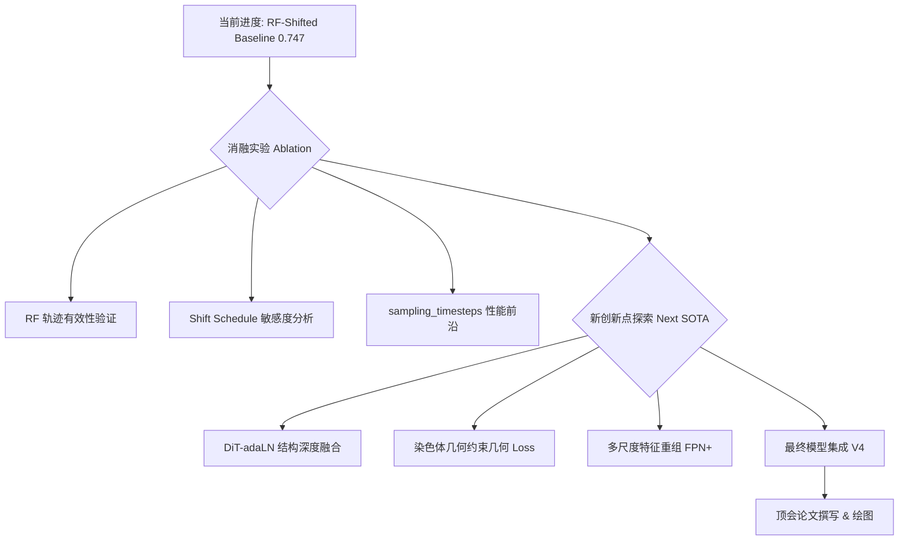

# 染色体检测顶会冲击计划 (Research Roadmap for CVPR/ICCV)

为了确保论文能够达到顶会（CVPR/ICCV/ECCV）的录用标准，我们需要在**实验的完备性**、**理论的深度**以及**创新的连贯性**上进一步发力。以下是接下来的详细工作安排。

______________________________________________________________________

## 1. 核心任务流 (Workflow)



______________________________________________________________________

## 2. 详细任务计划 (Task Schedule)

### 第一阶段：实验完备性补全 (预计 1-2 周)

**目标**：通过严密的消融实验，证明 RF-Shifted 每一个组件的必要性。

| 任务类型       | 任务描述                                                                | 预期结果                         |
| :------------- | :---------------------------------------------------------------------- | :------------------------------- |
| **消融实验 1** | **RF vs. DDPM (同步数)**: 在 1, 2, 4, 8 步下分别对比 RF 和 DDPM。       | 证明 RF 在低步数下的压倒性优势。 |
| **消融实验 2** | **Shift 强度 $s$ 搜索**: 测试 $s \\in {1, 2, 3, 5, 8}$ 对 mAP 的影响。  | 找到染色体任务的最优采样偏置。   |
| **消融实验 3** | **训练-推理一致性**: 验证训练时加入 Shift 是否比仅推理加入 Shift 更好。 | 支撑“分布对齐”的理论点。         |

### 第二阶段：采样效率分析 (针对 RF 改进点)

**目标**：绘制完整的“效率-精度”前沿曲线。

- **实验矩阵**：
  - $T \\in {1, 2, 4, 8, 16, 32, 64}$
  - 指标：mAP, FPS, GFLOPs
- **可视化目标**：生成一张 `mAP-vs-FPS` 图，证明模型在保持高精度的同时，推理速度接近 One-step 检测器。

### 第三阶段：新创新点探索 (提升论文上限)

**目标**：在 RF 的基础上增加第二个甚至第三个贡献点，确保“创新分”拉满。

1. **DiT-adaLN 深度增强 (架构创新)**:
   - **方向**：目前我只尝试了引入了简单的 adaLN-Zero。可以尝试将检测头彻底 Transformer 化，利用 DiT 的扩展性处理重叠严重的染色体。
2. **几何约束损失 (领域知识创新)**:
   - **方向**：染色体具有独特的条带和弯曲结构。引入“旋转框检测”或“关键点约束”的辅助任务，在 RF 的反向 ODE 过程中加入几何引导。

______________________________________________________________________

## 3. 时间线安排 (Timeline)

| 周次   | 任务重点                | 关键里程碑                                    |
| :----- | :---------------------- | :-------------------------------------------- |
| **W1** | 消融实验全自动化运行    | 完成所有 $s$ 和 $T$ 的组合测试，拿到数据。    |
| **W2** | 效率分析 & 现有图表升级 | 完成 mAP-vs-FPS 曲线，完善 Method 章节。      |
| **W3** | 新创新点 (V4) 开发      | 跑通 DiT 深度融合模型，争取 mAP 突破 0.755+。 |
| **W4** | 论文初稿 (Writing)      | 完成 Introduction 和 Related Work 撰写。      |
| **W5** | 实验结果填表 & 投稿准备 | 完成全类别对比、Badcase 分析。                |

______________________________________________________________________

## 4. 重点实验配置模板 (建议直接尝试)

```python
# 建议创建 configs/ablation/ 目录进行以下实验
# 实验 A: 采样偏置对比
shifts_to_test = [1.0, 2.0, 3.0, 5.0, 8.0]
# 实验 B: 步数饱和度对比
steps_to_test = [1, 2, 4, 8, 16]

# 核心验证脚本: projects/LDMDet/scripts/run_ablation.sh
```

______________________________________________________________________

## 5. 顶会录用核心建议 (Checklist)

- [ ] **数据量级**：是否在更大的染色体数据集上验证过？
- [ ] **对比模型**：是否对比了最新的 DiffusionDet 变体或 SOTA 检测器（如 YOLOv10, RT-DETR）？
- [ ] **可视化**：是否有高质量的检测结果对比图（Baseline 漏检 vs. 我们检出）？
- [ ] **理论深度**：能否用数学公式严密推导 Shifted RF 的收敛边界？

______________________________________________________________________

*注：该计划已同步至 \[Research_Plan.md\](file:///home/linkst/workplace/chromo/chromosome-kd/Research_Plan.md)，建议以此为基准进行周报管理。*
