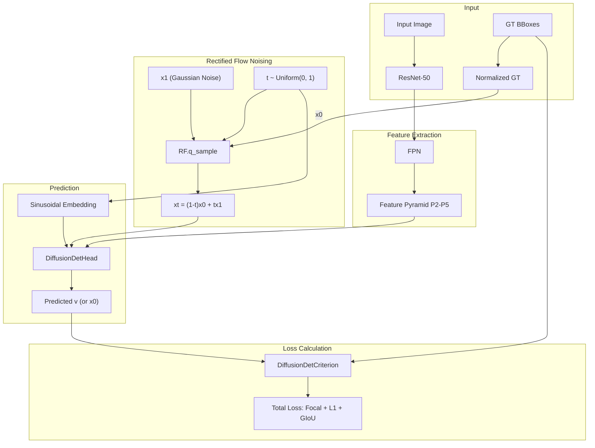
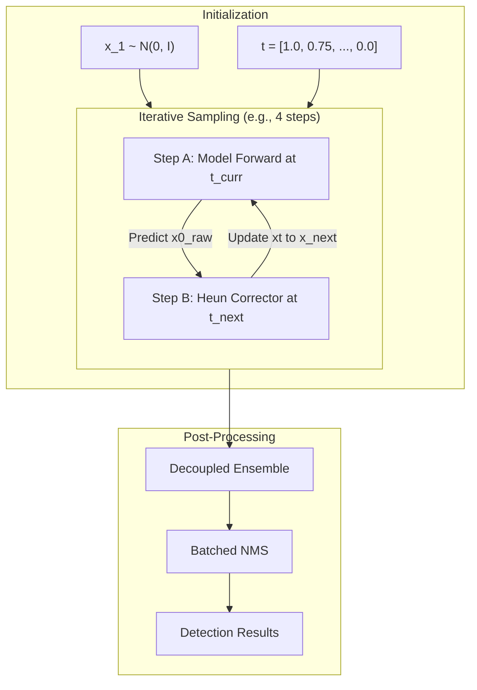

# LDMDet 算法架构与数据流深度剖析

LDMDet 是一个基于 **Rectified Flow (RF)** 的扩散目标检测器。它将目标检测任务建模为一个从纯噪声框（Noise Boxes）到精确预测框（Data Boxes）的直线演化过程。

______________________________________________________________________

## 1. 核心流程图 (Flowchart)

### A. 训练阶段 (Training/Forward Noising)

训练的核心是学习“速度”向量 $v$，使得噪声能沿着直线路径还原为 GT。

### B. 推理阶段 (Inference/Denoising Sampling)

推理是一个迭代去噪过程，通过 **Heun Solver**（二阶）提高采样精度。

______________________________________________________________________

## 2. 模块深度剖析 (Module Analysis)

### 2.1 SinusoidalPositionEmbeddings

- **功能**: 将连续的时间步 $t \\in \[0, 1\]$ 映射到高维特征空间，使网络能感知当前的去噪阶段。
- **计算**:
  $$PE(t, 2i) = \\sin(t \\cdot 10000^{-2i/d})$$
  $$PE(t, 2i+1) = \\cos(t \\cdot 10000^{-2i/d})$$
- **维度**: `[bs]` $\\rightarrow$ `[bs, feat_channels]` (通常为 256)。

### 2.2 SingleDiffusionDetHead (迭代单元)

这是 LDMDet 的核心计算单元，每个 Head 内部包含以下子模块：

1. **RoIExtractor**:
   - **输入**: 特征金字塔 $P_2 \\sim P_5$, 当前边界框 `bboxes` `[bs, 500, 4]`。
   - **处理**: 执行 `RoIAlign`。
   - **维度**: `[bs*500, 256, 7, 7]`。
2. **Self-Attention**:
   - **功能**: 让 500 个提案框之间进行信息交互，学习物体间的全局关系。
   - **维度**: `[500, bs, 256]`。
3. **DynamicConv (Dynamic Interaction)**:
   - **核心**: 使用提案特征生成卷积权重，作用于 ROI 特征。
   - **计算**: `parameters = Linear(proposals)` $\\rightarrow$ `roi_feats * parameters`。
   - **目的**: 实现实例级的动态特征增强。
4. **Time-Conditioning (Scale-Shift)**:
   - **逻辑**: `feature = feature * (scale + 1) + shift`。
   - **维度**: `scale, shift` 均由 `TimeMLP` 生成，维度为 `[bs, 256]`。

______________________________________________________________________

## 3. 数据维度演变 (Dimension Flow)

以推理模式为例（假设 `batch_size=1`, `num_proposals=500`）：

| 阶段         | 数据对象        | 维度               | 备注                                      |
| :----------- | :-------------- | :----------------- | :---------------------------------------- |
| **初始**     | `x_raw` (Noise) | `[1, 500, 4]`      | 扩散空间的 cxcywh                         |
| **RoI 提取** | `roi_features`  | `[500, 256, 7, 7]` | 500 个框对应的局部特征                    |
| **交互后**   | `obj_features`  | `[1, 500, 256]`    | 经过自注意力和动态卷积                    |
| **分类分支** | `cls_logits`    | `[1, 500, 24]`     | 24 个类别的预测分数                       |
| **回归分支** | `reg_deltas`    | `[1, 500, 4]`      | 相对于输入框的偏移量                      |
| **更新**     | `x_raw_next`    | `[1, 500, 4]`      | 通过 Heun Step 更新后的框位置             |
| **最终**     | `results`       | `[N, 6]`           | NMS 后的框 (x1, y1, x2, y2, score, label) |

______________________________________________________________________

## 4. Heun Solver 采样细节 (Mathematical Logic)

为了解决普通 Euler 法（一阶）的误差，我们使用了 Heun（二阶）求解器：

1. **预测 (Predictor)**:
   - 计算当前速度 $v_t = (x_t - x\_{0,pred}) / t$。
   - 预估下一步位置：$x\_{next, euler} = x_t + \\Delta t \\cdot v_t$。
2. **修正 (Corrector)**:
   - 在新位置 $x\_{next, euler}$ 再次调用模型，预测 $x\_{0,pred_next}$。
   - 计算新位置的速度 $v\_{next}$。
   - **最终更新**: $x\_{next} = x_t + \\frac{\\Delta t}{2} (v_t + v\_{next})$。
3. **集成 (Ensemble)**:
   - 为了稳健性，集成预测值取两次预测的均值：$x\_{0,corr} = (x\_{0,pred} + x\_{0,pred_next}) / 2$。
