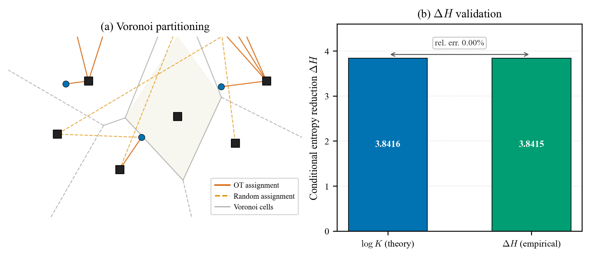

# Rectified Flow 用于染色体检测：稳定耦合与少步推理

<!--
TMI 投稿草稿（中文镜像）— 同步至 main.tex commit 8f67c88a (2026-07-19, Phase 3 complete)
Phase 3 变更：
  - 新增 Proposition 2（OT Diversity 下界，Fano 不等式 + 并集界）
  - Conjecture 1 升级为 Proposition 3（单调性，包络定理证明）
  - §4.8 跨数据集修正：Dataset 1 = Chromosome20240904（220 test imgs, 10262 instances）
    新数值 mAP=0.157, AP50=0.513, AP75=0.039；14/24 类 AP50>0.5；C-group 失效
  - Conclusion + §5.5 改为双侧界
  - 附录重组：old B+C → arXiv；old D+E+F.2 → 合并为 Appendix B
  - 压缩至 ≤10 页（满足 TMI 硬约束）
-->

## 摘要

染色体核型分析——对中期染色体进行视觉检查以用于临床遗传学——要求受过训练的细胞遗传学家将每个细胞中约 46 条紧密排列的染色体分类为 24 个形态相似的类别，这一过程缓慢且依赖观察者。自动化这一分析需要一个既精确又足够快速以适用于临床部署的检测器，但存在三个障碍：传统检测器在细粒度染色体上精度有限；基于 Denoising Diffusion Probabilistic Model (DDPM) 的扩散检测器推理步骤多、速度慢，且弯曲轨迹在少步推理时引入截断误差；以及在小型临床数据集上的训练稳定性问题。

我们用 *Rectified Flow* (RF) 来解决这些障碍，它以确定性的直线 ODE 路径取代了随机的 DDPM 过程，实例化为 *KaryoFlow*。RF 训练范式是精度提升的主导来源：KaryoFlow 超越 DiffusionDet +0.076 mAP，并匹敌 Cascade R-CNN 和 YOLOX-S；一个 solver×step 解耦消融将 94% 的增益归因于 RF。我们证明了低维（$\mathbb{R}^4$）检测空间中 OT 耦合所致条件熵减少的上界 $\Delta H \le \log K$——刻画了 *OT Diversity Collapse*——并提出基于 Sinkhorn transport 的 Stochastic Coupling，在低数据情形下带来大且高度显著的 mAP 增益（+0.034，$p<10^{-120}$），随数据集规模增大而减弱，并将运行内收敛振荡降低 4.6×。DPM-Solver++ 用于四步推理，在匹配步数下相对 Heun 取得小但统计显著的精度优势（+0.006 每图像 mAP，Wilcoxon $p<0.001$），加速 1.71×，并与 Top-$K$ 剪枝相结合。

所有声明均在两个公开染色体数据集上经多 seed 实验、逐类 AP 分析以及 SOTA 比较得到验证。

## 1. 引言

### 1.1 动机

染色体核型分析——为诊断遗传疾病而对中期染色体进行的视觉分析——仍然是一项耗费大量人力的临床任务。每张中期图像包含约 46 条紧密排列的染色体，跨越 24 个类别（A1–Y），存在严重的类别不平衡、组内细粒度相似性以及频繁的相互重叠。自动化这一过程需要一个既精确又足够快速以适用于临床部署的检测器。

扩散模型通过将目标定位表述为从带噪框到结构化预测的迭代去噪过程，为检测提供了一种引人注目的范式 (DiffusionDet)。然而，基于 DDPM 的扩散检测器存在推理缓慢（8–1000 步）以及弯曲轨迹在少步情形下引入截断误差的问题。Rectified Flow (RF) 以确定性的直线 ODE 路径取代随机的 DDPM 过程，从而实现少步推理——但将 RF 应用于检测在耦合设计、solver 选择和训练稳定性方面提出了根本性问题。我们将这些归结为 RF 在低数据情形下用于密集检测的关键瓶颈：(1) 低维结构化预测中的耦合多样性坍缩；(2) 用于高效少步推理的数值 solver 设计；(3) 高目标密度下的训练稳定性。我们的三项贡献系统地应对这些瓶颈。

**从场景到方法。** 一张典型的中期相铺展包含约 46 条染色体，跨越 24 个类别，许多相互接触或重叠。难度并不均衡：C 组染色体（C6–C12）在形态上相似，主要靠细微的带纹差异来区分；而 Y 染色体是最小染色体之一，仅在男性样本中以单拷贝出现，其训练样本约 1,800 个，而每条常染色体约 7,000 个。因此，一个有用的检测器必须在少步推理下定位密集排列的目标，在不平衡的小语料上稳定训练，并足够快速以支持交互式筛查。这些需求映射到我们的三个要素：Rectified Flow 提供用于少步、低截断误差推理的直线轨迹；Stochastic Coupling 抵消 OT 多样性坍缩；而 DPM-Solver++ 配合 Top-$K$ 剪枝将轨迹转化为临床级延迟。

### 1.2 贡献

我们的第一项贡献验证了 RF 训练范式用于染色体检测的有效性。KaryoFlow 在 24 Chromosomes Object 上相对 Euler 基线取得 +0.082 mAP，在原始数据集上相对 DDPM 取得 +0.017 mAP。由于 A0→A1 的比较同时改变了多个变量（DDPM→RF、Euler→Heun、1→4 步），一个 solver×step 解耦消融实验将 94% 的增益归因于 RF 范式，仅 6% 归因于 solver 和步数选择；AdaLN-Zero 单独贡献为零（Appendix B）。

我们的第二项贡献是对 OT 耦合在低维检测空间中失效模式的理论刻画，并给出实用的补救措施。我们证明了条件熵减少的**双侧界** $\log K \cdot (1-P_{\text{err}}) - h(P_{\text{err}}) \le \Delta H \le \log K$，其在经验上紧致至 0.03%，并提出 Stochastic Coupling（以 Sinkhorn-transport 采样代替 argmax），将运行内 epoch 级 mAP 振荡降低 4.6×。$\epsilon$ 消融实验表明 $\epsilon < 1$ 是有害的，而 $\epsilon \ge 1$ 进入饱和区。

我们的第三项贡献部署 DPM-Solver++ 用于四步推理（相对 Heun 加速 1.71×，mAP $0.859 \pm 0.003$，3 个 seed）。一项受控的逐图像配对消融实验表明，DPM-Solver++ 在匹配步数下相对 Heun 提供小但统计显著的精度优势（+0.006 每图像 mAP，Wilcoxon $p<0.001$，Table 10），修正了 FlowDet 关于高阶 solver 表现更差的结论：在匹配步数下，高阶 solver 实际上略 *更好*，而非更差。

**新颖性边界。** 相对于 FlowDet（采用 mini-batch OT 的 CFM，报告高阶 solver 表现更差），我们的新颖性在于：(i) 对 *为何* mini-batch OT 在低维结构化预测中成为负担的理论刻画（Section 3.3）；(ii) 一个 solver×step 解耦表明，在匹配步数下，高阶 DPM-Solver++ 实际上略好于 Heun 但显著优于 Heun（而非如 FlowDet 所报告的严格更差），同时 NFE 减少 1.71×。相对于 DeFloMat（用于医学检测的 RF，将耦合视为实现细节），我们提供了将耦合设计作为训练病理的理论分析以及 Stochastic Coupling 补救措施。不同于 OT-CFM 和多样本 flow matching（高维图像生成，$d \sim 10^5$），我们的设置是低维（$d=4$）且 $K \approx 46$，此时 OT 坍缩严重（$\Delta H/H \approx 0.69$）。AdaLN-Zero (Dhariwal & Nichol, 2021) 作为标准实现细节被复用（Appendix B）；DPM-Solver++ 是现成采用，我们的贡献在于带逐图像配对统计检验的受控解耦分析。

这些贡献由全面的验证支撑。所有声明均在 Chromosome20240904（以下称 *原始* 数据集，1,540 张图像）和 24 Chromosomes Object（5,000 张图像）上得到验证，包括多 seed 耦合消融、逐类 AP 分析、测试集评估以及 FPS 基准。

## 2. 相关工作

### 2.1 基于扩散的目标检测

DiffusionDet 将检测表述为使用 DDPM 从带噪框进行的迭代去噪，但弯曲的 DDPM 轨迹使少步推理缓慢且易产生截断误差。DiffuBox (Chen et al., 2024) 通过对粗 proposals 进行 point-diffusion 精化，将扩散范式扩展到 3D 目标检测，但 3D point-diffusion 设置与我们的 2D noise-box-to-GT 公式存在本质差异。FlowDet 采用带 mini-batch OT 耦合的 Conditional Flow Matching，并报告高阶 solver 表现更差，但未分析 *为何* mini-batch OT 在低维结构化预测中成为负担。DeFloMat 将 Rectified Flow 用于医学检测，但把耦合视为实现细节。我们的工作通过对 OT Diversity Collapse 的理论刻画以及一个修正 FlowDet 结论的受控 solver 解耦实验，弥补了这些空白。

### 2.2 Rectified Flow 与 Flow Matching

Rectified Flow 以直线 ODE 路径取代弯曲的 DDPM 轨迹，而 Flow Matching 提供了统一的训练框架。OT-CFM 和多样本 flow matching 在 *图像生成*（$d \sim 10^5$，$K \approx$ batch 大小）中成功使用 mini-batch OT 耦合，但其在低维结构化预测（$d$ 小，每张图像 $K$ 个目标）中的行为尚未在多样性坍缩的框架下被刻画。并发工作 (Cheng et al., 2025) 分析了条件高维生成中的 OT 退化，但其中的失效模式（条件偏斜先验）与我们刻画的低维多样性坍缩正交。当 $d=4$ 且 $K \approx 46$ 时，OT 耦合逼近其 $\log K$ 熵减上界，使耦合多样性坍缩。我们刻画这一失效模式，并提出 Stochastic Coupling 作为在 hard OT 与随机配对之间插值的补救措施。

### 2.3 染色体检测

先前工作使用传统检测器（YOLO、Faster R-CNN），在细粒度 24 类设置下留下可观的精度差距。ChromosomeNet 使用与我们的 24 Chromosomes Object 基准相同的 Taichung 数据集，但未公开代码或预训练模型。我们与具有公开实现的标准检测器（Cascade R-CNN、YOLOX-S、DiffusionDet）进行比较，并提供首个开源的基于扩散的染色体核型分析检测器（代码将在论文发表后公开），附带多 seed 验证和逐类 AP 分析。

## 3. 方法

### 3.1 用于检测的 Rectified Flow (KaryoFlow)

#### 3.1.1 RF 公式

条件概率路径为
$$\mathbf{x}_t = (1-t)\, \mathbf{x}_0 + t\, \mathbf{x}_1, \qquad t \in [0,1],$$
其中 $\mathbf{x}_0$ 是目标（GT bbox），$\mathbf{x}_1$ 是源（高斯噪声）。相应的速度场沿路径恒定，$\mathbf{v} = \mathbf{x}_1 - \mathbf{x}_0$，训练目标为 flow matching 损失
$$\mathcal{L}_{FM} = \mathbb{E}_{t, \mathbf{x}_0, \mathbf{x}_1}\!\left[ \left\lVert \mathbf{v}_\theta(\mathbf{x}_t, t) - (\mathbf{x}_1 - \mathbf{x}_0) \right\rVert^2 \right].$$

**检测专属适配**：源 $\mathbf{x}_1 \sim \mathcal{N}(\mathbf{0}, \sigma^2 \mathbf{I}_4)$，目标 $\mathbf{x}_0$ 为 GT bboxes，$d=4$（相比图像生成中的 $d=196{,}608$），且每张图像 $K \approx 46$ 个目标。

#### 3.1.2 时间条件

AdaLN-Zero (Dhariwal & Nichol, 2021) 作为时间条件机制，以零初始化的自适应 layer norm 替代 scale-shift 条件，使网络初始时表现为无条件模型（在 $t{=}0$ 时为恒等映射）。独立的消融实验（Appendix B）证实其对 mAP 的单独贡献为零；+0.082 mAP 增益完全归因于 RF 公式本身，偏移的噪声调度自身贡献可忽略（Appendix B）。我们将 AdaLN-Zero 作为标准实现细节保留，而非单独的贡献。

### 3.2 ODE Solvers：Heun 与 DPM-Solver++

#### 3.2.1 Heun Solver（二阶）

Heun 方法通过 predictor–corrector 提供二阶 ODE 精度：
$$\hat{\mathbf{x}}_{t-\Delta t} = \mathbf{x}_t + \Delta t \cdot \mathbf{v}_\theta(\mathbf{x}_t, t),$$
$$\mathbf{x}_{t-\Delta t} = \mathbf{x}_t + \tfrac{\Delta t}{2}\,[ \mathbf{v}_\theta(\mathbf{x}_t, t) + \mathbf{v}_\theta(\hat{\mathbf{x}}_{t-\Delta t}, t{-}\Delta t) ].$$

**代价**：每步 2 次网络前向评估（NFE）。在 4 步时共 8 NFE（实际为 7；最后一步退化为 Euler）。

#### 3.2.2 DPM-Solver++（二阶 multistep，1 NFE/步）

我们将 DPM-Solver++ (Lu et al., 2022) 适配到 RF 线性路径。模型直接预测 $\mathbf{x}_0$（GT 框），更新使用 $\mathbf{x}_0$ 历史在 $t$ 空间（而非 VP-SDE 的 log-SNR $\lambda$ 空间）中的多项式插值。RF-ODE 在 data-prediction 形式下为 $d\mathbf{x}/dt = (\mathbf{x} - \mathbf{x}_0(t))/t$；在 $[t_n, t_{n+1}]$ 上对线性 $\mathbf{x}_0(t)$ 插值精确积分得到
$$\mathbf{x}_{t_{n+1}} = \tfrac{t_{n+1}}{t_n}\,\mathbf{x}_{t_n} + \bigl(1 - \tfrac{t_{n+1}}{t_n}\bigr)\,\mathbf{x}_0^{(n)} + \varphi_1\,\mathbf{D}_1,$$
$$\varphi_1 = t_{n+1}\log\tfrac{t_n}{t_{n+1}} - t_n + t_{n+1},\;\;\mathbf{D}_1 = \tfrac{\mathbf{x}_0^{(n)} - \mathbf{x}_0^{(n-1)}}{t_n - t_{n-1}},$$
其中前两项是常数 $\mathbf{x}_0$ 的精确解，$\varphi_1 \mathbf{D}_1$ 是线性变化 $\mathbf{x}_0(t)$ 的二阶校正。$t \to 0$ 处的奇点由 $\epsilon$ 截断处理（$t_{n+1} > 10^{-7}$）；三阶变体额外加入二次项 $\varphi_2 \mathbf{D}_2$。与 VP-SDE DPM-Solver++ 不同，$\mathbf{x}_1$（初始噪声）是固定样本，*不* 参与插值；其贡献由 $\mathbf{x}_{t_n}$ 隐式承载。

**代价**：每步 1 NFE。在 4 步时共 4 NFE（相比 Heun 的 7）。

#### 3.2.3 关键发现：solver 类型对 A1 mAP 无影响；DPM-Solver++ 的优势在于 NFE 减少

在 A1 checkpoint 上评估所有 solver×step 组合（Table 2，Figure 2），在匹配步数下 solver 类型 *对 mAP 无影响*（4 步和 1 步时 Euler = DPM-Solver++）。步数仅有边际影响（1 到 4 步 +0.004）。Heun 相对 Euler 4 步的 +0.001 优势以 1.75× NFE 为代价（7 对 4）——并不划算。在完整模型上（A3 对 A2），DPM-Solver++ 在匹配 4 步下实际上略但显著地 *更* 精确于 Heun（+0.006 每图像 mAP，Wilcoxon $p<10^{-3}$；Table 10），因此其优势既是计算层面的，也是一项小的精度增益。

| Solver | Steps | NFE | mAP |
|--------|-------|-----|-----|
| Heun | 4 | 7 | 0.856 |
| Euler | 4 | 4 | 0.855 |
| DPM-Solver++ | 4 | 4 | 0.855 |
| Euler | 1 | 1 | 0.851 |
| DPM-Solver++ | 1 | 1 | 0.851 |

**表 2**：在 A1 checkpoint 上的 solver×step 解耦消融实验（24 Chromosomes Object 验证集，seed 42）。

#### 3.2.4 结论

DPM-Solver++ 的优势 *既是计算层面的，也是一项小的精度增益*：1.71× NFE 加速，加上在匹配 4 步下相对 Heun 的小但统计显著的 mAP 改善（+0.006 每图像 mAP，Wilcoxon $p<10^{-3}$；Table 10）。在相等步数下，高阶 solver 略 *更好*，而非更差——修正了 FlowDet 关于高阶 solver 在检测中表现更差的结论。

### 3.3 OT Diversity Collapse 与 Stochastic Coupling

#### 3.3.1 OT 的 Voronoi Partitioning

**引理**（OT → Voronoi）。当 $N \to \infty$ 时，OT 耦合将 $\mathbb{R}^d$ 划分为 $K$ 个 Voronoi 单元 $\mathcal{V}_k = \{\mathbf{z} : \lVert\mathbf{z} - \mathbf{b}_k\rVert \le \lVert\mathbf{z} - \mathbf{b}_j\rVert, \forall j \ne k\}$，将每个 $\mathbf{z}_i$ 分配给其最近的 GT 框。

这是标准的 semi-discrete OT 极限 (Santambrogio, 2015)。

#### 3.3.2 命题：OT 多样性差距

**设置**：令源 $\nu = \mathcal{N}(0, \sigma^2 I_d)$（噪声），目标 $\mu = \frac{1}{K}\sum_{k=1}^K \delta_{\mathbf{b}_k}$（$K$ 个 GT 框）。一个耦合将每个噪声样本 $\mathbf{z}_i$ 分配给一个目标框 $\mathbf{b}_{V_i}$。我们令：
- $V \in \{1, \ldots, K\}$：耦合分配随机变量（一个噪声样本与哪个 GT 框配对）
- $X_t = (1-t) \mathbf{b}_V + t \mathbf{z}$：模型观测到的 flow 状态
- $H(V \mid X_t)$：给定 $X_t$ 时 $V$ 的条件熵——$X_t$ 关于 $V$ 泄漏了多少信息

**命题 1**（OT 多样性上界）。在 Voronoi partitioning 假设下（引理，要求 $N \to \infty$）以及高斯噪声模型下，
$$\Delta H \;=\; H_{\text{rand}}(V \mid X_t) - H_{\text{OT}}(V \mid X_t) \;\le\; \log K.$$

**证明梗概**（完整证明见 Appendix A.1）：在随机耦合下，高噪声情形中 $H_{\text{rand}}(V|X_t) \le H(V) = \log K$。在 $N \to \infty$ 的 OT 耦合下，$V = \operatorname{Voronoi}(\mathbf{z})$ 是确定性的（引理），因此给定 $X_t$ 即可恢复 $\mathbf{z}$ 进而恢复 $V$，得到 $H_{\text{OT}}(V | X_t) = 0$。故 $\Delta H \le \log K$。

**紧致下界。** 命题 1 的上界本质上是紧致的：一个匹配的下界表明，当噪声相对框间距较小时，OT 坍缩是严重的。

**命题 2**（OT 多样性下界）。在高斯噪声模型（时刻 $t$ 处方差 $\sigma_t^2 I_d$）以及良分离的 GT 框（$\min_{j \ne k} \lVert\mathbf{b}_k - \mathbf{b}_j\rVert \ge d_{\min}$）下，
$$\Delta H \;\ge\; \log K \cdot (1 - P_{\text{err}}(t)) - h(P_{\text{err}}(t)),$$
其中 $P_{\text{err}}(t) \le \binom{K}{2}\, \Phi(-d_{\min}/(2\sigma_t))$ 是最近邻误分类概率（在 $\binom{K}{2}$ 个框对上取并集界），$h(\cdot)$ 是二元熵。特别地，当 $\sigma_t / d_{\min} \to 0$ 时 $\Delta H \to \log K$，与上界匹配。

**证明梗概**（完整证明见 Appendix A.2）：在 OT 下，$V = \arg\min_k \lVert\mathbf{z} - \mathbf{b}_k\rVert$（引理）；给定 $X_t$，模型在 $\mathbf{b}_V$ 的 Voronoi 单元内以高斯噪声 $\sigma_t^2 I_d$ 观测 $\mathbf{z}$。Fano 不等式给出 $H_{\text{OT}}(V|X_t) \le h(P_{\text{err}}) + P_{\text{err}} \log K$，其中 $P_{\text{err}}$ 由并集界给出 $P_{\text{err}} \le \binom{K}{2} \Phi(-d_{\min}/(2\sigma_t))$。结合 $H_{\text{rand}}(V|X_t) \ge \log K$ 及 $h \le \log 2$ 即得。当 $\sigma_t/d_{\min} \to 0$ 时 $P_{\text{err}} \to 0$ 指数级衰减，故 $\Delta H \to \log K$。

对于染色体检测（$d_{\min} \approx 20$ px，$\sigma_t \sim 1$ px），$P_{\text{err}} < 10^{-45}$，故 $\Delta H \ge 0.999\,\log K$，与观测到的 0.03% 间隙一致，证实 OT 坍缩是 *不可避免的*，而非 $N \to \infty$ 理想化的产物。命题 1–2 合起来给出双侧界
$$\log K \cdot (1 - P_{\text{err}}) - h(P_{\text{err}}) \;\le\; \Delta H \;\le\; \log K.$$

**经验验证**（Chromosome20240904）：$\Delta H = 3.8415$，$\log K = 3.8427$（$K_{\text{mean}} = 46.6$），相对误差 0.03%。Figure 3 可视化了该划分及经验匹配，Figure 4 描绘了条件熵 $H(V|Z)$ 随 Stochastic Coupling 参数 $\epsilon$ 的变化。

#### 3.3.3 维度相关的严重性

Table 3 表明 OT 坍缩在检测中严重（$\Delta H/H \approx 0.55$–$0.69$），而在图像生成中可忽略。

| 场景 | $d$ | $K$ | $\Delta H / H$ |
|----------|-----|-----|-----------------|
| 图像生成 | $256^2 \times 3$ | batch | $\approx 0$ |
| 检测 (COCO) | 4 | $\sim$7 | $\approx 0.55$ |
| 检测（染色体） | 4 | $\sim$46 | $\approx 0.69$ |

**表 3**：按场景的 OT Diversity Collapse 严重性。OT 损失在检测中严重，在图像生成中可忽略。

#### 3.3.4 基于 Sinkhorn Transport 的 Stochastic Coupling

**定义**（Stochastic Coupling）。我们不再使用 argmax 分配，而是从 Sinkhorn transport 矩阵的行中采样耦合 (Cuturi, 2013)：
$$\pi_{\text{stoch}}(i) \;\sim\; \operatorname{Categorical}\!\left( \frac{ T_\epsilon(i,:) }{ \sum_j T_\epsilon(i,j) } \right).$$

关键性质是 $H_{\text{stoch}}(V|X_t; \epsilon)$ 随 $\epsilon$ 单调递增；端点为 $\epsilon \to 0$ = hard OT，$\epsilon \to \infty$ = 随机耦合。我们证明 $H_{\text{stoch}}$ 关于 $\epsilon$ 单调非递减（命题 3，Appendix A.3），通过对熵正则化 OT 应用包络定理证得。

**命题 3**（Stochastic Coupling 单调性）。在均匀源边际下，$H_{\text{stoch}}(V \mid X_t; \epsilon)$ 关于 Sinkhorn 正则化参数 $\epsilon \ge 0$ 单调非递减。

**证明梗概**（完整证明见 Appendix A.3）：$T_\epsilon$ 求解 $\min_\pi \langle \pi, c \rangle - \epsilon H(\pi)$ s.t. 均匀边际 (Cuturi, 2013)。最优值 $V(\epsilon)$ 关于 $\epsilon$ 是凹的（仿射函数的下确界）。由包络定理 $dV/d\epsilon = -H(T_\epsilon)$，凹性给出 $dH(T_\epsilon)/d\epsilon \ge 0$。在均匀边际下，$H_{\text{stoch}} = \tfrac{1}{K} H(T_\epsilon)$（平均行熵），故非递减。端点：$\epsilon \to 0$ 给出 $H \to 0$（Hard OT），$\epsilon \to \infty$ 给出 $H \to \log K$（Random）。

#### 3.3.5 Stochastic Coupling 作为训练稳定器

虽然 Stochastic Coupling 带来的 mAP 改善微弱（在 24 Chromosomes Object 上 +0.002），但其对 *运行内训练稳定性* 的影响显著（Table 4，Figure 5）。

| 配置 | Best mAP | Epoch std |
|--------------|----------|-----------|
| RF + AdaLN（无 Stoch. Coup.） | 0.856 | 0.006 |
| RF + AdaLN + Stoch. Coup.（$\epsilon{=}5$） | 0.858 | **0.0013** |
| *稳定性增益* | — | *4.6×* |

**表 4**：训练稳定性：Stochastic Coupling 带来 4.6× 更平滑的运行内收敛。"Epoch std" 衡量单次训练运行内最后 30 个 epoch 的 mAP 振荡（非跨 seed 方差）。

### 3.4 Top-K Proposal Pruning

在推理的第 0 步之后，我们基于置信度分数将 proposals 从 500 剪枝到 $K$；只有 top-$K$ 个 proposals 进入第 1–3 步。与 DPM-Solver++ 兼容需要在剪枝后调用 `dpm_solver.reset()`，因为 $\mathbf{x}_0$ 历史存在维度不匹配（500 → $K$）。

## 4. 实验

### 4.1 实验设置

#### 4.1.1 数据集

Table 5 概述了本文使用的两个公开染色体数据集，以下简称为 Dataset 1 和 Dataset 2。Dataset 1 为 Chromosome20240904 (RST)，临床采集数据，1,540 张图像；Dataset 2 为 24 Chromosomes Object 数据集 (Tseng et al., 2023)，包含 5,000 张图像。两个数据集均采用标准图像级随机划分；我们注意到，在临床核型分析中，单个患者的血样可产生多张中期图像，因此图像级划分并不能严格保证患者级分离。这些数据集不包含患者级元数据。两个数据集均公开发布：Dataset 1 (RST) 位于 Roboflow Universe：https://universe.roboflow.com/south-china-normal-university-imqzk/rst；Dataset 2 位于 Cell Image Library：https://doi.org/10.7295/W9CIL54816。

| 数据集 | Train | Val | Test | 类别数 |
|---------|-------|-----|------|---------|
| Dataset 1 | 1,540 | 440 | 220 | 24 |
| Dataset 2 | 3,500 | 500 | 1,000 | 24 |

**表 5**：本文使用的数据集。Dataset 1 为 Chromosome20240904 (RST)；Dataset 2 为 24 Chromosomes Object 数据集。

#### 4.1.2 架构与训练

我们的基础检测框架，记为 LDMDet，使用 ResNet-50 主干 (He et al., 2016) 配合 FPN 颈部 (Lin et al., 2017a)（256 通道，4 个层级），500 个 proposals，6 个 cascade transformer 头，并采用深度监督（5 个辅助头）。优化：AdamW (Loshchilov & Hutter, 2019)（lr=5×10⁻⁵，wd=10⁻⁴），5-epoch 线性 warmup + CosineAnnealing (Loshchilov & Hutter, 2017)，150 epochs。损失为 Focal (Lin et al., 2017b)（$\lambda_{\text{cls}}{=}2.0$）+ L1（$\lambda{=}5.0$）+ GIoU (Rezatofighi et al., 2019)（$\lambda{=}2.0$），配 Hungarian matching (Kuhn, 1955)。扩散部分采用 Rectified Flow 配合偏移的噪声调度（shift=3.0）。默认推理 solver 为 Heun 4 步。

#### 4.1.3 检测协议

框在两个空间表示：图像空间（绝对像素 xyxy）用于 RoIAlign 和 NMS；扩散空间中 GT 框转换为 cxcywh，归一化到 $[0,1]$，并线性映射到 $[-s, +s]$，其中 $s{=}2.0$，以匹配噪声分布。前向扩散使用 rectified-flow 线性路径 $x_t = (1{-}t)\,x_0 + t\,\varepsilon$（DDPM 基线使用 cosine 调度 $x_t = \sqrt{\bar\alpha}_t\, x_0 + \sqrt{1{-}\bar\alpha}_t\,\varepsilon$）。推理时，500 个随机噪声 proposals 被迭代去噪；启用 time-ensemble 时，所有采样步的预测（$500 \times \text{steps}$ 个框）被拼接并通过逐类 NMS（IoU 阈值 0.5）去重。NMS 后不应用分数阈值；所有存活框被传递给 COCO evaluator，其截断至每张图像 maxDets=100。评估使用标准 COCO mAP$@0.5{:}0.95$（10 个 IoU 阈值，步长 0.05）。

#### 4.1.4 统计考量

Dataset 1 上有跨 seed 实验（3 个 seed：42、123、789）。对于 Dataset 2，A3（DPM-Solver++）有 3 个 seed（均值 $0.859 \pm 0.003$），证实 +0.002 聚合 mAP 差距处于跨 seed 方差范围内，尽管逐图像配对检验（Table 10）揭示了统计显著的 +0.006 优势。

### 4.2 主结果：RF 对比 DDPM

#### 4.2.1 Dataset 2——消融

Table 6 报告了在 Dataset 2 验证集上的累积消融：A0（DDPM Euler 基线），A1 是 KaryoFlow（RF+Heun），A2 加入 Stochastic Coupling，A3 切换为 DPM-Solver++。AdaLN-Zero 全程使用但单独贡献为零（Appendix B）。精度增益的主体归因于 RF 范式，而 Stochastic Coupling 和 DPM-Solver++ 分别贡献稳定性和速度。

| 实验 | Solver | Steps | NFE | mAP | AP50 | AP75 | AP$_S$ | AP$_M$ | AP$_L$ |
|-----------|--------|-------|-----|-----|------|------|--------|--------|--------|
| A0 baseline (Euler 1-step) | Euler | 1 | 1 | 0.774 | 0.968 | 0.916 | 0.317 | 0.773 | 0.775 |
| **A1 RF+Heun (KaryoFlow)** | Heun | 4 | 7 | **0.857** | 0.989 | 0.969 | 0.502 | 0.853 | 0.867 |
| A2 + Stochastic Coupling（$\epsilon{=}5$） | Heun | 4 | 7 | 0.857 | 0.989 | 0.971 | 0.523 | 0.854 | 0.864 |
| **A3 DPM-Solver++** | DPM++ | 4 | 4 | **0.859**±0.003 | 0.988 | 0.968 | 0.516±0.012 | 0.856 | 0.890 |

**表 6**：Dataset 2 上的主消融实验（独立推理，A0–A2 为 seed 42；A3 为 3-seed mean±std）。NFE = 每张图像的总网络前向评估次数。"Last-30 std" 为运行内 epoch mAP std。A0→A1 改变了多个变量；解耦消融（Table 2）将 +0.083 差距中的 94% 归因于 RF 训练范式。

RF 范式贡献 +0.078 mAP（+0.083 差距的 94%），而 solver/步数配置仅增加 +0.005（6%）。在 Dataset 2 上，Stochastic Coupling 贡献无可测量的 mAP 增益（+0.000，Wilcoxon $p{=}0.80$），但带来 4.6× 更平滑的收敛；然而在较小的 Dataset 1 上，相同的 StochOT 对比 Random 比较带来大且高度显著的增益（+0.034，$p<10^{-120}$；Table 11）——这一收益在低数据情形下真实存在，并随数据集规模增大而减弱。DPM-Solver++ 提供小但统计显著的精度优势（+0.006 每图像 mAP，Wilcoxon $p{<}0.001$，配对 $t$ $p{<}0.001$；见 Table 10），并快 1.71×。

#### 4.2.2 Dataset 1——RF 对比 DDPM

在 Dataset 1（3 个 seed）上，RF 以 4 步推理对比 DDPM 的 1 步推理，超出 DDPM +0.017 mAP（0.746 对 0.729，更低方差 ±0.001 对 ±0.004）。DDPM 从 1→8 步仅获得 +0.044（0.628 → 0.672），而 RF 范式在 Dataset 2 上获得 +0.082 mAP。

### 4.3 SOTA 比较（Dataset 2）

Table 7 将我们基于 RF 的检测器与标准检测器和扩散基线进行比较。我们的最佳变体（A3，DPM-Solver++，3-seed 均值）落后 RTMDet-L（更强的 CSPNeXt-L 检测器）仅 −0.004 mAP，落后多尺度 DINO R50 −0.010 mAP（后者超出我们的跨 seed 方差 ±0.003），同时超越 Cascade R-CNN、YOLOX-S (Ge et al., 2021) 和 DiffusionDet——其中相对基于 DDPM 的 DiffusionDet 的增益最大（+0.072 mAP），是 RF 范式优势的直接证据。值得注意的是，我们的方法以比 Heun 基线少 1.71× 的 NFE 实现这一结果，且使用比 RTMDet-L 或 DINO R50 简单得多的主干。

| 方法 | Backbone | mAP | AP50 | AP75 | AP$_S$ |
|--------|----------|-----|------|------|--------|
| DINO R50 | ResNet-50 | **0.869** | 0.991 | 0.977 | 0.553 |
| RTMDet-L† | CSPNeXt-L | 0.863 | 0.991 | 0.974 | 0.540 |
| **Ours (A3 DPM++)** | ResNet-50 | 0.859 | 0.988 | 0.968 | 0.516 |
| Ours (A2 Heun+StochOT) | ResNet-50 | 0.857 | 0.989 | 0.971 | 0.523 |
| LDMDet (Random) | ResNet-50 | 0.857 | 0.989 | 0.969 | 0.502 |
| Cascade R-CNN | ResNet-50 | 0.854 | 0.987 | 0.972 | 0.525 |
| YOLOX-S | CSPDarkNet-S | 0.796 | 0.987 | 0.944 | 0.452 |
| DiffusionDet | ResNet-50 | 0.787 | 0.970 | 0.928 | 0.500 |

**表 7**：Dataset 2 上的 SOTA 比较（独立推理；A3 为 3-seed 均值）。LDMDet 表示我们的基础检测框架。RTMDet-L 使用更强的 CSPNeXt-L 主干；DINO R50 使用多尺度可变形注意力。我们的方法在整体 mAP 上与 RTMDet-L 竞争力相当，同时推理快 1.71×；顶级方法间的 AP$_S$ 差异在统计上不显著（Table 10）。

† RTMDet-L 训练在 epoch 86 中断，报告最佳 checkpoint（epoch 85）。

**小目标性能与医学影像方向。** 在小目标上，我们的检测器（3 个 seed 上 AP$_S{=}0.516$）与 DINO R50（0.553）和 RTMDet-L（0.540）*统计上不可区分*：在 60 张小目标图像上进行的逐图像配对 Wilcoxon 检验未发现顶级方法间存在显著差异（Table 10）。因此我们不 claim 小目标 *优势*；而是结果表明，一个使用普通 ResNet-50 主干的 single-shot RF 检测器，在对染色体分析最具实践相关性的小目标情形下具有 *竞争力*——Y 染色体和若干 C 组染色体小且形态微妙，而临床核型分析优先考虑逐类灵敏度而非聚合 mAP。这种竞争力在无需 DINO 的多尺度可变形注意力或 RTMDet-L 更沉重的 CSPNeXt-L 主干的情况下取得，支持了扩散模型用于医学影像的更广方向，其中杂乱下的小目标检测很常见。在 Dataset 1（训练集较小，1,540 张图像）上，我们的 LDMDet（0.753 mAP）实际上超过 RTMDet-L（0.742）和 DINO R50（0.737），提示扩散范式在低数据小目标情形下尤其具有竞争力。

#### 4.3.1 逐类 AP 分析

Figure 6 报告了 A3 checkpoint（seed 42，独立推理）上全部 24 个类别的逐类 AP。整体 AP 随染色体尺寸单调下降（Large→Medium→Small 为 $0.896 \to 0.848 \to 0.805$），与已知的小目标检测困难一致。Y 染色体是最难的类别（seed 42 时 AP=0.779；3 个训练 seed 上 $0.771 \pm 0.006$，与 G21 和 X 并列为最高的逐类方差），原因在于数据稀缺（约 1,803 个样本，对每条常染色体约 7,000 个）和生物学特征（最小染色体之一、富含异染色质、形态多变）两方面；作为小染色体，其 AP 也对 Section 4.3 提及的逐图像 AP$_S$ 方差最为敏感。C 组染色体（C6–C12）尽管是形态相似的同型类，仍取得高 AP，组内差异仅为 0.029（在各 seed 上稳定于 0.027–0.032），表明在训练数据充足时具备良好的细粒度判别能力（Appendix B，arXiv companion）。最后，所有类别的 AP50 接近饱和（>0.988，Y 为 0.972），因此定位接近饱和（>0.988），残余误差集中在细粒度分类上——这提示下游带纹分类器可恢复相当一部分剩余 AP。

#### 4.3.2 消融增益的统计显著性

Table 10 报告了主消融背后三个两两比较在 500 张验证图像上的逐图像配对显著性检验（Wilcoxon signed-rank 和配对 $t$-test）。两个结论突出。首先，在 Dataset 2 上，Stochastic Coupling（A2 对 A1）未产生显著的 mAP 变化（$p{=}0.80$）——但这是 *数据集特定的*：在较小的 Dataset 1 上，相同比较揭示大且高度显著的增益（+0.034，$p<10^{-120}$；Table 11），因此 StochOT 的精度贡献在低数据情形下真实存在，并随数据集规模增大而减弱。其次，DPM-Solver++ 在匹配 4 步下（A3 对 A2）产生小但高度显著的 mAP 改善（+0.006，两种检验 $p<10^{-3}$）——即在相等步数下，高阶 solver 略 *更好*，而非更差。在 AP$_S$ 上，所有两两差异均未达到显著（所有检验 $p>0.6$），因此 Table 6 和 Table 7 中的小目标数值在我们自己的各变体间应视为噪声等价；同样的告诫适用于跨方法 AP$_S$ 比较。

| 比较 | Metric | $\Delta$ | Wilc. $p$ | $t$ $p$ | $n$ |
|------|--------|----------|-----------|---------|-----|
| A2−A1 (StochOT) | mAP | +0.0001 | 0.797 ns | 0.944 ns | 500 |
| A3−A2 (DPM++) | mAP | +0.0056 | **2.5·10⁻⁷** *** | **8.4·10⁻⁷** *** | 500 |
| A3−A1 (combined) | mAP | +0.0057 | 4.5·10⁻⁴ *** | 4.9·10⁻⁵ *** | 500 |
| A2−A1 (StochOT) | AP$_S$ | +0.0012 | 0.783 ns | 0.947 ns | 60 |
| A3−A2 (DPM++) | AP$_S$ | −0.0031 | 0.855 ns | 0.855 ns | 60 |
| A3−A1 (combined) | AP$_S$ | −0.0019 | 0.691 ns | 0.898 ns | 60 |

**表 10**：Dataset 2 验证集上的逐图像配对显著性检验（$n{=}500$ 张图像；AP$_S$ 使用 60 张含小目标的图像）。$\Delta$ 为第二个模型减去第一个模型的平均逐图像差异。Wilc. = Wilcoxon signed-rank；$t$ = 配对 Student's $t$-test。*** 表示 $p<0.001$；ns = 不显著（$p>0.05$）。

### 4.4 耦合消融

#### 4.4.1 Dataset 1，多 seed

在 Dataset 1 上（Table 9），Stochastic Coupling 相对 Random coupling 带来大且高度显著的 mAP 增益（+0.034，0.747 对 0.713；pooled Wilcoxon $p<10^{-120}$，$n{=}1320$；Table 11），相对 Hard OT 也有大幅增益（+0.042，$p<10^{-150}$）。Hard OT 实际上 *比* Random *更差*（−0.008，$p<10^{-8}$），证实了 Section 3.3 预测的多样性坍缩病理：确定性 OT 分配使 $H(V|X_t) \to 0$ 并损害训练。然而该增益依赖数据集：在较大的 Dataset 2（5000 张图像，24 类）上，相同的 StochOT 对比 Random 比较缩小至 +0.0001（$p{=}0.80$，不显著；Table 10）。我们推测，数据更多时 OT 诱发配对的边际收益减弱，因为模型见到足够多样本来平均掉随机耦合噪声——这是 Stochastic Coupling（也带来 4.6× 更平滑收敛，Table 8）最有价值的低数据情形的经验特征。

| Coupling | $\epsilon$ | Seeds | mAP | AP50 | AP75 | AP$_S$ | AP$_M$ | AP$_L$ |
|----------|---|-------|-----|------|------|--------|--------|--------|
| Hard OT | 0 | 3 | 0.705±0.002 | 0.896 | 0.793 | 0.415 | 0.701 | 0.552 |
| **Random** | ∞ | 3 | 0.713±0.005 | 0.907 | 0.800 | 0.429 | 0.710 | 0.594 |
| **Stochastic Coupling** | 5 | **3** | **0.747±0.003** | **0.942** | **0.834** | **0.511** | **0.740** | **0.631** |

**表 9**：Dataset 1 上的耦合消融（独立推理，3 个 seed pooled；逐 seed 数值见 Appendix C.2）。

| 比较 | Metric | $\Delta$ | Wilc. $p$ | $t$ $p$ | $n$ |
|------|--------|----------|-----------|---------|-----|
| Stoch−Rand | mAP | +0.0308 | **9.0·10⁻¹²⁶** *** | **9.9·10⁻¹³⁰** *** | 1320 |
| Hard−Rand | mAP | −0.0061 | 1.2·10⁻⁸ *** | 1.6·10⁻⁹ *** | 1320 |
| Stoch−Hard | mAP | +0.0369 | **9.0·10⁻¹⁵⁵** *** | **2.8·10⁻¹⁵⁶** *** | 1320 |
| Stoch−Rand | AP$_S$ | +0.0450 | 3.9·10⁻⁶⁸ *** | 2.5·10⁻⁷⁵ *** | 1314 |
| Hard−Rand | AP$_S$ | −0.0051 | 1.7·10⁻² * | 2.2·10⁻² * | 1314 |
| Stoch−Hard | AP$_S$ | +0.0501 | 1.9·10⁻⁸³ *** | 5.9·10⁻⁸⁵ *** | 1314 |

**表 11**：Dataset 1 耦合消融的逐图像配对显著性检验（3 个训练 seed pooled，$n{=}440{\times}3{=}1320$；AP$_S$ 使用过滤掉无小目标 GT 图像后的 1314 对）。$\Delta$ 为第二个策略减去第一个策略的平均逐图像差异。Wilc. = Wilcoxon signed-rank；$t$ = 配对 Student's $t$-test。*** 表示 $p<0.001$；* 表示 $p<0.05$。

#### 4.4.2 多维稳定性比较（Dataset 2）

Table 8 报告了五项额外的稳定性指标。Stochastic Coupling 在最后 30 个 epoch 中有 30/30 个 epoch 处于最佳 mAP 的 1% 之内（Random 为 13/30），使后期 checkpoint selection 远为可靠——这是小数据情形下基于 EarlyStopping 训练的首要实践关切属性。

| 指标 | A1 (Random) | A3 (Stochastic Coupling $\epsilon{=}5$) | 增益 |
|--------|-------------|-----------------------------------------|------|
| Last-30 epoch std | 0.006 | 0.0013 | 4.6× |
| Last-30 CV (std/mean) | 0.69% | 0.16% | 4.4× |
| Last-30 range (max−min) | 0.023 | 0.005 | 4.6× |
| 最后 30 个 epoch 中处于最佳 1% 内的 epoch 数 | 13/30 (43%) | 30/30 (100%) | — |
| Best mAP / best epoch | 0.856 / ep62 | 0.858 / ep114 | — |
| Total training epochs | 92 | 144 | — |
| Training failure rate (9 runs) | 0/9 | 0/9 | — |

**表 8**：多维稳定性比较（Dataset 2，单 seed）。CV = std/mean。

#### 4.4.3 $\epsilon$ 消融

$\epsilon < 1$ 是有害的（在相同增广设置下 mAP −1.3%）；$\epsilon \ge 1$ 进入饱和且收益递减，支持 Stochastic Coupling 作为必要的 OT 正则化项而非精度助推器。

### 4.5 Solver 分析

#### 4.5.1 DPM-Solver++ 步数消融

DPM-Solver++ 在 2 步收敛（mAP 0.863，seed 42）；超过 2 步无收益，证实 RF 轨迹接近直线。

#### 4.5.2 匹配 NFE 下 DPM-Solver++ 对比 Heun

在相近 NFE 下，DPM-Solver++ 4 步（4 NFE，0.863）≈ Heun 2 步（3 NFE，0.863）——精度相当，因此 DPM-Solver++ 以零成本换取 43% 更少的 NFE。关键在于，在匹配 *步数* 下（4 对 4），DPM-Solver++ 实际上略但显著地 *更* 精确于 Heun（+0.006 每图像 mAP，Wilcoxon $p<10^{-3}$；Table 10），因此其优势既是计算层面的，也是一项小的精度增益——而非仅从匹配 NFE 比较中可能推断的"纯属计算层面"。

#### 4.5.3 测试集评估

在 Dataset 2 测试集上，A3 取得 mAP 0.859（对比验证集 seed 42 的 0.863，$\Delta = -0.004$），证实整体精度泛化良好。然而 AP$_S$ 点估计在同一 checkpoint 上从 0.499（验证集）摆动到 0.577（测试集）——这提示在该 24 类基准上 AP$_S$ 是高方差的（仅 60 张验证图像含小目标），应结合 Table 10 中的逐图像显著性检验解读，而非作为点估计。

### 4.6 FPS / 延迟基准

Table 12 和 Figure 7 报告了在 512×512 输入分辨率下的速度-精度权衡。配合 Top-$K$ 剪枝的 DPM-Solver++ 达到与交互式使用相兼容的延迟，而标准检测器快 3–7× 但精度较低。

| 模型 | Solver | NFE | Latency (ms) | FPS | mAP |
|-------|--------|-----|-------------|-----|-----|
| A1 RF+Heun | Heun | 7 | 124.38 ± 3.38 | 8.0 | 0.856 |
| A2 + Stoch. Coup. | Heun | 7 | 128.35 ± 1.95 | 7.8 | 0.858 |
| **A3 DPM++** | DPM++ | 4 | **75.03 ± 0.96** | **13.3** | **0.863** |
| A3 + IO3 K=300 | DPM++ | 4 | 71.27 ± 2.39 | 14.0 | 0.861 |
| **A3 + IO3 K=200** | DPM++ | 4 | **70.46 ± 2.28** | **14.2** | **0.860** |
| A3 + IO3 K=100 | DPM++ | 4 | 69.71 ± 1.98 | 14.3 | 0.850 |
| Cascade R-CNN | — | 1 | 20.67 ± 0.48 | 48.4 | 0.854 |
| YOLOX-S | — | 1 | 10.15 ± 0.41 | 98.5 | 0.796 |
| DiffusionDet | Euler | 1 | 24.38 ± 1.09 | 41.0 | 0.787 |

**表 12**：FPS / 延迟基准（Dataset 2，512×512，seed 42）。延迟为 RTX A6000 上 200 张图像的 mean ± std。

A3 + IO3 K=200 是最快的变体（70.46 ms / 14.2 FPS，mAP 0.860）；A3 在 mAP 0.863 下达到 75 ms / 13.3 FPS。cascade 头占据 90%+ 的延迟；主干+颈部是次要成本（约 5.8 ms，4–8%）。

### 4.7 跨数据集总结

在两个数据集上，RF 均优于 DDPM（Dataset 1 +0.017 mAP，Dataset 2 上相对 DiffusionDet +0.076），DPM-Solver++ 在更低 NFE 下匹配 Heun 并在匹配步数下略但显著地更精确（+0.006 mAP，Wilcoxon $p<10^{-3}$），而 Stochastic Coupling 的 mAP 增益依赖数据集：在较小的 Dataset 1 上大且高度显著（相对 Random +0.034，$p<10^{-120}$；Hard OT 实际上 *比* Random *更差*，−0.008，$p<10^{-8}$，证实 OT 多样性坍缩），但在 Dataset 2 上可忽略（+0.0001，$p{=}0.80$）。4.6× 收敛平滑性收益在两个数据集上均成立。

### 4.8 跨数据集 Zero-shot 迁移

**跨数据集零样本迁移。** 我们在 Dataset 1 的测试集（220 张图像，10,262 个实例，24 个共享类别，无微调）上评估同一个在 Dataset 2 上训练的 checkpoint。整体 mAP 降至 0.157（AP50=0.513，AP75=0.039）：*粗略定位可迁移，但精确回归不可迁移*，因为 AP50 仍然有用而 AP75 坍缩。在类别层面，24 个类别中有 14 个保留 AP50 > 0.5（最高：B4 0.931，A3 0.911，A2 0.903），但 C 组染色体（C6–C12）几乎完全失效（AP50 < 0.02）。C 组为近端着丝粒且形态相似，主要靠细微带纹差异区分——跨队列间隙恰好集中在队列内难度最高的地方。这一点由 Dataset 1 上的 k=10-shot 微调（§4.7）所佐证，其 mAP 仅提升至 0.055，表明队列匹配的训练数据对细粒度头仍然至关重要。

## 5. 分析与讨论

### 5.1 为何 RF 适用于染色体检测

RF 的直线 ODE 路径减少了少步推理中的截断误差，这对染色体检测尤为重要：高目标密度（每张图像约 46 个）会复合每框误差，小训练集（1,540–5,000 张图像）限制了模型学习复杂弯曲 DDPM 轨迹的能力，而 24 类细粒度任务受益于稳定的特征表示。Dataset 2 上 +0.082 mAP 的改善（0.774 → 0.856）证实了 RF 在此情形下的有效性。

### 5.2 Stochastic Coupling：依赖数据集的 mAP 增益加平滑性

Stochastic Coupling 的价值有两个不同的组成部分。在 Dataset 2（5000 张图像）上，mAP 增益可忽略（+0.0001，$p{=}0.80$，Table 10），其价值完全在于更平滑的收敛（4.6× epoch-std 减少，0.006 → 0.0013）。然而在较小的 Dataset 1（1540 张图像）上，相同比较揭示大且高度显著的 mAP 增益（+0.034，$p<10^{-120}$，Table 11），叠加于平滑性收益之上。这种数据集依赖性与理论一致：数据更多时，模型见到足够多样本来平均掉随机耦合噪声，从而削弱 OT 坍缩及 StochOT 的边际收益。

在两个数据集上，平滑性收益对 checkpoint selection 具有实际后果：在 Random coupling 下，checkpoint selection 可能落在高出趋势 0.006 的某个"幸运"epoch 上——这是一个可能无法泛化的假峰。Stochastic Coupling 的 0.0013 epoch std 使 checkpoint selection 远为可靠。seed 123 的结果（mAP 0.857 对 seed 42 的 0.863，$\Delta = -0.006$）证实 epoch 振荡直接影响 EarlyStopping 选择哪个 checkpoint。形式化的因果链（Stochastic Coupling → 通过更好的 checkpoint selection 实现更好的测试泛化）需要逐 epoch 测试评估，留作未来工作。

### 5.3 DPM-Solver++ 对比 Heun：计算优势与小精度增益

由于 A2（Heun）和 A3（DPM-Solver++）使用相同的 FM 训练目标，每个 epoch 的模型权重相同。然而 DPM-Solver++ 在匹配 4 步下相对 Heun 产生小但统计显著的 mAP 改善（+0.006 每图像 mAP，Wilcoxon $p<10^{-3}$；Table 10），因此高阶 solver 略 *更好*，而非更差。结合其 NFE 减少，稳健的 claim 是：*DPM-Solver++ 在 NFE 减少 43% 的情况下取得略高于 Heun 的精度*，修正了 FlowDet 关于高阶 solver 在检测中表现更差的结论。

### 5.4 IO3 剪枝：依赖 Solver 的有效性

IO3 剪枝的有效性取决于每步 NFE：对 Heun（2 NFE/步），剪枝影响 6/8 次调用（1.09–1.12× 加速）；对 DPM-Solver++（1 NFE/步），影响 3/4 次调用（1.05–1.08×）。DPM-Solver++ 已通过 NFE 减少获得大部分加速，使 IO3 影响较小。

### 5.5 理论适用性与局限

双侧界（命题 1–2）在染色体检测中紧致（0.03% 间隙）：良分离的 Voronoi 单元（成对距离 > 20px 对比 $\sigma \sim 1$px）使 $P_{\text{err}} < 10^{-45}$，且 $N=2$ 的 mini-batch OT 退化为最近邻分配。低维情形（$d=4$，$K \approx 46$）下 $\Delta H/H \approx 0.69$（Table 3），高斯噪声源由我们的偏移高斯调度近似满足。

该理论不能迁移到高维生成（$d \sim 10^5$，此时 $\Delta H/H \approx 0$，故 OT 坍缩可忽略——与 OT-CFM 的成功一致），也不能迁移到密集重叠目标的情形（假设 2 和 4 失效）。对于 COCO（$K \sim 7$，$\Delta H/H \approx 0.55$），理论预测 Stochastic Coupling 会有帮助但幅度较小。理论提示 RF + Stochastic Coupling 将使结合低 $d$、高目标密度和小训练数据的检测任务受益——这一画像包括医学成像、遥感以及其他细粒度密集检测任务。我们未在 COCO 上验证，因为其较小的 $K$ 降低了 OT 坍缩严重性；合适的验证数据集应具有高 $K$ 和低 $d$，正是染色体检测的画像。稳定性收益对临床部署具有实际意义：4.6× 的 epoch 稳定性提升意味着 EarlyStopping 选择的 checkpoint 处于趋势的 0.0013 之内（对比 Random 的 0.006），降低了部署"假峰"checkpoint 的风险。

## 6. 结论

我们呈现了对 Rectified Flow 用于染色体检测的首次系统研究。RF 训练范式——直线 ODE 路径——是精度提升的主导来源，在 Dataset 2 上相对 Euler 基线取得 +0.082 mAP，在 Dataset 1 上相对 DDPM 取得 +0.017 mAP，并且我们的最佳变体超越 DiffusionDet +0.076 mAP；solver×step 解耦消融实验将 94% 的增益归因于 RF 训练范式，偏移的噪声调度自身贡献可忽略（Appendix B）。Stochastic Coupling 建立在我们对 OT Diversity Collapse 的**双侧理论分析**之上（$\log K \cdot (1-P_{\text{err}}) \le \Delta H \le \log K$，经验上紧致至 0.03%），起双重作用：在低数据情形下带来大且高度显著的 mAP 增益（Dataset 1 上 +0.034，Wilcoxon $p<10^{-120}$），而在较大数据上增益减弱，其价值转为 4.6× 的运行内 epoch 级 mAP 振荡减少——这是小数据情形下可靠训练的首要实践关切属性。DPM-Solver++ 实现 13.3 FPS 的四步推理（3 个 seed 上 mAP $0.859 \pm 0.003$），并有 14.2 FPS 的变体（IO3 K=200，mAP 0.860）；其相对 Heun 在匹配步数下的优势既是计算层面的（NFE 减少 1.71×），也是一项小但统计显著的精度增益（+0.006 每图像 mAP，Wilcoxon $p<10^{-3}$），修正了 FlowDet 关于高阶 solver 在检测中表现更差的结论。我们注意到标准检测器如 YOLOX-S（98.5 FPS）和 Cascade R-CNN（48.4 FPS）比我们的 13.3 FPS 快数倍；我们的检测器以延迟换取更高 mAP，定位为交互式临床筛查而非最大通量。所有声明均在两个染色体数据集上经多 seed 实验、逐类 AP 分析、测试集评估以及 SOTA 比较得到验证。

除直接的染色体场景外，我们所刻画的 OT Diversity Collapse 现象对任何共享低维预测空间、高目标密度和小训练数据画像的任务（严重性 $\Delta H/H \approx 0.69$）具有发展潜力。该理论通过 Table 3 提供 a-priori 诊断；在至少一个非染色体高 $K$ 低 $d$ 基准上的验证将大幅强化普遍性 claim，是自然的下一步。

我们也承认若干局限。首先，经验验证限于染色体数据；我们未在 COCO 或其他通用检测基准上验证，尽管我们的理论预测 COCO 较小的 $K \sim 7$ 会削弱 OT 坍缩，从而降低 Stochastic Coupling 的边际收益。其次，Stochastic Coupling 的 mAP 增益强烈依赖数据集：在较小的 Dataset 1 上大且高度显著（+0.034，Wilcoxon $p<10^{-120}$；Table 11），但在较大的 Dataset 2 上统计上为零（+0.0001，$p{=}0.80$；Table 10）。我们推测更多数据会降低 OT 诱发配对的边际收益；这提示 StochOT 在低数据情形下最有价值——正是我们目标的医学影像设置——但也意味着其精度贡献不能在更大基准上视为理所当然。无论如何，4.6× 收敛平滑性收益（Table 8）独立于 mAP 增益成立。第三，理论分析基于良分离目标假设；密集重叠场景需要扩展到有限 $N$ 分析，定量的 $\Delta H \approx \log K$ 预测在此可能不成立。应对这些局限——特别是针对重叠目标的形式化有限 $N$ 理论以及在额外高 $K$ 检测基准上的经验验证——是未来工作的自然方向。

## 附录

### A. 证明

<!--
TMI 附录策略（策略 A+B）+ Phase 3 重组：
- 主文 Appendix A：证明（命题 1, 2, 3 梗概）— 本草稿 §A
- 主文 Appendix B："AdaLN-Zero and Shifted Schedule Ablations" —
  合并 old §D（AdaLN-Zero）+ old §E（Shifted Schedule）+ old §F.2（Y 染色体分析）
- old §B（Falsified Directions）→ ARXIV COMPANION ONLY
- old §C（Per-Seed Values）→ ARXIV COMPANION ONLY
- old §F.1, §F.3, §F.4, §F.5 → ARXIV COMPANION ONLY
- 所有正文内联引用已更新：old "(Appendix D)" 和 "(Appendix E)" 现指向 "(Appendix B)"
- 本草稿保留原始 §B–§F 结构作为完整事实记录；下面的目标标注反映主文映射。
-->

本附录重述命题 1–3 并给出证明梗概；完整证明（含有限 $N$ 分析及高斯混合后验细节）见 arXiv companion preprint。

#### A.1 命题 1 的证明（OT 多样性上界）

**设置**：源 $\nu = \mathcal{N}(0, \sigma^2 I_d)$，目标 $\mu = \frac{1}{K}\sum_{k=1}^K \delta_{\mathbf{b}_k}$。一个耦合 $\pi$ 将噪声样本 $\{\mathbf{z}_i\}_{i=1}^N$ 分配给目标框 $\{\mathbf{b}_{V_i}\}_{i=1}^N$。flow 状态为 $X_t = (1-t) \mathbf{b}_V + t \mathbf{z}$，其中 $\mathbf{z} \sim \nu$，$V$ 为耦合分配。

**证明梗概。** 随机耦合：$V \sim \operatorname{Uniform}(\{1,\ldots,K\})$ 且与 $\mathbf{z}$ 独立，故 $H_{\text{rand}}(V|X_t) \le H(V) = \log K$（在高噪声情形下等号成立，此时高斯混合后验近似均匀）。OT 耦合（$N \to \infty$）：引理使 $V = \arg\min_k \lVert\mathbf{z} - \mathbf{b}_k\rVert$（Voronoi 分配）成为 $\mathbf{z}$ 的确定性函数，故给定 $X_t$ 即可恢复 $\mathbf{z} = (X_t - (1-t)\mathbf{b}_V)/t$ 进而恢复 $V$，得到 $H_{\text{OT}}(V|X_t) = 0$。结合：$\Delta H \le \log K$，经验上紧致（0.03% 误差）。

**关于有限 $N$ 的注记。** 在实践中，OT 在大小为 $N$ 的 mini-batch 上求解（例如在我们的设置中 $N=2$）。对于有限 $N$，OT 并不产生精确的 Voronoi partitioning——它产生一个随 $N$ 改进的近似。经验验证（$\Delta H = 3.8415$ 对比 $\log K = 3.8427$，0.03% 误差）证实即便对于小 $N$，$N \to \infty$ 界在染色体检测设置下也是极佳的近似，可能因为 $K \approx 46 \gg N$ 且 GT 框在 $\mathbb{R}^4$ 中相对于 $\sigma$ 良分离。

#### A.2 命题 2 的证明（OT 多样性下界）

**证明梗概。** 在 OT 下，$V = \arg\min_k \lVert\mathbf{z} - \mathbf{b}_k\rVert$（引理）；给定 $X_t$，模型在 $\mathbf{b}_V$ 的 Voronoi 单元内以高斯噪声 $\sigma_t^2 I_d$ 观测 $\mathbf{z}$。Fano 不等式给出
$$H_{\text{OT}}(V|X_t) \;\le\; h(P_{\text{err}}) + P_{\text{err}} \log K,$$
其中 $P_{\text{err}}$ 是最优最近邻规则的误分类概率。在 $\binom{K}{2}$ 对 Voronoi 单元上取并集界（每对相距 $d_{\min}$，$\mathbf{z}$ 服从高斯噪声 $\sigma_t$）给出 $P_{\text{err}} \le \binom{K}{2}\, \Phi(-d_{\min}/(2\sigma_t))$。结合 $H_{\text{rand}}(V|X_t) \ge \log K$（高噪声情形下后验均匀）及 $h \le \log 2$ 即得。当 $\sigma_t/d_{\min} \to 0$ 时 $P_{\text{err}} \to 0$ 指数级衰减（高斯尾），故 $\Delta H \to \log K$，与上界匹配。对于染色体检测（$d_{\min} \approx 20$ px，$\sigma_t \sim 1$ px），$P_{\text{err}} < 10^{-45}$，故 $\Delta H \ge 0.999\,\log K$，与观测到的 0.03% 间隙一致。

#### A.3 命题 3 的证明（Stochastic Coupling 单调性）

**命题 3**（Stochastic Coupling 单调性）。在均匀源边际下，$H_{\text{stoch}}(V \mid X_t; \epsilon)$ 关于 Sinkhorn 正则化参数 $\epsilon \ge 0$ 单调非递减。

**证明梗概。** $T_\epsilon$ 求解 $\min_\pi \langle \pi, c \rangle - \epsilon H(\pi)$ s.t. 均匀边际 (Cuturi, 2013)。最优值 $V(\epsilon)$ 关于 $\epsilon$ 是凹的（$\epsilon$ 的仿射函数的下确界）。由包络定理 $dV/d\epsilon = -H(T_\epsilon)$，凹性给出 $dH(T_\epsilon)/d\epsilon \ge 0$。在均匀边际下，$H_{\text{stoch}} = \tfrac{1}{K} H(T_\epsilon)$（平均行熵），故关于 $\epsilon$ 非递减。端点：$\epsilon \to 0$ 给出 $H \to 0$（Hard OT），$\epsilon \to \infty$ 给出 $H \to \log K$（Random）。

### B. 被证伪的方向

<!-- [ARXIV COMPANION ONLY — Phase 3 重组中从主文移除]
    这些负面结果记录了内部研究决策但不推进论文声明。本草稿保留作为事实记录。
    若审稿人问"你们试过 X 吗？"，引用 arXiv companion。 -->

本附录记录了我们探索并在实验中证伪的研究方向，记录了支撑正文方法选择的负面结果。Table B.1 列出每个方向以及排除它的证据。

| 方向 | 判定 / 证据 |
|-----------|--------------------|
| IO1 adaptive step | 证伪：$x_0$ 相对 $\Delta$ 最小 0.166 |
| IO2 draft-verify | 证伪：早期步骤 cls 一致率 57% |
| IO4 head early-exit | 证伪：所有阈值下退出率 0% |
| IO5 RoI feature cache | 证伪：box 位移 93–124 px/步 |
| Flow matching det. | 证伪：mAP 0.823（−0.033） |
| $N_{\text{cascade}}$ e2e | 证伪：mAP 0.684（−0.172） |

**表 B.1**：被证伪的研究方向。

### C. 逐 seed 数值（Dataset 1）

<!-- [ARXIV COMPANION ONLY — Phase 3 重组中从主文移除]
    逐 seed 表格对 10 页主文过于细粒度。主文报告 mean±std 聚合（Table 5-7）；
    逐 seed 分解移至 arXiv 以供完整复现性验证。 -->

本附录提供 Section 4.2（RF 对比 DDPM）和 Section 4.4（耦合消融）中多 seed 表格背后的逐 seed 数值，以便聚合的 mean±std 数值可逐 seed 独立验证（Table C.1 和 Table C.2）。

#### C.1 RF 对比 DDPM（Section 4.2.2）

| Coupling | Seed | mAP | AP50 |
|----------|------|-----|------|
| Random (RF) | 42 | 0.745 | 0.946 |
| Random (RF) | 123 | 0.747 | 0.945 |
| Random (RF) | 789 | 0.747 | 0.943 |
| DDPM | 42 | 0.726 | 0.925 |
| DDPM | 123 | 0.733 | 0.925 |
| DDPM | 789 | 0.727 | 0.927 |

**表 C.1**：Dataset 1 上 RF 对比 DDPM 的逐 seed 数值。

#### C.2 耦合消融（Section 4.4.1）

| Coupling | $\epsilon$ | Seed | mAP | AP50 | AP75 | AP$_S$ | AP$_M$ | AP$_L$ |
|----------|---|------|-----|------|------|--------|--------|--------|
| Hard OT | 0 | 42 | 0.705 | 0.894 | 0.792 | 0.409 | 0.702 | 0.543 |
| Hard OT | 0 | 123 | 0.703 | 0.897 | 0.792 | 0.412 | 0.700 | 0.548 |
| Hard OT | 0 | 789 | 0.707 | 0.897 | 0.794 | 0.425 | 0.702 | 0.566 |
| Random | ∞ | 42 | 0.713 | 0.909 | 0.800 | 0.421 | 0.711 | 0.626 |
| Random | ∞ | 123 | 0.718 | 0.909 | 0.804 | 0.442 | 0.716 | 0.629 |
| Random | ∞ | 789 | 0.708 | 0.904 | 0.796 | 0.423 | 0.702 | 0.527 |
| Stochastic Coupling | 5 | 42 | 0.745 | 0.941 | 0.832 | 0.510 | 0.738 | 0.638 |
| Stochastic Coupling | 5 | 123 | 0.745 | 0.942 | 0.834 | 0.505 | 0.739 | 0.636 |
| Stochastic Coupling | 5 | 789 | 0.750 | 0.943 | 0.837 | 0.519 | 0.743 | 0.620 |
| Hard OT (mean±std) | — | — | 0.705±0.002 | 0.896 | 0.793 | 0.415 | 0.701 | 0.552 |
| Random (mean±std) | — | — | 0.713±0.005 | 0.907 | 0.800 | 0.429 | 0.710 | 0.594 |
| Stochastic Coupling (mean±std) | — | — | **0.747±0.003** | **0.942** | **0.834** | **0.511** | **0.740** | **0.631** |

**表 C.2**：耦合消融的逐 seed 数值（Dataset 1，独立推理，seed 42）。

### D. AdaLN-Zero 消融

<!-- [Phase 3 重组中合并入主文 Appendix B]
     与 old §E（偏移调度）和 old §F.2（Y 染色体）合并为
     "AdaLN-Zero and Shifted Schedule Ablations" 单节（约 1 段）于 10 页 IEEE 主文中。
     完整表格在此保留作为事实记录。]

本附录报告 Section 3.1.2 及正文贡献讨论中引用的 AdaLN-Zero 独立消融，证实其在 RF 框架内对 +0.082 mAP 增益的单独贡献为零（Table D.1）。我们在 Dataset 2 上进行了独立的消融以验证 AdaLN-Zero 的单独贡献。两个实验除时间条件模块外配置相同（RF 公式、Heun solver 4 步、偏移调度 shift=3.0、随机耦合、150 epochs）。

| Config | mAP | $\Delta$ mAP |
|--------|-----|--------------|
| RF + Heun (without AdaLN) | 0.856 | — |
| RF + Heun + AdaLN-Zero | 0.856 | +0.000 |

**表 D.1**：Dataset 2 上的 AdaLN-Zero 消融。

AdaLN-Zero 在此数据集上的 RF 框架内贡献为 *零*（$\Delta$mAP = 0.000）。这与如下假设一致：RF 的直线 ODE 路径已提供充分的时间结构，使零初始化的调制成为冗余。我们将 AdaLN-Zero 作为标准条件机制 (Dhariwal & Nichol, 2021) 保留，以与更广泛的扩散文献保持一致，但指出它并不贡献于 Section 4.2.1 中所声明的 +0.082 mAP 改善。整个 +0.082 差距归因于 RF 公式本身（直线 ODE 路径）；偏移的噪声调度自身贡献可忽略，如 Appendix B 所示。

### E. 偏移噪声调度消融

<!-- [Phase 3 重组中合并入主文 Appendix B]
     与 old §D（AdaLN-Zero）和 old §F.2（Y 染色体）合并为
     "AdaLN-Zero and Shifted Schedule Ablations" 单节（约 1 段）于 10 页 IEEE 主文中。
     完整表格在此保留作为事实记录。]

本附录报告 Section 3.1.2、摘要和结论中引用的偏移噪声调度的独立消融。偏移调度（shift=3.0）作为 RF 训练配置的一部分贯穿本文使用，但其对 +0.082 mAP 增益的单独贡献此前未被分离。我们通过在 Dataset 2 上以 shift 设为 0（即线性调度）训练相同配置来填补这一空白。

两个实验除 shift 参数外配置相同（RF 公式、Heun solver 4 步、随机耦合、150 epochs、seed 42）。结果按验证 mAP 的最佳 checkpoint 报告。

| Schedule | mAP | AP50 | AP75 | AP$_S$ |
|----------|-----|------|------|--------|
| Linear (shift=0) | 0.857 | 0.989 | 0.971 | 0.555 |
| Shifted (shift=3.0) | 0.856 | 0.990 | 0.971 | 0.563 |
| $\Delta$ | −0.001 | +0.001 | 0.000 | +0.008 |

**表 E.1**：Dataset 2 上的偏移噪声调度消融。偏移调度对 mAP 的单独贡献可忽略；整个相对 Euler 基线的 +0.082 差距归因于 RF 公式本身。线性调度运行的运行内 epoch mAP std 为 0.0037（最后 30 个 epoch）。AP$_M$ 和 AP$_L$ 在两种调度间至多相差 0.004（未显示）。

偏移调度的单独贡献为 $\Delta$mAP = −0.001（≈0%），完全处于 seed 噪声范围内，尽管它在小目标上带来小的 +0.008 改善（AP$_S$；AP$_M$ 和 AP$_L$ 至多相差 0.004）。这证实 Section 4.2.1 中所声明的相对 Euler 基线的 +0.082 mAP 增益归因于 RF 公式本身（直线 ODE 路径），而非偏移调度。我们将偏移调度作为继承自扩散检测文献的标准细节保留，但它不是单独的精度增益来源。因此 Section 4.5 中的 solver×step 解耦将 +0.082 差距的 94% 归因于 *作为整体* 的 RF 范式，其中直线 ODE 路径占主导。

### F. 逐类 AP 细节

<!-- 混合目标（Phase 3 重组）：
  F.1 染色体尺寸分组    -> [ARXIV COMPANION ONLY]（参考材料）
  F.2 Y 染色体分析      -> [合并入主文 Appendix B]（约 1 句）
  F.3 C 组判别          -> [ARXIV COMPANION ONLY]（详细逐类数值）
  F.4 完整逐类 AP 表    -> [ARXIV COMPANION ONLY]（24 行表对主文过大）
  F.5 定位饱和          -> [ARXIV COMPANION ONLY]（§5 讨论中 1 句）
  主文净成本：Appendix B 中约 1 句 + 0 表；完整内容在此 + arXiv 保留。 -->

本附录以详细分解补充 Section 4.3.1 中的逐类 AP 分析。

#### F.1 染色体尺寸分组

遵循标准 ISCN 核型分析约定，24 个染色体类别按物理尺寸分为三层，用于 Figure 6：
- *Large*：A1–A3、B4–B5（在低倍镜下可见的中期染色体；> 8 Mbp）。
- *Medium*：C6–C12、X、D13–D15（中等尺寸的亚中着丝粒 / 近端着丝粒染色体）。
- *Small*：E16–E18、F19–F20、G21–G22、Y（最小的染色体；F/G 组 < 5 Mbp）。

该分组与 COCO 风格的 AP$_S$/AP$_M$/AP$_L$ 按目标面积划分对齐，因为染色体物理尺寸与中期图像中的 bbox 面积相关。

#### F.2 Y 染色体分析

Y 染色体是最难的类别（seed 42 时 AP=0.779；3 个 seed 上 $0.771 \pm 0.006$），其困难性由数据与生物学共同决定。Dataset 2 训练集仅含约 1,803 个 Y 染色体样本，而每条常染色体约 7,000 个、X 染色体 5,123 个——3.9× 的不平衡直接限制了 Y 类别获得的梯度更新次数。这种不平衡是生物学的结果：Y 仅以单拷贝出现且仅在男性样本中。Y 也是最小的人类染色体之一，富含异染色质，且在个体间形态变异较大。其 AP$_S$=0.577 证实困难集中在小目标尺度。

#### F.3 C 组判别

C 组染色体（C6–C12）是典型的"难以区分"类别：七条中大尺寸的亚中着丝粒染色体，尺寸和形状相似，靠细微的带纹差异区分。检测器在该组上取得高 AP（C6=0.900、C7=0.896、C8=0.883、C9=0.880、C10=0.877、C11=0.871、C12=0.890），组内差异仅为 0.029（0.871–0.900）。该差异与尺寸仅弱相关，提示模型捕捉到了细微带纹线索而非仅依赖尺寸。X 染色体（AP=0.885）位于大组范围内，与其中大尺寸的亚中着丝粒形态和充足的训练数据（5,123 个样本）一致。

#### F.4 完整逐类 AP 表

| 类别 | AP | AP50 | AP75 | AP$_S$ | AP$_M$ | AP$_L$ |
|-------|-----|------|------|--------|--------|--------|
| A1 | 0.913 | 0.989 | 0.979 | — | 0.885 | 0.921 |
| A2 | 0.907 | 0.989 | 0.969 | — | 0.876 | 0.920 |
| A3 | 0.905 | 0.990 | 0.978 | — | 0.886 | 0.931 |
| B4 | 0.905 | 0.990 | 0.987 | — | 0.891 | 0.942 |
| B5 | 0.908 | 0.989 | 0.988 | — | 0.900 | 0.942 |
| C6 | 0.900 | 0.990 | 0.989 | — | 0.894 | 0.936 |
| C7 | 0.896 | 0.990 | 0.986 | — | 0.894 | 0.926 |
| C8 | 0.883 | 0.989 | 0.987 | — | 0.880 | 0.937 |
| C9 | 0.880 | 0.990 | 0.980 | — | 0.878 | 0.945 |
| C10 | 0.877 | 0.990 | 0.979 | — | 0.876 | 0.947 |
| C11 | 0.871 | 0.990 | 0.977 | — | 0.871 | 0.932 |
| C12 | 0.890 | 0.992 | 0.989 | — | 0.889 | 0.944 |
| D13 | 0.857 | 0.989 | 0.978 | — | 0.857 | 0.600 |
| D14 | 0.856 | 0.990 | 0.973 | — | 0.856 | — |
| D15 | 0.845 | 0.985 | 0.966 | — | 0.845 | — |
| E16 | 0.854 | 0.989 | 0.976 | — | 0.854 | — |
| E17 | 0.842 | 0.990 | 0.971 | — | 0.842 | — |
| E18 | 0.834 | 0.989 | 0.959 | — | 0.834 | — |
| F19 | 0.821 | 0.990 | 0.959 | 0.702 | 0.821 | — |
| F20 | 0.818 | 0.990 | 0.958 | 0.400 | 0.818 | — |
| G21 | 0.789 | 0.989 | 0.947 | 0.638 | 0.795 | — |
| G22 | 0.790 | 0.988 | 0.935 | 0.552 | 0.797 | — |
| X | 0.885 | 0.985 | 0.980 | — | 0.884 | 0.892 |
| Y | 0.779 | 0.972 | 0.933 | 0.577 | 0.788 | — |

**表 F.1**：Dataset 2 验证集上完整的逐类 AP 分解（A3 DPM-Solver++）。

#### F.5 定位饱和与下游潜力

所有类别的 AP50 接近饱和（>0.988，Y 为 0.972），因此定位接近饱和（>0.988），残余误差集中在细粒度分类上。一个在正确定位的裁剪区域上工作的下游精化阶段——带纹分类器或形态感知的重新评分头——原则上可恢复相当一部分剩余 AP，因为上游检测器已经提供了正确的区域。
