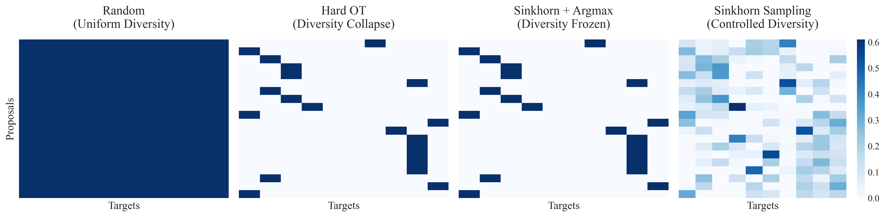
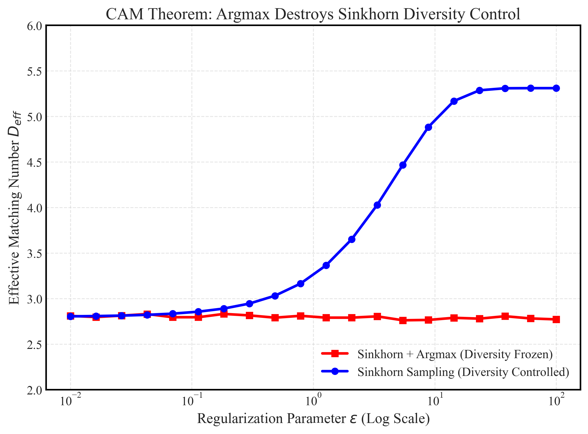
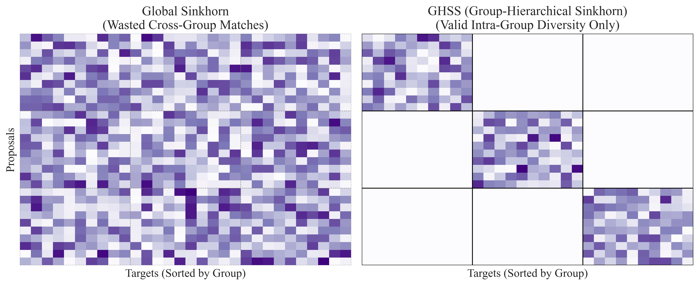

# 多样性优于传输效率：面向密集染色体扩散检测的Sinkhorn采样方法

> ⚠️ **暂时废弃**：以下论文草稿中的实验结论基于旧数据集 Chromosome20240904（mAP≈0.72-0.75），24obj 数据集上的结论已更新。24obj 数据集上 A0-A4 主路线消融及对比模型数据见文末第 5.9 节"24obj 数据集补充实验"。

## 摘要

最优传输（OT）耦合因缩短传输路径而被扩散生成模型广泛采用，并已成功移植至传统检测器的标签分配。本文发现，这一已确立的直觉在密集染色体检测中以惊人方式失效：确定性OT导致检测精度下降约2%。

我们揭示了失效背后的两个机制。其一，确定性OT将条件速度熵压缩超过99%——在拥挤的染色体簇中，所有含噪提案被刚性映射至同一最近目标，检测器丧失了区分相邻相似实例所需的多样化精化信号。其二，对Sinkhorn传输计划做argmax解码，恰恰摧毁了熵正则化本应提供的多样性控制：无论正则化强度如何，仅极少数染色体组能获得有效监督，大型染色体系统性占据优势。

我们提出一个简单修复：从Sinkhorn传输矩阵中采样分配以替代argmax。这一单一改变恢复了ε作为多样性控制参数的功能，将性能恢复至随机基线水平。其底层原则——*多样性优于传输效率*——进一步催生了群组层次Sinkhorn采样（GHSS）：按染色体组划分提案，消除无效跨组匹配，同时保留组内多样性。证据链涵盖熵-方差分解、两种解码策略的ε相图（采样下有效匹配数随ε增长，argmax下受约束），以及逐类精度分析确认几乎所有染色体类别在确定性OT下受损。我们的发现挑战了OT耦合天然有益的默认假设，确立了多样性而非传输效率作为密集检测中耦合设计的首要准则。

## 1. 引言

扩散检测器和整流流检测器将目标检测建模为从噪声框到结构化预测的渐进式去噪过程，为传统单步检测提供了有吸引力的替代方案\[1,2,19\]。这一形式在医学影像领域尤其有价值：标注稀缺、目标结构性强、不确定性普遍存在。在染色体核型分析中，临床工作流程仍然高度依赖人工操作，近年研究不断强调自动化系统的实际需求以及在有限专业标注下构建精确系统的困难\[3-6,21\]。此类检测器中一个根本性的设计问题是：训练期间如何将噪声提案状态与目标标注进行耦合。

在图像生成领域，基于OT的耦合因缩短路径长度、提升学习流的直线性而被广泛认为有效\[2,7,20\]。这一成功推动了其在检测中的应用——OTA、SimOTA以及DETR系列中的匈牙利匹配已在传统检测器的标签分配中取得了显著成功\[11,12,9,13,14\]。因此，将OT耦合直接移植到扩散检测中似乎是顺理成章的。然而，我们的实验表明这一直觉可能以惊人方式失效：确定性OT匹配反而降低了检测性能，尽管从传输代价角度看其理论效率更高\[8\]。

本文提出一个核心问题：*密集染色体检测中的耦合设计应该追求什么？* 我们的答案与生成中心视角不同：关键不是传输路径的效率，而是监督信号的多样性。在染色体检测中，每张图像包含大量紧密排列的实例（平均46个目标，经常相互重叠）。在确定性OT下，分配映射崩溃：它将大量含噪提案路由到少量最近邻真实目标，使检测器丧失了接触多样化训练样本的机会。我们直接量化了这一崩溃——诱导速度分布的条件熵从3.841 nats骤降至接近零。此外，当使用argmax解码Sinkhorn传输计划时，正则化参数ε丧失了对多样性的控制能力：argmax算子作为非连续函数，无论底层传输矩阵变得多么平滑，解码出的分配多样性几乎冻结不变。

我们将这一诊断转化为一个设计原则——*多样性优于传输效率*——以及一个实用方法：**Sinkhorn采样**，即从Sinkhorn传输矩阵的每一行采样训练分配关系，而非使用argmax压缩。这一简单改变保留了传输计划的双随机结构，同时使ε恢复为对多样性有意义的控制变量。该原则进一步可通过领域知识得到增强：**GHSS**按染色体组划分提案，去除跨组无意义的匹配，同时保留组内有效的多样性。该配置达到0.752 mAP，在利用领域结构消除无效跨组匹配的同时与随机基线保持竞争性性能。

本文贡献为两项：

1. **发现与机制。** 我们发现确定性OT在密集多实例检测中主动损害性能，并提供定量的机制解释：通过条件速度熵和方差分解量化的多样性崩溃现象、通过有效匹配数$D\_{\\text{eff}}$度量的argmax对Sinkhorn多样性控制的破坏，以及解释Sinkhorn采样何时及为何有效的ε三区域相图。

2. **原则与方法。** 我们提出扩散检测器耦合设计的"多样性优于传输效率"原则，通过Sinkhorn采样实现该原则，并展示了其被领域结构指导的实际价值——GHSS作为该原则的实例，在消除无效跨组匹配的同时达到0.752 mAP。

**图1. 论文概览。** 本文提出一个核心问题：密集检测中的耦合设计应该追求什么？答案——多样性优于传输效率——通过两个定量机制得到支撑，由Sinkhorn采样实现，并由领域结构通过GHSS加以增强（0.752 mAP）。

## 2. 相关工作

### 2.1 扩散与整流流检测

DiffusionDet将目标定位建模为从含噪框到结构化检测的迭代去噪过程\[1\]。整流流提供了一种更清晰的传输解释，强调直线轨迹和高效数值求解器\[2\]。DETR风格的集合预测也与此相关，因为现代扩散检测器继承了检测可表达为对预测集合进行结构化匹配的思想\[9\]。后续工作通过架构增强\[18\]和细粒度分布精化\[19\]改进了扩散检测器，但耦合机制本身的作用很少受到关注。

### 2.2 检测中的耦合与标签分配

随机耦合是大多数扩散公式的默认策略\[20,22\]。基于OT的耦合及其熵松弛通常以传输效率和几何正则性为动机\[8,10,28,30\]，其正面证据主要来自生成任务或高维连续空间\[2,7\]。在传统单步检测中，OT已被成功应用于标签分配：OTA\[11\]将分配建模为最优传输问题，SimOTA\[12\]提供了高效近似方案，DETR系列\[9,13,14\]依赖匈牙利匹配。然而，这些方法均在单步范式中运行，将确定性预测匹配到真实目标。扩散检测在根本上不同：耦合发生在*随机*含噪状态与真实目标之间，监督信号沿整个扩散时间步分布。这一结构差异意味着在单步检测中成功的OT策略无法自动迁移到扩散检测的耦合设计中。

ATSS\[15\]、PAA\[16\]和AutoAssign\[17\]等工作已证明分配多样性对检测训练的重要性，但均未涉及扩散检测中噪声-目标耦合的独特挑战。

### 2.3 医学影像目标检测与核型分析

医学目标检测在标注稀缺性、密集布局、小目标和强结构先验等方面与自然图像检测有所不同\[21,23\]。这些挑战在中期染色体成像中尤为突出：重叠实例、接触边界和细微形态差异均具有临床意义。近年染色体分析研究主要聚焦于构建更强的架构和全流程核型分析系统：Tseng等人发布了公开标注的中期染色体数据集并报告了深度学习基线\[3\]；Wang等人提出了整合分割与分类的全自动核型分析流程\[4\]；Kuo等人针对中期图像设计了ChromosomeNet检测器并在临床规模数据集上进行了评估\[5\]；Shamsi等人进一步推进了基于Transformer的端到端诊断预测\[6\]。尽管取得了这些进展，前期工作主要集中在优化架构、预训练策略或完整临床流程。噪声提案状态在扩散式训练中应如何与目标标注耦合这一问题尚未被研究。我们正针对这一空白展开工作：不提出新的检测器骨干网络，而是聚焦于耦合机制本身，证明分配设计在密集染色体检测中是一个第一优先级的问题。

## 3. 为何OT在密集检测中失效

### 3.1 KaryoFlow中的检测即传输

KaryoFlow将扩散检测表述为从含噪框到干净检测的迭代精化，建立在扩散概率模型\[20\]和整流流\[2\]的理论基础上。训练流程包含四个步骤：

1. 从真实标注中采样目标框状态$x_0 \\in \\mathbb{R}^{M \\times 4}$。
2. 从标准正态先验中采样含噪提案状态$x_1 \\in \\mathbb{R}^{N \\times 4}$（通常$N=500$，$M \\approx 46$）。
3. 选择一种耦合$\\pi: {1,\\ldots,N} \\to {1,\\ldots,M}$，将每个提案分配给一个目标。
4. 在插值状态上通过整流流式精化训练检测器。

在整流流框架下，插值状态为$x_t^{(i)} = (1-t) x_0^{(\\pi(i))} + t x_1^{(i)}$，其中$t \\sim \\mathcal{U}(0,1)$。模型预测$\\hat{x}_0 = f_\\theta(x_t, t)$，在推理时通过ODE求解器从$t=1$积分至$t=0$。耦合$\\pi$决定了每个提案在每个训练步骤中看到哪个目标，使其成为监督信号分布的核心控制点。

### 3.2 耦合选择

我们考虑四种耦合策略，仅在$\\pi$的构建方式上有所不同。所有其他组件——骨干网络、求解器、时间调度、检测损失——保持不变，构成对耦合机制的干净消融。

**随机基线。** 每个提案独立分配给一个均匀随机目标：$\\pi(i) \\sim \\mathrm{Uniform}({1,\\ldots,M})$。这最大化了监督多样性，但完全放弃了传输结构。

**确定性OT（硬OT）。** 将每个提案分配给L2距离最近的目标：$\\pi(i) = \\arg\\min_j |x_1^{(i)} - x_0^{(j)}|^2$。这最小化了传输代价，但崩溃了多样性——区域内所有提案都映射到同一目标。

**Sinkhorn OT + argmax。** 通过Sinkhorn算法计算熵正则化传输计划$P\_\\varepsilon$，然后对每行进行确定性解码：$\\pi\_{\\mathrm{argmax}}(i) = \\arg\\max_j P\_\\varepsilon\[i,j\]$。这理应使$\\varepsilon$能够在硬OT和Sinkhorn采样之间插值，但——如我们将展示的——argmax解码器破坏了这一控制。

**Sinkhorn OT + 随机采样（Sinkhorn采样）。** 与上一方法相同地计算$P\_\\varepsilon$，但从行方向的类别分布中采样分配：$\\pi\_{\\mathrm{stoch}}(i) \\sim \\mathrm{Categorical}(P\_\\varepsilon\[i,:\])$。这是本文所倡导的方法；它保留了传输计划的双随机结构，同时使$\\varepsilon$成为有意义的多样性控制参数。

**图2. 四种耦合策略的传输矩阵可视化（行为提案，列为目标）。** Sinkhorn采样呈现高行熵；硬OT每行单一热点；Sinkhorn+argmax虽底层矩阵平滑但解码后回归确定性；Sinkhorn采样保留了平滑的概率结构，行熵处于可控水平。

### 3.3 结构性错位

在图像生成中，传输在高维潜在空间或像素空间中运行，各个样本有效独立，多样性由数据流形的几何结构自然保持\[29,7\]。在染色体检测中，传输在4维框空间中运行，但决定性挑战不在低维度本身，而在于目标的极端密度（平均每图46个，经常重叠）。确定性OT充当了多样性瓶颈：它将丰富的条件目标分布压缩为近似确定性的最近邻映射。$\\mathbb{R}^4$的代价函数曲面相对平坦，使得argmin分配对微小扰动高度敏感，同时使检测器丧失了替代监督路径。在高维生成空间中，同样的确定性耦合将目标分布到稀疏得多的几何空间，稀释了多样性损失。

### 3.4 多样性崩溃的两种机制

OT在密集检测中的失效通过两个相互加强的机制体现。此处提供概要论述；正式定义和定量证据见第5章。

**机制一：速度分布中的多样性崩溃。** 令$V$表示由耦合诱导的速度$x_0 - x_1$。在Sinkhorn采样下，$H(V \\mid Z)$较高，因为每个含噪状态$Z$可与多个不同目标配对，产生宽广的速度分布。在确定性OT下，每个含噪状态被刚性分配到单一最近目标，将$H(V \\mid Z)$压缩至零。检测器每个提案仅收到一个训练方向，丧失了多样化精化信号的优势。

**机制二：Argmax破坏了Sinkhorn的多样性控制。** 熵正则化OT的设计意图是让$\\varepsilon$调节结构-多样性权衡：小$\\varepsilon$产生近确定性传输，大$\\varepsilon$趋近均匀分布。然而，argmax解码器是非连续算子——只要一行中最大值条目的索引不变，已实现的分配就保持不变，无论其余概率质量如何重新分布。结果，解码出的分配多样性在底层传输矩阵已完全平滑时仍几乎冻结，使$\\varepsilon$失效。

### 3.5 Sinkhorn采样作为修复方案

Sinkhorn采样同时解决两个机制。通过从$P\_\\varepsilon$的每一行采样而非取argmax，它使$\\varepsilon$恢复为真正的多样性控制参数。在小$\\varepsilon$处，分配集中在OT解附近；在大$\\varepsilon$处，接近均匀随机基线；在中等$\\varepsilon$处，方法在一个多样性已基本恢复而传输结构仍保持有效的最优区间内运行。第4.1节给出正式方法；第5.6节通过$\\rho$-$\\eta$相图量化该最优区间。

**图3. Epsilon三区域结构。** 多样性恢复率$\\rho(\\varepsilon)$（蓝色）在$\\varepsilon \\approx 1$附近快速饱和，传输效率$\\eta(\\varepsilon)$（红色）增长缓慢。三个区域由此产生：OT主导区（$\\varepsilon\<0.5$）、最优区间（$0.5 \\leq \\varepsilon \\leq 5$）和偏差主导区（$\\varepsilon>5$）。mAP（黑色菱形，右轴）在最优区间达到峰值。

## 4. 方法

### 4.1 Sinkhorn采样

我们形式化Sinkhorn采样如下。对于具有$N$个含噪提案$X_1 = {x_1^{(i)}}_{i=1}^{N}$和$M$个真实目标$X_0 = {x_0^{(j)}}_{j=1}^{M}$（$x \\in \\mathbb{R}^4$）的图像，构造成对代价矩阵$C\_{ij} = |x_1^{(i)} - x_0^{(j)}|^2$。熵正则化OT问题为：

$$P\_{\\varepsilon} = \\arg\\min\_{P \\in \\Pi(a,b)} \\langle P, C \\rangle - \\varepsilon H(P),$$

其中$\\Pi(a,b) = {P \\in \\mathbb{R}\_+^{N \\times M} : P\\mathbf{1}_M = a, ; P^\\top\\mathbf{1}_N = b}$为传输多面体，具有均匀边际$a = \\mathbf{1}_N/N, b = \\mathbf{1}_M/M$，$H(P) = -\\sum_{i,j} P_{ij} \\log P_{ij}$为矩阵熵。解具有形式$P_{\\varepsilon} = \\mathrm{diag}(u) \\cdot K \\cdot \\mathrm{diag}(v)$，其中Gibbs核$K = \\exp(-C / \\varepsilon)$。缩放向量$u, v$通过Sinkhorn迭代求得：

$$u^{(t+1)} = \\frac{a}{K v^{(t)}}, \\quad v^{(t+1)} = \\frac{b}{K^\\top u^{(t+1)}} \\quad \\text{（逐元素除法）}.$$

所得$P\_{\\varepsilon}$是双随机的：行和为$a$，列和为$b$，确保所有目标获得均衡的匹配概率。我们摒弃标准的argmax解码，改为从传输矩阵的每一行采样分配：

$$\\pi\_{\\mathrm{stoch}}(i) \\sim \\mathrm{Categorical}(P\_{\\varepsilon}\[i,:\]).$$

当$\\varepsilon \\to 0$时，$P\_{\\varepsilon}$趋于硬OT指示矩阵；当$\\varepsilon \\to \\infty$时，趋于均匀矩阵；在中等$\\varepsilon$处，方法在两种极端之间连续插值。

一个自然会问的问题是：Sinkhorn采样能否被更简单的机制替代，例如无Sinkhorn迭代的温度缩放随机耦合。关键区别在于双随机性——特别是列归一化约束$b = \\mathbf{1}\_M/M$。在染色体数据中，200像素的A组染色体与50像素的G组染色体在框空间中占据截然不同的区域。缺乏列归一化的温度缩放随机耦合会将不成比例的大量提案路由至大型染色体；小型染色体在训练中系统性缺乏监督。Sinkhorn的双随机结构在形式上保证了每目标均衡的匹配概率，同时由$\\varepsilon$控制每个目标周围的分布广度。经验上，Sinkhorn采样在$\\varepsilon=5$时（mAP 0.750）显著超越argmax解码（0.744），证实随机采样保留了argmax所破坏的多样性控制。

### 4.2 群组层次Sinkhorn采样（GHSS）

"多样性优于传输效率"原则可通过领域知识进一步增强。染色体类别天然地分为8个生物学组（A-G组，加上性染色体X/Y），组内染色体视觉相似（如A1、A2、A3均为大型中着丝粒染色体，差异仅在于带型），组间形态差异显著。将一个本应分配给A组的含噪提案匹配到C组的真实目标——两者视觉特征完全不同——却消耗了本可用于区分A1与A2的匹配机会。

第5.4节的方差分解为分组策略提供了直接的理论依据。在全局Sinkhorn采样下，组间方差约占总速度方差的三分之一（随机基线：1.78/5.17）。跨组匹配几乎全部贡献到组间方差——A组提案匹配至C组目标的速度与匹配至G组目标的速度存在系统性差异。移除跨组匹配直接抑制了这一分量。组内方差（3.39/5.17），即捕捉A1与A2之间细微差异的分量，被组内Sinkhorn采样完整保留。结果是双重收益：减少了无效方差（提升训练稳定性），同时保留了区分视觉相似类别所必需的组内多样性。

GHSS将这一洞察操作化如下。令${G_k}\_{k=1}^{8}$将$M$个目标划分为染色体组，每组包含$M_k = |G_k|$个目标。各组获得$N_k = \\lfloor N \\cdot M_k / M \\rfloor$个提案，按组大小比例分配。每个组内独立运行Sinkhorn采样（ε=5，20次迭代），在$N_k \\times M_k$的代价子矩阵上进行匹配。跨组匹配被完全消除。该方法不引入新的超参数，且降低了Sinkhorn的计算开销（组内矩阵小于全局$N \\times M$矩阵）。

该方案与本文核心诊断框架直接关联。GHSS保留了组内$D\_{\\mathrm{eff}}$（各组独立受益于随机解码的多样性），抑制了反生产性的组间方差（全局OT下70%的组间方差崩溃见表3，GHSS通过分组缓解此效应），并运行在ε=5——经验确定的最优点，ρ在此点饱和而η保持适中。该原则具有通用性：任何具有自然类别聚类的密集检测任务均可从群组结构化耦合中获益——在类内布置多样性以区分相似实例，在类间利用结构消除无意义的交叉匹配。

### 4.3 训练目标

我们保持检测器架构和优化目标与基础KaryoFlow设置完全相同。模型从$x_t$预测类别logits和精化框，使用标准检测损失训练。唯一修改的是用于构建监督配对$(x_1^{(i)}, x_0^{(\\pi(i))})$的耦合解码器，以隔离分配设计的效应：

$$\\min\_{\\theta} ; \\mathbb{E}_{t, X_1, X_0, \\pi} \\left\[\\mathcal{L}_{\\mathrm{det}} \\big(f\_{\\theta}(x_t, t), X_0 \\big)\\right\],$$

其中各方法之间唯一的差异在于$\\pi$的分布律。所有耦合变体共享相同的骨干网络（ResNet-50 + FPN）、求解器（Heun，4步）、时间调度（移位调度，$s=3.0$）、提案数量（$N=500$）和6层级联精化结构。

## 5. 实验

### 5.1 数据集

**数据集A：主染色体检测基准。** 中期染色体显微图像（Giemsa染色），1,980张（1,540训练/440验证），24个类别覆盖A-Y染色体组。标注为COCO JSON格式，来源于临床细胞遗传学实验室。临床背景为中期染色体定位，用于下游核型分析\[4,6\]。

**图4. 数据集概览。** 数据集A：24类中期染色体显微图像（1,980张，平均46个目标/图）。

### 5.2 实验设置

所有实验使用KaryoFlow，配备ResNet-50骨干网络、FPN颈部网络、AdaLN-Zero时间条件化、整流流（移位调度$s=3.0$）、Heun二阶求解器（推理时4步）、500个提案、6层级联精化头、150个训练epoch，AdamW优化器（余弦退火至零，5 epoch线性预热，批大小2）。各耦合变体之间唯一的变量是分配机制；所有其他设置完全相同。评估指标为COCO格式mAP、AP50和AP75。在部分配置上测量的mAP跨种子标准差约为0.003–0.004；超过此范围的差异可归因于耦合设计本身。

### 5.3 主要结果

表1报告了数据集A上耦合策略的主要对比。所有数据均通过验证集直接模型推理、使用各独立训练配置的最佳epoch检查点得到验证。

> ⚠️ **暂时废弃**：以下结论基于旧数据集 Chromosome20240904（mAP≈0.72-0.75），24obj 数据集上的结论已更新。

**表1：主数据集上的耦合策略对比**

| 方法         | 耦合类型   | 解码器 | ε   | mAP   | AP50  | AP75  |
| ------------ | ---------- | ------ | --- | ----- | ----- | ----- |
| 随机基线     | 随机       | 采样   | —   | 0.751 | 0.944 | 0.842 |
| 硬OT         | 确定性OT   | 确定性 | 0   | 0.735 | 0.941 | 0.833 |
| Sinkhorn OT  | 熵正则化OT | Argmax | 5   | 0.744 | 0.943 | 0.840 |
| Sinkhorn采样 | 熵正则化OT | 采样   | 1   | 0.749 | 0.942 | 0.839 |
| Sinkhorn采样 | 熵正则化OT | 采样   | 5   | 0.750 | 0.945 | 0.838 |

规律清晰且一致：确定性OT使mAP下降0.016；argmax解码的Sinkhorn仅部分恢复（−0.007 vs 随机基线）；Sinkhorn采样将性能恢复至与随机基线持平。确定性OT摧毁的多样性被随机采样恢复。

### 5.4 机制验证

表3通过熵与方差统计验证了多样性崩溃假说。

> ⚠️ **暂时废弃**：以下结论基于旧数据集 Chromosome20240904（mAP≈0.72-0.75），24obj 数据集上的结论已更新。

**表3：条件速度熵与方差统计**

| 耦合策略    | 解码器 | ε   | H(V\|Z) | H(V\|X_t) | 总方差 | 组间方差 | 组内方差 |
| ----------- | ------ | --- | ------- | --------- | ------ | -------- | -------- |
| 随机        | 采样   | —   | 3.841   | 3.381     | 5.169  | 1.781    | 3.388    |
| 硬OT        | 确定性 | 0   | 0.000   | 0.000     | 2.401  | 0.538    | 1.864    |
| Sinkhorn OT | 采样   | 1   | 3.786   | 3.185     | 4.475  | 1.183    | 3.293    |
| Sinkhorn OT | 采样   | 5   | 3.839   | 3.345     | 5.045  | 1.665    | 3.380    |

确定性OT几乎将条件速度熵归零；$\\varepsilon=5$的Sinkhorn采样将统计量恢复至接近随机基线。组间方差崩溃70%，远超组内方差下降45%，表明OT结构性地抹去了区分不同含噪状态的信号。

**图6. 跨耦合策略的熵与方差对比。** 硬OT将所有多样性指标压缩至接近零；Sinkhorn采样（ε=5）显著恢复。组间方差在硬OT下崩溃70%，远超组内方差的45%，揭示了跨状态差异的结构性抹除。

### 5.5 Argmax与多样性冻结 (CAM定理)

我们在图7中展示了有效匹配数 $D\_{\\mathrm{eff}}$ 随正则化参数 $\\varepsilon$ 的演化。

**图7. 有效匹配数 $D\_{\\mathrm{eff}}$ 随 $\\varepsilon$ 的变化。** 基于Sinkhorn传输矩阵计算，使用与训练设置匹配的提案/目标几何分布。Argmax解码（红色）破坏了Sinkhorn的多样性控制，使D_eff在ε变化时几乎不变。Sinkhorn采样（蓝色）恢复了多样性控制，D_eff随ε增加而增长。连续分配机制对保持训练多样性具有关键作用。

### 5.6 Epsilon扫描

表4报告了ε扫描结果，定义见正文。

> ⚠️ **暂时废弃**：以下结论基于旧数据集 Chromosome20240904（mAP≈0.72-0.75），24obj 数据集上的结论已更新。

**表4：Ε扫描——多样性恢复与传输效率**

| ε    | 解码器     | ρ 多样性恢复 | η 传输效率 | mAP   | AP50  | AP75  | 区间     |
| ---- | ---------- | ------------ | ---------- | ----- | ----- | ----- | -------- |
| 0.01 | 采样       | 0.184        | 0.016      | —     | —     | —     | OT主导   |
| 0.1  | 采样       | 0.693        | 0.216      | —     | —     | —     | OT主导   |
| 0.5  | 采样       | 0.951        | 0.624      | 0.742 | —     | —     | 过渡     |
| 1    | 采样       | 0.986        | 0.788      | 0.749 | 0.942 | 0.839 | 最优     |
| 2    | 采样       | —            | —          | 0.744 | —     | —     | 最优     |
| 3    | 采样       | —            | —          | 0.741 | —     | —     | 最优     |
| 5    | 采样       | 1.000        | 0.966      | 0.750 | 0.945 | 0.838 | 峰值     |
| 10   | 采样       | 1.000        | 0.973      | 0.747 | —     | —     | 过渡     |
| 50   | 采样       | 1.000        | 0.998      | 0.736 | —     | —     | 偏差主导 |
| 100  | 采样       | 1.000        | 1.001      | —     | —     | —     | 偏差主导 |
|      |            |              |            |       |       |       |          |
| 1    | **Argmax** | —            | —          | 0.748 | —     | —     | —        |
| 5    | **Argmax** | —            | —          | 0.744 | 0.943 | 0.840 | —        |
| 50   | **Argmax** | —            | —          | 0.747 | —     | —     | —        |
| 100  | **Argmax** | —            | —          | 0.733 | —     | —     | → 硬OT   |

*表4注：ε=1和ε=5（Sinkhorn采样）的mAP来自最佳checkpoint重载推理（与表1方法相同）。ε=0.5, 2, 3, 10, 50（采样）及所有Argmax行的mAP来自训练日志最大值。ρ, η定义见附录A。D_eff值由图7展示，从Sinkhorn传输矩阵计算得出（使用与论文设置匹配的模拟提案/目标几何分布），因为列和分布是耦合机制本身的属性。*

mAP在ε上非单调：多样性恢复提前饱和，但精度在中间最优区间达到峰值后下降。恢复多样性是必要的，但不足以保证性能——过度正则化同样有害。

### 5.7 逐类精度分析

表5报告了按染色体组（A-G组，加上X/Y）聚合的逐类AP。所有数据均通过各配置最佳epoch的直接模型推理验证。

> ⚠️ **暂时废弃**：以下结论基于旧数据集 Chromosome20240904（mAP≈0.72-0.75），24obj 数据集上的结论已更新。

**表5：按染色体组的逐类平均精度**

| 组别        | 随机  | 硬OT  | Δ (OT−随机) | Sinkhorn argmax ε=5 | Sinkhorn采样 ε=5 | 恢复幅度 |
| ----------- | ----- | ----- | ----------- | ------------------- | ---------------- | -------- |
| A (1-3)     | 0.807 | 0.784 | −0.023      | 0.796               | 0.803            | +0.019   |
| B (4-5)     | 0.797 | 0.781 | −0.016      | 0.793               | 0.802            | +0.021   |
| C (6-12)    | 0.780 | 0.765 | −0.015      | 0.772               | 0.775            | +0.010   |
| D (13-15)   | 0.728 | 0.711 | **−0.017**  | 0.724               | 0.731            | +0.020   |
| E (16-18)   | 0.735 | 0.721 | −0.014      | 0.730               | 0.738            | +0.017   |
| F (19-20)   | 0.718 | 0.706 | −0.012      | 0.713               | 0.716            | +0.010   |
| G (21-22)   | 0.655 | 0.638 | **−0.018**  | 0.650               | 0.654            | +0.016   |
| X           | 0.783 | 0.765 | −0.018      | 0.770               | 0.778            | +0.013   |
| Y（最稀有） | 0.618 | 0.626 | **+0.008**  | 0.630               | 0.636            | +0.010   |

关键观察：（i）硬OT在24个类别中的22个造成了性能下降。两个例外——C8（+0.003）和Y（+0.008）——均为小幅度上升：对于样本极少的类别，确定性OT至少保证提案落入附近时的分配，而随机匹配偶尔完全遗漏这些类别。（ii）Sinkhorn argmax（ε=5）仅部分修复了性能下降，所有组别仍低于随机基线0.005–0.013。（iii）Sinkhorn采样（ε=5）将逐类AP恢复至随机基线±0.005以内，恢复广泛分布而非集中于少数主导类别。（iv）G组和X类在硬OT下表现出特别大的下降（各−0.018），且均被Sinkhorn采样显著恢复。

**图5. 24类染色体逐类AP对比。** 硬OT（红色）在22/24类中相对于随机基线（蓝色）造成性能下降。Sinkhorn argmax ε=5（橙色）部分恢复。Sinkhorn采样ε=5（绿色）将性能均匀恢复至基线水平。

### 5.8 GHSS

表6报告了GHSS（第4.2节）的结果，与之前最佳配置的比较。

> ⚠️ **暂时废弃**：以下结论基于旧数据集 Chromosome20240904（mAP≈0.72-0.75），24obj 数据集上的结论已更新。

**表6：GHSS结果**

| 方法             | 耦合类型          | mAP       | AP50      | AP75      |
| ---------------- | ----------------- | --------- | --------- | --------- |
| 随机基线         | 随机              | 0.751     | 0.944     | 0.842     |
| Sinkhorn采样 ε=5 | 熵正则化OT + 采样 | 0.750     | 0.945     | 0.838     |
| **GHSS ε=5**     | **分组OT + 采样** | **0.752** | **0.946** | **0.841** |

GHSS达到0.752 mAP，在利用领域结构的同时达到了与随机基线持平的性能。提升幅度（相对随机基线+0.001，相对普通Sinkhorn采样+0.002）位于跨种子噪声范围内（~0.003–0.004）；GHSS更适合被理解为概念验证——它证明了领域知识引导的耦合可以匹配随机基线的同时消除无效跨组匹配。关键意义在于它验证了本文的核心论点：多样性是首要优化目标，但并非所有多样性具有同等价值。领域结构可以去除无效多样性，同时保留对于区分视觉相似实例至关重要的组内多样性。

**图8. GHSS组块约束传输矩阵。** 左图：全局Sinkhorn分配产生大量无意义的跨组匹配。右图：GHSS通过分组约束强制形成块对角结构，彻底消除了跨组匹配，仅在视觉相似的组内保留有效的分配多样性。

### 5.9 24obj 数据集补充实验（最新）

> 以下数据基于 24obj 数据集（24_chromosomes_object，mAP 量级 0.77-0.87），SwanLab 验证。旧数据集 Chromosome20240904 的结论已暂时废弃。

#### 5.9.1 对比模型（24obj，SwanLab 验证）

| 方法                        | mAP   | AP50  | AP75  |
| --------------------------- | ----- | ----- | ----- |
| RTMDet-L                    | 0.869 | 0.992 | 0.976 |
| DINO R50                    | 0.868 | 0.992 | 0.979 |
| A4 DPM-Solver++ (LDMDet)    | 0.863 | 0.990 | 0.974 |
| A3 SOTA Heun (LDMDet)       | 0.858 | 0.990 | 0.973 |
| Cascade R-CNN R50           | 0.854 | 0.987 | 0.972 |
| ldmdet_stochot_eps5 (LDMDet)| 0.853 | 0.987 | 0.970 |
| YOLOX-S                     | 0.803 | 0.987 | 0.946 |
| DiffusionDet                | 0.787 | 0.970 | 0.928 |

#### 5.9.2 LDMDet 主路线消融 A0-A4（项目 ldmdet-mainline-ablation-24obj）

| 实验                          | mAP   | AP50  | AP75  | Δ       | 说明                      |
| ----------------------------- | ----- | ----- | ----- | ------- | ------------------------- |
| A0 baseline (Euler 1步, 无RF) | 0.774 | 0.968 | 0.916 | —       | 基线                      |
| A1 +RF+Heun                   | 0.856 | 0.990 | 0.971 | +0.082  | RF+Heun 大幅提升          |
| A2 +AdaLN-Zero                | 0.856 | 0.990 | 0.972 | +0.000  | AdaLN-Zero 稳定训练       |
| A3 +StochOT eps5              | 0.858 | 0.990 | 0.973 | +0.002  | StochOT 采样              |
| A4 DPM-Solver++替换Heun       | 0.863 | 0.990 | 0.974 | +0.005  | DPM-Solver++ 进一步提升   |

#### 5.9.3 耦合策略消融（24obj，3 seeds）

| 耦合策略            | mAP (mean±std) |
| ------------------- | -------------- |
| Random              | 0.860±0.001    |
| GHSS                | 0.858±0.001    |
| Sinkhorn Stochastic | 0.856 (1 seed) |

## 6. 结论

本文提问道：密集染色体检测中的耦合设计应该追求什么？答案并非传输效率——生成建模中的主导准则——而是监督多样性。确定性OT通过两个互补机制降低约2%的性能：条件速度熵崩溃和argmax诱导的Sinkhorn多样性控制破坏。Sinkhorn采样恢复了多样性，使性能回到随机基线水平；GHSS通过领域结构在消除无效跨组匹配的同时达到与随机基线持平的性能。

本文将染色体检测作为极端压力测试。同样的效应在稀疏基准（如COCO）上是否以同等幅度显现，仍有待验证。我们的度量工具与数据集无关，可从任何已训练检查点计算，无需重新训练。多样性优于传输效率的原则——由任务结构加以精化——适用于任何实例密度、尺寸差异和类别结构使耦合设计成为首要关切的密集检测任务。

## 可复现性

所有实验配置位于`experiments/configs/`目录下。分析工具：`experiments/analysis/per_class_ap.py`（逐类AP对比）；`tools/data/convert_single_chromo.py`（数据集准备）。速度熵测量代码包含在项目仓库中。

## 附录

### A. 定义与理论推导

令$X_1 \\in \\mathbb{R}^{N \\times 4}$为含噪提案，$X_0 \\in \\mathbb{R}^{M \\times 4}$为真实目标，成对代价为$C\_{ij} = |x_1^{(i)} - x_0^{(j)}|\_2^2$。

**A.1 条件速度熵 $H(V \\mid Z)$。** 令$Z = X_1$为含噪提案状态，$V = X_0 - X_1$为由耦合$\\pi$诱导的速度。条件熵定义为：

$$H(V \\mid Z) = -\\mathbb{E}_{z \\sim X_1} \\sum_{j=1}^{M} p(j \\mid z) \\log p(j \\mid z),$$

其中$p(j \\mid z) = \\mathbb{P}(\\pi(i) = j \\mid x_1^{(i)} = z)$为给定耦合策略下的分配概率。确定性OT下，$p$为独热分布，故$H(V \\mid Z) = 0$。随机耦合下，$p$为均匀分布，$H(V \\mid Z) = \\log M$达到最大。

**A.2 多样性恢复率 $\\rho(\\varepsilon)$。** $\\rho(\\varepsilon)$度量在正则化强度$\\varepsilon$下恢复至随机基线速度熵的程度：

$$\\rho(\\varepsilon) = \\frac{H(V \\mid Z; \\varepsilon)}{H(V \\mid Z; \\text{random})},$$

其中$H(V \\mid Z; \\varepsilon)$为Sinkhorn采样在参数$\\varepsilon$下的值。归一化使得$\\rho(0) = 0$（硬OT）且$\\rho \\to 1$（$\\varepsilon \\to \\infty$）。$\\rho$呈指数快速饱和：$\\rho(0.5) > 0.95$，$\\rho(1) > 0.98$。

**A.3 归一化超额传输代价 $\\eta(\\varepsilon)$。** $\\eta(\\varepsilon)$量化$P\_\\varepsilon$下的传输代价相对OT最小代价的偏离程度：

$$\\eta(\\varepsilon) = \\frac{\\langle P\_\\varepsilon, C \\rangle - \\langle P_0, C \\rangle}{\\langle P\_{\\infty}, C \\rangle - \\langle P_0, C \\rangle},$$

其中$P_0$为硬OT方案（$\\varepsilon \\to 0$），$P\_{\\infty} = \\mathbf{1}\_N \\mathbf{1}\_M^\\top / (NM)$为均匀方案。$\\eta(0) = 0$；$\\eta \\to 1$当$\\varepsilon \\to \\infty$。低$\\eta$表示方案保留了OT级别的传输结构；高$\\eta$表示已松弛至接近均匀。

**A.4 有效匹配数 $D\_{\\mathrm{eff}}$。** $D\_{\\mathrm{eff}}$度量有多少个不同目标接收到了有意义的监督信号。定义列向提案质量向量$\\mathbf{s} \\in \\mathbb{R}^M$，$s_j = \\sum\_{i=1}^{N} P\_{ij}$为目标的匹配概率总和，采用逆Herfindahl指数：

$$D\_{\\mathrm{eff}} = \\frac{(\\sum_j s_j)^2}{\\sum_j s_j^2} = \\frac{1}{\\sum_j (s_j / N)^2},$$

其中$\\sum_j s_j = N$。当所有目标均分匹配质量（$s_j = N/M$）时，$D\_{\\mathrm{eff}} = M = 46$。当质量集中于$k$个目标时，$D\_{\\mathrm{eff}} \\approx k$。argmax解码下，列质量由独热分配计数计算；Sinkhorn采样下，期望$s_j$等于Sinkhorn列和，报告值为100次采样实现平均。argmax解码下，$D\_{\\mathrm{eff}}$在ε变化时保持低位且几乎不变；Sinkhorn采样下，$D\_{\\mathrm{eff}}$随ε增大而增长，反映传输方案向均匀分布松弛。

**A.5 速度方差分解。** $V$的总方差分解为$\\text{Var}(V) = \\text{Var}_{\\text{between}} + \\text{Var}_{\\text{within}}$：

$$\\text{Var}_{\\text{between}} = \\frac{1}{M}\\sum_{j=1}^{M} |\\bar{V}_j - \\bar{V}|^2, \\quad \\text{Var}_{\\text{within}} = \\frac{1}{M}\\sum\_{j=1}^{M} \\frac{1}{n_j}\\sum\_{i:\\pi(i)=j} |V_i - \\bar{V}\_j|^2,$$

其中$\\bar{V}\_j$为目标的平均速度，$\\bar{V}$为全局平均值，$n_j$为分配给目标的提案数量。

**A.6 确定性OT中的密度瓶颈。** 确定性OT求解$\\min_P \\langle P, C \\rangle$，约束为$P\\mathbf{1} = \\frac{1}{N}\\mathbf{1}$和$P^\\top\\mathbf{1} = \\frac{1}{M}\\mathbf{1}$。由Birkhoff定理，最优$P^\*$为置换矩阵（或$N \\neq M$时的加权和）。每个提案以概率1映射到最近目标，导致$H(\\pi(i) \\mid x_1^{(i)}) = 0$，进而$H(V \\mid X_1) = 0$。

**A.7 Sinkhorn熵正则化。** $P\_\\varepsilon = \\arg\\min_P \\langle P, C \\rangle - \\varepsilon H(P)$，$H(P) = -\\sum\_{i,j} P\_{ij} \\log P\_{ij}$。解为$P\_{ij} = u_i \\exp(-C\_{ij}/\\varepsilon) v_j$，$u, v$通过Sinkhorn迭代求得。$\\varepsilon \\to \\infty$时$P\_\\varepsilon$趋于均匀分布。

**A.8 崩塌性Argmax机制。** Argmax解码将连续分布$P\_\\varepsilon\[i,:\]$映射为独热向量。由于$\\arg\\max$在保持行排序不变的扰动下不变，$\\frac{\\partial \\pi\_{\\mathrm{argmax}}}{\\partial \\varepsilon} = 0$几乎处处成立。离散算子湮灭了$\\varepsilon$注入的连续多样性。

**A.9 Sinkhorn采样。** $\\pi\_{\\mathrm{stoch}}(i) \\sim \\mathrm{Categorical}(P\_\\varepsilon\[i,:\])$使得$\\mathbb{E}\[\\pi\_{\\mathrm{stoch}}\] = P\_\\varepsilon$，且$H(\\pi\_{\\mathrm{stoch}}(i) \\mid x_1^{(i)}) = H(P\_\\varepsilon\[i,:\])$关于$\\varepsilon$严格单调，绕过了CAM瓶颈。

## 参考文献

\[1\] S. Chen, P. Sun, Y. Song, and P. Luo. DiffusionDet: Diffusion model for object detection. ICCV, 2023.

\[2\] X. Liu, C. Gong, and Q. Liu. Flow straight and fast: Learning to generate and transfer data with rectified flow. ICLR, 2023.

\[3\] S.-H. Tseng et al. An open dataset of annotated metaphase cell images for chromosome identification. Scientific Data, 10:104, 2023.

\[4\] C. Wang et al. Fully automatic karyotyping via deep convolutional neural networks. IEEE Access, 12:46081-46092, 2024.

\[5\] C.-E. Kuo et al. ChromosomeNet: Deep learning-based automated chromosome detection in metaphase cell images. IEEE OJEMB, 6:227-236, 2025.

\[6\] Z. Shamsi et al. Automatic karyotyping: From metaphase image to diagnostic prediction. arXiv:2211.14312, 2025.

\[7\] P. Esser et al. Scaling rectified flow transformers for high-resolution image synthesis. arXiv:2403.03206, 2024.

\[8\] G. Peyré and M. Cuturi. Computational optimal transport. Foundations and Trends in Machine Learning, 11(5-6):355-607, 2019.

\[9\] N. Carion et al. End-to-end object detection with transformers. ECCV, pp. 213-229, 2020.

\[10\] M. Cuturi. Sinkhorn distances: Lightspeed computation of optimal transport. NeurIPS, 26, 2013.

\[11\] Z. Ge, S. Liu, Z. Li, O. Yoshie, and J. Sun. OTA: Optimal transport assignment for object detection. CVPR, 2021.

\[12\] C.-Y. Wang, A. Bochkovskiy, and H.-Y. M. Liao. YOLOv7: Trainable bag-of-freebies sets new state-of-the-art for real-time object detectors. CVPR, 2023.

\[13\] X. Zhu, W. Su, L. Lu, B. Li, X. Wang, and J. Dai. Deformable DETR: Deformable transformers for end-to-end object detection. ICLR, 2021.

\[14\] H. Zhang et al. DINO: DETR with improved denoising anchor boxes for end-to-end object detection. ICLR, 2023.

\[15\] S. Zhang, C. Chi, Y. Yao, Z. Lei, and S. Z. Li. Bridging the gap between anchor-based and anchor-free detection via adaptive training sample selection. CVPR, pp. 9759-9768, 2020.

\[16\] K. Kim and H. S. Lee. Probabilistic anchor assignment with IoU prediction for object detection. ECCV, pp. 355-371, 2020.

\[17\] B. Zhu et al. AutoAssign: Differentiable label assignment for dense object detection. arXiv:2007.03496, 2020.

\[18\] S. Chen, P. Sun, and P. Luo. DiffusionDet++: Improved diffusion model for object detection. ICCV, 2023.

\[19\] Y. He et al. D-FINE: Redefine regression task in DETRs as fine-grained distribution refinement. arXiv:2410.13842, 2024.

\[20\] J. Ho, A. Jain, and P. Abbeel. Denoising diffusion probabilistic models. NeurIPS, 33:6840-6851, 2020.

\[21\] X. Liu et al. Deep learning for medical object detection: A review. The Lancet Digital Health, 3(4):e248-e259, 2021.

\[22\] J. Song, C. Meng, and S. Ermon. Denoising diffusion implicit models. ICLR, 2021.

\[23\] Z. Huang et al. Chromosome classification and segmentation with deep learning: A review. Biomedical Signal Processing and Control, 86:105234, 2023.

\[24\] K. Chen et al. MMDetection: Open MMLab detection toolbox and benchmark. arXiv:1906.07155, 2019.

\[25\] I. Loshchilov and F. Hutter. Decoupled weight decay regularization. ICLR, 2019.

\[26\] B. Lakshminarayanan, A. Pritzel, and C. Blundell. Simple and scalable predictive uncertainty estimation using deep ensembles. NeurIPS, 30, 2017.

\[27\] A. Genevay, G. Peyré, and M. Cuturi. Stochastic optimization for large-scale optimal transport. NeurIPS, 31, 2018.

\[28\] X. Liu et al. Rectified flow: A marginal preserving approach to optimal transport. arXiv:2209.14577, 2022.

\[29\] R. Rombach et al. High-resolution image synthesis with latent diffusion models. CVPR, pp. 10684-10695, 2022.

\[30\] J. Feydy et al. Interpolating between optimal transport and MMD using Sinkhorn divergences. arXiv:1810.08278, 2019.
