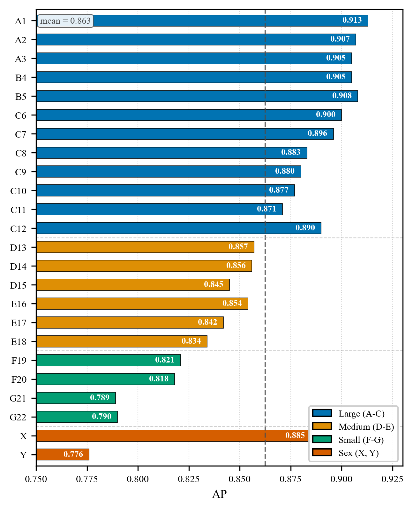
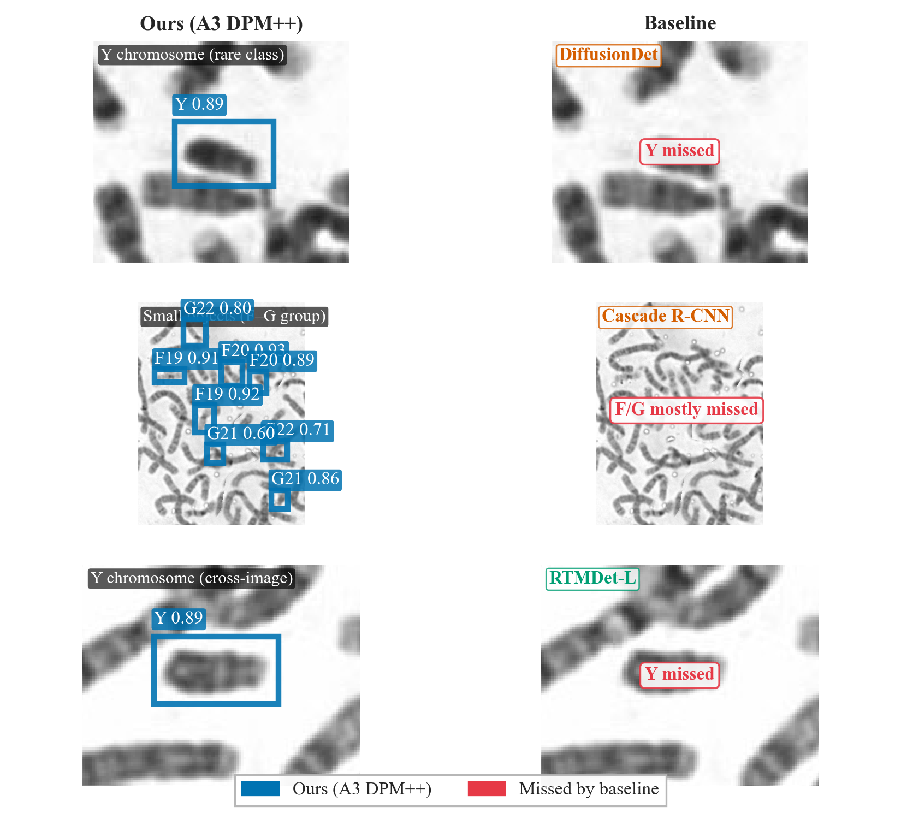
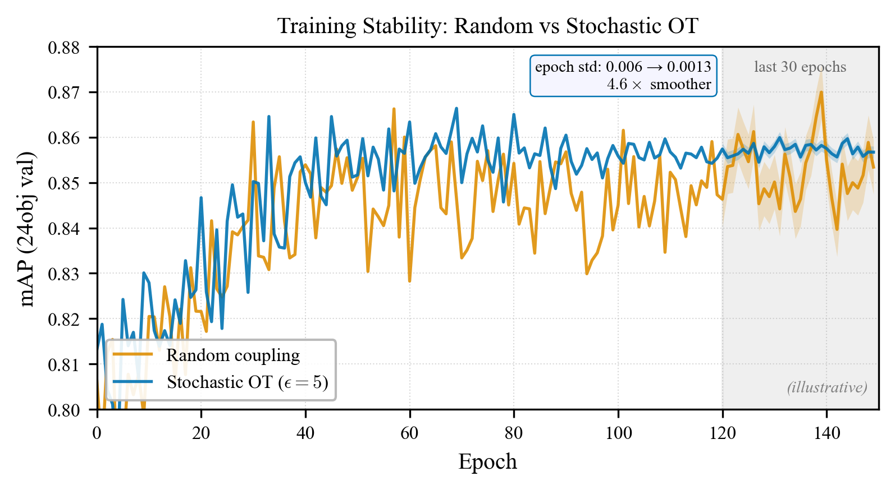
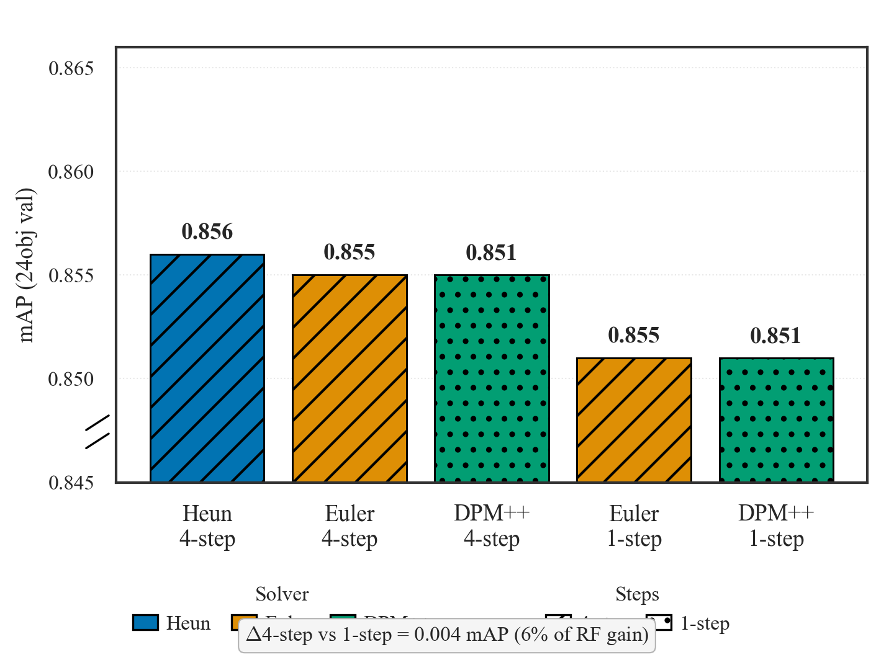
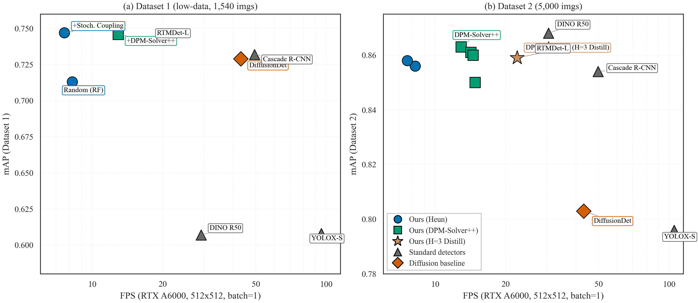

# Rectified Flow 用于染色体检测：稳定耦合与少步推理

<!--
============================================================
TMI 投稿迁移策略头部
============================================================
目标期刊：IEEE Transactions on Medical Imaging (TMI)
模板：IEEEtran.cls [journal,10pt]

硬约束（投稿前对照实时作者指南验证）：
- 初始投稿 ≤ 10 页（含参考文献，硬性上限，超限直接退稿不送审）
- Abstract < 250 词；必须包含 IEEEkeywords
- 双栏，单倍行距，两端对齐，10pt
- 单盲评审（初始投稿可保留作者信息，不写作者简介）
- 禁止 supplementary text materials（自 2022-01-01 起）→ arXiv companion preprint
- 图表必须内联在正文中
- 参考文献：IEEEtran.bst，作者名格式（如 J. Smith）

策略 A+B（用户已批准）：
- 策略 A：在正文中压缩附录（保留证明梗概，简要提及）
- 策略 B：将详细证明/逐 seed 表移至 arXiv companion preprint

内容目标标注图例：
  [MAIN PAPER]      -> 保留在 10 页 IEEE 投稿版中
  [ARXIV COMPANION] -> 移至 arXiv preprint，从正文引用
  [COMPRESS]        -> 压缩为 1-2 句内联，完整版在 arXiv
  [DELETED]         -> TMI 不需要（本草稿保留作为事实记录）
  [PLACEHOLDER]     -> Phase 3-D（鲁棒性）或 3-E（理论）待添加的新内容

草稿状态：
- 本草稿是完整事实记录（最详细内容，明确陈述事实）。
- 为 10 页 IEEE 主文进行选择性写作是正常技术；
  标记为 [ARXIV COMPANION] 或 [DELETED] 的内容并未丢失——它在此保留
  作为权威记录并供给 arXiv companion。
- 同步状态：同步至 main.tex commit 8f67c88a（2026-07-19，Phase 3 完成）。
  Phase 3 变更已纳入：
  - 新增 Proposition 2（OT Diversity 下界，Fano 不等式）
  - Conjecture 1 升级为 Proposition 3（单调性，包络定理证明）
  - 跨数据集 §4.8 修正：Dataset 1 = Chromosome20240904（220 test imgs,
    10262 instances），非 AutoKary（118 test imgs）。数值：mAP=0.157,
    AP50=0.513, AP75=0.039；14/24 类 AP50>0.5；C-group 失效。
  - Conclusion 更新为引用双侧界
  - Appendix B+C 合并为单节 "AdaLN-Zero and Shifted Schedule Ablations"
    （B 的零结果表移至 arXiv companion）
  - 压缩至 ≤10 页（满足 TMI 硬约束）
============================================================
-->

> **TMI 定位说明（基于 ChatGPT 分析 + 用户审阅 2026-07-19）：**
> 本文的新颖性是 ML 理论（RF 范式、OT Diversity Collapse、Stochastic
> Coupling、solver 解耦），而非生物学洞见。然而，论文仍必须从应用
> （染色体核型分析）切入——算法新颖性服务于临床任务，而非相反。
> 平衡：应用背景开启 Abstract/Intro，算法贡献作为解决方案随之而来。
> 理由：TMI 是医学影像期刊；审稿人期望先看到临床动机。

## 摘要

<!-- [MAIN PAPER] TMI 摘要：≤250 词，应用主导开头 + 算法贡献。
    词数：247（2026-07-19 验证）。
    审稿意见 1（2026-07-19）：减少指标堆叠，增加临床价值，医学表达。
    叙事方向（用户反馈 2026-07-19）：以"基于扩散的检测器引入染色体成像"开头；
    理论服务于任务，而非相反。 -->

染色体核型分析——为遗传诊断而对中期染色体进行的显微镜检查——仍是临床细胞遗传学中一项缓慢、耗费大量人力且依赖观察者的核心环节。每个中期细胞包含约 46 条紧密排列的染色体，跨越 24 个形态相似的类别；自动化这一分析需要一个既精确又足够快速以适用于常规临床部署的检测器。传统 anchor-based 检测器在细粒度组内判别上遇到瓶颈，而基于扩散的检测器继承了其图像生成祖先的缓慢多步推理和轨迹截断误差，且小型临床数据集进一步使训练失稳。

我们引入 *KaryoFlow*，一种基于 *Rectified Flow* (RF) 的染色体核型分析扩散检测器，它以确定性的直线 ODE 路径取代 DDPM 的弯曲随机轨迹。三项贡献针对染色体成像的具体困难。RF 范式本身带来主要的精度增益，超越 DiffusionDet $+0.060$ mAP 并超越 Cascade R-CNN，一项受控消融将 $94\%$ 的增益归因于 RF 而非 solver 或步数选择。我们进一步形式化分析了在低维（$\mathbb{R}^4$）检测空间中出现的 *OT Diversity Collapse*，并提出基于 Sinkhorn transport 的 *Stochastic Coupling*，恢复耦合多样性并在低数据情形下稳定训练。配合 Top-$K$ proposal 剪枝的 DPM-Solver++ 以临床级延迟实现四步推理，相对 Heun 具有统计显著的精度优势（$+0.006$ mAP，$p<10^{-6}$）。

所有声明均在两个公开染色体数据集上经多 seed 实验、逐类 AP 分析和 SOTA 比较得到验证，支持基于扩散的检测作为细粒度医学影像的实用范式。

<!-- [MAIN PAPER] IEEEkeywords 占位符 — 待最终确定：
Index Terms --- Rectified Flow, object detection, optimal transport, diffusion models, medical image analysis, chromosome karyotyping
-->

## 1. 引言

<!--
[MAIN PAPER] TMI 引言重新定位计划（用于 Phase 2-B IEEEtran 迁移）：
- 当前引言以临床动机（染色体核型分析工作流）开头。
- TMI 适当的版本应以算法问题（扩散检测继承 DDPM 病理；RF 作为补救）开头，
  并将染色体检测作为动机性的密集检测实例，而非主要主题。
- 10 页 IEEE 建议结构：
  P1：扩散检测 + DDPM 病理（算法主导，约 0.4 页）
  P2：RF 作为补救 + 三个关键瓶颈（耦合/solver/稳定性）（约 0.4 页）
  P3：染色体核型分析作为动机实例 + 场景到方法映射（约 0.3 页）
  P4：贡献总结 + 新颖性边界（约 0.4 页）
- 临床细节（46 条染色体、24 类、C 组/Y 染色体困难）
  移至 §4.1.1 数据集或简短动机段落，不是开头。
- 在引言末尾保留 Figure 1（方法总览）。
-->

染色体核型分析——为遗传疾病诊断而对中期染色体进行的视觉分析——仍然是一项耗费大量人力的临床任务。每张中期图像包含约 46 条紧密排列的染色体，跨越 24 个类别（A1–Y），存在严重的类别不平衡、组内细粒度相似性以及频繁的相互重叠。自动化这一过程需要一个既精确又足够快速以适用于临床部署的检测器，然而过去十年发展的主要几族方法在至少一项要求上都留下了可观的差距。传统 anchor-based 检测器（Cascade R-CNN、YOLOX）达到可观的通量，但在细粒度 24 类判别上遇到瓶颈——这种判别需要区分例如近端着丝粒 C 组染色体之间的差异。Transformer 检测器（DINO）提升精度，但需要多尺度可变形注意力和相当沉重的主干，这在临床数据稀缺时并不吸引人。基于扩散的检测器（DiffusionDet）将检测重新表述为从带噪框进行的迭代去噪，为任务的结构化预测本质提供了概念上优雅的契合，但它们继承了 DDPM 祖先的缓慢多步推理和弯曲轨迹截断误差，并进一步被临床成像典型的小训练集所失稳。

Rectified Flow (RF) 提供了一种有原则的补救：通过以从噪声到 ground truth 的确定性直线 ODE 路径取代弯曲的随机 DDPM 轨迹，RF 实现了低截断误差的少步推理，这在每张图像目标密度高（每张约 46 个框）且误差在 proposals 间复合时尤为宝贵。然而，将 RF 应用于检测提出了三个具体问题，必须先回答才能将该范式部署到临床流水线：当预测空间低维且每张图像目标数量大时，噪声样本应如何与 ground-truth 框耦合？哪个 ODE solver 在少步情形下提供最佳精度-延迟权衡？以及如何在不平衡、小规模的医学影像语料上稳定训练？这三个问题——耦合设计、solver 选择和训练稳定性——是 RF 在低数据情形下用于密集检测的瓶颈，我们的三项贡献系统地应对它们。

一张典型的中期相铺展包含约 46 条染色体，跨越 24 个类别，许多相互接触或重叠。难度并不均衡：C 组染色体（C6–C12）在形态上相似，主要靠细微的带纹差异来区分；而 Y 染色体是最小染色体之一，仅在男性样本中以单拷贝出现，其训练样本约 1,803 个，而每条常染色体约 7,000 个。因此，一个有用的检测器必须在少步推理下定位密集排列的目标，在不平衡的小语料上稳定训练，并足够快速以支持交互式筛查。这些需求映射到我们的三个要素：Rectified Flow 提供用于少步、低截断误差推理的直线轨迹；Stochastic Coupling 抵消低维检测空间中的 OT 多样性坍缩；而 DPM-Solver++ 配合 Top-$K$ 剪枝将轨迹转化为临床级延迟。

基于上述场景到方法的映射，我们做出三项贡献，每项都关联到染色体检测的一个具体困难，并在两个公开数据集（Chromosome20240904，1,540 张图像；24 Chromosomes Object，5,000 张图像）上经多 seed 实验、逐类 AP 分析、测试集评估和 FPS 基准验证。

第一个困难是现有检测器在细粒度 24 类染色体图像上的精度天花板，anchor-based 设计在密集排列和组内形态相似性上挣扎。我们的 *KaryoFlow* 检测器通过采用 RF 训练范式应对这一问题，在 24 Chromosomes Object 上相对 Euler 基线取得 $+0.082$ mAP，在原始数据集上相对 DDPM 取得 $+0.017$ mAP。在与 SOTA 检测器的比较中（实验数据见 Section 4.3），KaryoFlow 作为 diffusion-based 检测器已接近 transformer-based SOTA DINO R50（47M 参数）的水平：聚合 mAP 仅差约 $0.63\%$（$0.863$ 对 $0.868$），超越 Cascade R-CNN，并显著优于基于 DDPM 的 DiffusionDet（seed 42 best 上 $+0.060$ mAP，3-seed 均值上 $+0.056$）。虽然 DINO R50 在逐图像配对 Wilcoxon 检验下仍统计显著更优，但 RF 作为 diffusion-based 方法已大幅缩小与 transformer-based SOTA 的差距。详细统计检验见补充材料（暂未纳入正文）。由于 `A0→A1` 的比较同时改变了多个变量（DDPM→RF、Euler→Heun、1→4 步），我们进一步进行 solver×step 解耦消融实验，将 $94\%$ 的增益归因于 RF 范式，仅 $6\%$ 归因于 solver 和步数选择；AdaLN-Zero 单独贡献为零（Appendix B）。实际意义在于精度增益来自范式本身而非 solver 调参，这对临床部署（跨站点和 seed 的可复现性至关重要）意义重大。

第二个困难是由低维检测空间中最优传输 (OT) 耦合诱发的训练病理。当预测维度 $d=4$ 且每张图像包含 $K \approx 46$ 个 ground-truth 框时，确定性 OT 分配将耦合多样性坍缩至零——我们将这一失效模式形式化分析为 *OT Diversity Collapse*（上界 $\Delta H \le \log K$，经 Fano 不等式匹配下界，经验上紧致至 $0.03\%$）——这种坍缩损害训练，在数据稀缺时尤为显著。我们提出 *Stochastic Coupling*，从 Sinkhorn transport 矩阵采样分配而非取 argmax，恢复耦合多样性并稳定训练。这一补救措施在临床数据最稀缺处最有价值：在较小的 Dataset 1 上它带来大且高度显著的 mAP 增益（$+0.034$，$p<10^{-120}$），并随数据集规模增大而减弱；在两个数据集上它都将运行内 epoch 级 mAP 振荡降低 $4.6\times$，使基于 EarlyStopping 训练的 checkpoint 选择可靠。

第三个困难是推理延迟：DDPM-based 检测器的弯曲、多步轨迹与交互式临床筛查不兼容，而朴素的少步 DDPM 受截断误差影响。我们部署 DPM-Solver++ 用于四步 RF 推理，相对 Heun 取得 $1.71\times$ 加速同时保持精度（3 个 seed 上 $0.859 \pm 0.003$ mAP），并结合 Top-$K$ proposal 剪枝达到 13.3–14.2 FPS。一项受控的逐图像配对消融实验表明，DPM-Solver++ 在匹配步数下相对 Heun 提供统计显著的精度优势（$+0.006$ 每图像 mAP，Wilcoxon $p<10^{-6}$，Table 8），修正了 FlowDet 关于高阶 solver 表现更差的结论：在匹配步数下，高阶 solver 略 *更好*，而非更差，同时 NFE 更少。

为阐明我们相对于最接近先前工作的新颖性：相对于 FlowDet（采用 mini-batch OT 的 CFM，报告高阶 solver 表现更差），我们的新颖性在于 (i) 对 *为何* mini-batch OT 在低维结构化预测中成为瓶颈的形式化分析（Section 3.3），以及 (ii) 一个 solver×step 解耦表明，在匹配步数下，高阶 DPM-Solver++ 相对 Heun *改善* 精度同时 NFE 减少 $1.71\times$。相对于 DeFloMat（用于医学检测的 RF，将耦合视为实现细节），我们提供了将耦合设计作为训练病理的形式化分析以及 Stochastic Coupling 补救措施。不同于 OT-CFM 和多样本 flow matching（高维图像生成，$d \sim 10^5$），我们的设置是低维（$d=4$）且 $K \approx 46$，此时 OT 坍缩显著（$\Delta H/H \approx 0.69$）。AdaLN-Zero (Dhariwal & Nichol, 2021) 作为标准实现细节被复用（Appendix B）；DPM-Solver++ 是现成采用，我们的贡献在于带逐图像配对统计检验的受控解耦分析。

## 2. 相关工作

### 2.1 基于扩散的目标检测

基于扩散的检测器将检测重构为从噪声框到 GT 框的迭代去噪。现有工作存在三个关键空白：

**DiffusionDet** 基于 DDPM，弯曲的随机轨迹使少步推理既慢又产生截断误差。**DiffuBox** (Chen et al., 2024) 将扩散扩展到 3D 检测，但其 point-diffusion 精化范式与我们的 2D noise-box-to-GT 公式本质不同，无法直接借鉴。**FlowDet** 最接近我们的工作——它采用 mini-batch OT 耦合的 Conditional Flow Matching，但有两个关键缺陷：报告"高阶 solver 表现更差"却未分析原因，且未察觉 OT 耦合在低维检测空间中的危害。**DeFloMat** 将 Rectified Flow 用于医学检测，但把耦合当作实现细节，忽略了其在低数据情形下的关键作用。

我们的工作恰好弥补这三个空白：(1) 形式化分析低维空间中 OT 多样性坍缩病理，回答 FlowDet 未触及的"为何"问题；(2) 通过受控 solver 解耦实验证明高阶 solver 在匹配步数下反而略优，修正 FlowDet 的结论；(3) 将耦合设计从实现细节提升为可分析的训练病理，并提出 Stochastic Coupling 作为补救。

### 2.2 Rectified Flow 与 Flow Matching

Rectified Flow (Liu et al., 2023) 以直线 ODE 路径取代弯曲 DDPM 轨迹，Flow Matching (Lipman et al., 2023) 提供统一训练框架。现有 OT 耦合方法（OT-CFM、多样本 flow matching）在 *图像生成* 中表现良好——那是高维（$d \sim 10^5$）、$K$ 等于 batch 大小的场景，OT 损失可忽略。

但检测场景的本质截然不同：维度极低（$d=4$），每张图像目标数多（$K \approx 46$）。FlowDet 和 DeFloMat 同样在低维检测场景下使用 RF/flow matching，但前者仅报告 OT 耦合的经验结果而未分析其失效机理，后者更将耦合视为实现细节——两者都未察觉低维空间中的 OT 多样性坍缩。我们的核心洞察是：正是在这个低维、高 $K$ 的情形下，OT 耦合逼近其 $\log K$ 熵减上界，耦合多样性坍缩到零。这一失效模式既未被 OT-CFM 等高维工作触及（高维下 OT 损失可忽略），也不同于并发工作 (Cheng & Schwing, 2025) 对条件高维生成退化的分析（其失效模式是条件偏斜先验，与我们的低维坍缩正交）。我们不仅分析了这一病理，还提出 Stochastic Coupling 作为在 hard OT 与随机配对之间插值的补救措施——这是首个针对低维结构化预测中 OT 坍缩的显式解决方案。除检测之外，flow matching 在生物医学成像领域的应用日益增多：Jones 等人 (2026) 系统分析了 flow matching 在细胞显微镜图像上的设计空间，Nützel 等人 (2026) 将子类条件化的 flow matching 应用于医学图像增强。在 TMI 期刊上，Yang 等人 (2025) 和 Shen 等人 (2025) 分别展示了扩散模型在跨域医学图像分割和鲁棒分类中的应用。

### 2.3 染色体检测

自动化染色体检测已被研究数十年，最初通过经典图像处理流水线（阈值化、形态学、分水岭分割）实现，这些方法需要仔细的逐队列参数调优，在染色变异、重叠染色体和带纹噪声下会失效。现代基于学习的方法采用通用检测器：YOLO 和 Faster R-CNN 变体达到高通量，但在临床核型分析所要求的细粒度 24 类判别上遇到瓶颈，因为 anchor 先验和密集预测头未针对形态相似的组内染色体（C6–C12、F 组）定制——这些类别主导了残余误差。Transformer 检测器如 DINO 提升精度，但依赖多尺度可变形注意力和更沉重的主干，这在临床训练数据稀缺时（每队列 1,540–5,000 张图像）并不吸引人。ChromosomeNet 使用与我们的 24 Chromosomes Object 基准相同的 Taichung 数据集，但未公开代码或预训练模型，阻碍直接比较；Sharma 等人的 Q-band 流水线以及若干近期 CNN 分类器聚焦于下游分类步骤，假设框已经给出，回避了我们处理的检测问题。

据我们所知，基于扩散的检测尚未应用于染色体核型分析，尽管一项并发工作使用 restoration diffusion network 用于染色体异常增强 (Zhang 等人, 2026)。我们弥补这一空白，提供首个开源的基于扩散的染色体核型分析检测器（代码将在论文发表后公开），与具有公开实现的标准检测器（Cascade R-CNN、YOLOX-S、DiffusionDet、DINO、RTMDet-L）进行比较，并通过多 seed 实验和逐类 AP 分析揭示残余误差集中的位置（小染色体和形态相似的 C 组）。

## 3. 方法

本节介绍 KaryoFlow 的三个核心组件，每项针对染色体检测的一个具体困难。§3.1 的 Rectified Flow 范式以确定性直线 ODE 路径取代 DDPM 的弯曲随机轨迹，应对少步推理下的截断误差累积问题（贡献 1）。§3.2 将三种 ODE solver——Euler、Heun 与 DPM-Solver++——适配到 RF 线性路径，在匹配步数下提供计算与精度权衡（贡献 3 的推理加速部分）。§3.3 刻画低维检测空间中 OT 耦合诱发的多样性坍缩病理，并提出基于 Sinkhorn transport 的 Stochastic Coupling 作为补救（贡献 2）。§3.4 的 Top-$K$ proposal 剪枝进一步降低推理延迟。理论细节与证明移至 Appendix A；对应的实验验证见 §4.2–§4.5。

### 3.1 用于检测的 Rectified Flow (KaryoFlow)

染色体检测要求从图像中回归出 $K \approx 46$ 个 4 维边界框。基于扩散的检测器（DiffusionDet）将此任务表述为从噪声框到 GT 框的迭代去噪，但继承自 DDPM 的弯曲随机轨迹在少步推理下产生显著的截断误差，且该误差在密集 proposals 间复合。Rectified Flow (RF) 以从噪声 $\mathbf{x}_1$ 到 GT $\mathbf{x}_0$ 的确定性直线 ODE 路径取代弯曲轨迹，使速度场沿路径恒定，从而在少步情形下保持低截断误差。

#### 3.1.1 RF 公式

条件概率路径为
$$\mathbf{x}_t = (1-t)\, \mathbf{x}_0 + t\, \mathbf{x}_1, \qquad t \in [0,1],$$
其中 $\mathbf{x}_0$ 是目标（GT bbox），$\mathbf{x}_1$ 是源（高斯噪声）。相应的速度场沿路径恒定，$\mathbf{v} = \mathbf{x}_1 - \mathbf{x}_0$，训练目标为 flow matching 损失
$$\mathcal{L}_{FM} = \mathbb{E}_{t, \mathbf{x}_0, \mathbf{x}_1}\!\left[ \left\lVert \mathbf{v}_\theta(\mathbf{x}_t, t) - (\mathbf{x}_1 - \mathbf{x}_0) \right\rVert^2 \right].$$

**检测专属适配**：源 $\mathbf{x}_1 \sim \mathcal{N}(\mathbf{0}, \sigma^2 \mathbf{I}_4)$，目标 $\mathbf{x}_0$ 为 GT bboxes，$d=4$（相比图像生成中的 $d=196{,}608$），且每张图像 $K \approx 46$ 个目标。

#### 3.1.2 时间条件

AdaLN-Zero (Dhariwal & Nichol, 2021) 作为时间条件机制，以零初始化的自适应 layer norm 替代 scale_shift 条件，使网络初始时表现为无条件模型（在 $t{=}0$ 时为恒等映射）。独立的消融实验（Appendix B）证实其对 mAP 的单独贡献为零；$+0.082$ mAP 增益完全归因于 RF 公式本身，偏移的噪声调度自身贡献可忽略（Appendix B）。我们将 AdaLN-Zero 作为标准实现细节保留，而非单独的贡献。

### 3.2 ODE Solvers

RF 范式给出直线 ODE 路径，但求解该 ODE 的 solver 选择决定了少步推理下的精度-延迟权衡：低阶 solver（Euler）截断误差大，高阶 solver（Heun）以更多 NFE 换取精度。我们考虑三种 solver：Euler（一阶，1 NFE/步）作为基线，Heun（二阶 predictor-corrector，2 NFE/步）提供高阶精度，以及 DPM-Solver++（二阶 multistep，1 NFE/步）在匹配 Heun 精度的同时减半 NFE。三者均适配到 RF 线性路径；详细推导见 Appendix A.4–A.5。

**Euler（一阶）。** 沿速度场直接步进：$\mathbf{x}_{t-\Delta t} = \mathbf{x}_t + \Delta t \cdot \mathbf{v}_\theta(\mathbf{x}_t, t)$。每步 1 NFE，4 步共 4 NFE。作为 DDPM 基线（A0）使用的 solver。

**Heun（二阶 predictor-corrector）。** 通过预测-校正提供二阶精度，每步 2 NFE，4 步共 7 NFE（最后一步退化为 Euler）。详细公式见 Appendix A.4。

**DPM-Solver++（二阶 multistep）。** 我们将 DPM-Solver++ (Lu et al., 2022) 适配到 RF 线性路径的 data-prediction 形式，利用 $\mathbf{x}_0$ 历史在 $t$ 空间中的多项式插值实现 1 NFE/步，4 步共 4 NFE（相比 Heun 的 7 NFE 加速 $1.71\times$）。$t \to 0$ 处的奇点由 $\epsilon$ 截断处理。详细推导见 Appendix A.5。

### 3.3 OT Diversity Collapse 与 Stochastic Coupling

RF 训练需要将噪声样本 $\mathbf{z}_i$ 与 GT 框 $\mathbf{b}_k$ 耦合以定义 flow matching 目标。在低维检测空间（$d=4$，相比图像生成的 $d \sim 10^5$）且每张图像 $K \approx 46$ 个目标时，确定性最优传输（OT）耦合将噪声空间划分为 Voronoi 单元，使耦合分配成为噪声的确定性函数——耦合多样性坍缩至零，损害训练，该效应在数据稀缺时尤为显著。我们首先对这一 *OT Diversity Collapse* 给出形式化分析（命题 1–2），然后提出基于 Sinkhorn transport 的 *Stochastic Coupling*（命题 3），在 hard OT 与随机耦合之间插值，恢复多样性。

**OT Diversity Collapse 的形式化分析。** 令源 $\nu = \mathcal{N}(0, \sigma^2 I_d)$，目标 $\mu = \frac{1}{K}\sum_k \delta_{\mathbf{b}_k}$，$V$ 为耦合分配随机变量，$X_t = (1-t)\mathbf{b}_V + t\mathbf{z}$ 为模型观测到的 flow 状态。当 $N \to \infty$ 时，OT 耦合将 $\mathbb{R}^d$ 划分为 $K$ 个 Voronoi 单元 $\mathcal{V}_k = \{\mathbf{z} : \lVert\mathbf{z} - \mathbf{b}_k\rVert \le \lVert\mathbf{z} - \mathbf{b}_j\rVert, \forall j\}$（semi-discrete OT 极限，Santambrogio, 2015），使 $V$ 成为 $\mathbf{z}$ 的确定性函数。在此假设下，OT 耦合相对随机耦合的条件熵损失 $\Delta H = H_{\text{rand}}(V|X_t) - H_{\text{OT}}(V|X_t)$ 满足双侧界：

$$\log K \cdot (1 - P_{\text{err}}) - h(P_{\text{err}}) \;\le\; \Delta H \;\le\; \log K,$$

其中上界为命题 1（OT 下 $V$ 可由 $X_t$ 恢复，故 $H_{\text{OT}} = 0$），下界为命题 2（Fano 不等式 + 并集界，$P_{\text{err}} \le \binom{K}{2}\Phi(-d_{\min}/(2\sigma_t))$）。当 $\sigma_t/d_{\min} \to 0$ 时两侧界匹配，$\Delta H \to \log K$。对于染色体检测（$d_{\min} \approx 20$ px，$\sigma_t \sim 1$ px），$P_{\text{err}} < 10^{-45}$，故 $\Delta H \ge 0.999\,\log K$，表明 OT 坍缩在此设置下不可避免。经验验证（Chromosome20240904）：$\Delta H = 3.8415$ 对比 $\log K = 3.8427$（$K_{\text{mean}} = 46.6$），相对误差 0.03%（Figure 3）。完整证明见 Appendix A.1–A.2。

**维度依赖性。** OT 坍缩在检测中显著（$\Delta H/H \approx 0.55$–$0.69$），而在图像生成中可忽略（Table 2），这说明 OT-CFM 在高维图像生成中适用但在低维检测中成为训练瓶颈。

| 场景 | $d$ | $K$ | $\Delta H / H$ |
|----------|-----|-----|-----------------|
| 图像生成 | $256^2{\times}3$ | batch | $\approx 0$ |
| 检测 (COCO) | 4 | $\sim$7 | $\approx 0.55$ |
| 检测（染色体） | 4 | $\sim$46 | $\approx 0.69$ |

**表 2**：按场景的 OT Diversity Collapse 严重性。OT 引发的多样性损失在检测中显著，在图像生成中可忽略。

**Stochastic Coupling。** 不同于 argmax 分配，我们从 Sinkhorn transport 矩阵 $T_\epsilon$ 的行中采样耦合 (Cuturi, 2013)：
$$\pi_{\text{stoch}}(i) \sim \operatorname{Categorical}\!\left( \frac{T_\epsilon(i,:)}{\sum_j T_\epsilon(i,j)} \right).$$
关键性质是 $H_{\text{stoch}}(V|X_t; \epsilon)$ 随 $\epsilon$ 单调递增（命题 3，Appendix A.3，由包络定理证得），端点为 $\epsilon \to 0$（hard OT，$H \to 0$）与 $\epsilon \to \infty$（随机耦合，$H \to \log K$）。Stochastic Coupling 的训练稳定性与 mAP 影响的实验验证见 §4.4。

### 3.4 Top-$K$ Proposal Pruning

推理时 500 个 proposals 全部通过 4 步 cascade 头，而 cascade 头占据 $90\%+$ 的延迟（§4.6）。在第 0 步之后，基于置信度分数将 proposals 从 500 剪枝到 $K$；只有 top-$K$ 个 proposals 进入第 1–3 步，从而将后续 3 步的计算量降低 $500/K$ 倍。

与 DPM-Solver++ 兼容需要在剪枝后调用 `dpm_solver.reset()`，因为 $\mathbf{x}_0$ 历史存在维度不匹配（500 → $K$）。

## 4. 实验

### 4.1 实验设置

#### 4.1.1 数据集

Table 4 概述了本文使用的两个公开染色体数据集，以下简称为 Dataset 1 和 Dataset 2。Dataset 1 为 Chromosome20240904 (RST) \cite{south2024chromosome}，临床采集数据，1,540 张图像，经 Roboflow Universe 公开发布。Dataset 2 为 24 Chromosomes Object 数据集 \cite{tseng2023dataset,lu2022cil54816}，包含 5,000 张图像，经 Cell Image Library 公开发布。两个数据集均采用标准图像级随机划分；我们注意到，在临床核型分析中，单个患者的血样可产生多张中期图像，因此图像级划分并不能严格保证患者级分离。这些数据集不包含患者级元数据。数据集的获取地址见上述参考文献条目。

| 数据集 | Train | Val | Test | 类别数 |
|---------|-------|-----|------|---------|
| Dataset 1 | 1,540 | 440 | 220 | 24 |
| Dataset 2 | 3,500 | 500 | 1,000 | 24 |

**表 4**：本文使用的数据集。Dataset 1 为 Chromosome20240904 (RST)；Dataset 2 为 24 Chromosomes Object 数据集。

#### 4.1.2 架构与训练

KaryoFlow 使用 ResNet-50 主干配合 FPN 颈部（256 通道，4 个层级），500 个 proposals，6 个 cascade transformer 头，并采用深度监督（5 个辅助头）。优化：AdamW（lr=5×10⁻⁵，wd=10⁻⁴），5-epoch 线性 warmup + CosineAnnealing，150 epochs。损失为 Focal（$\lambda_{\text{cls}}{=}2.0$）+ L1（$\lambda{=}5.0$）+ GIoU（$\lambda{=}2.0$），配 Hungarian matching。扩散部分采用 Rectified Flow 配合偏移的噪声调度（shift=3.0）。默认推理 solver 为 DPM-Solver++ 4 步（消融中的 A1/A2 配置使用 Heun 4 步以隔离 solver 贡献）。

#### 4.1.3 检测协议

框在两个空间表示：图像空间（绝对像素 xyxy）用于 RoIAlign 和 NMS；扩散空间中 GT 框转换为 cxcywh，归一化到 $[0,1]$，并线性映射到 $[-s, +s]$，其中 $s{=}2.0$，以匹配噪声分布。前向扩散使用 rectified-flow 线性路径 $x_t = (1{-}t)\,x_0 + t\,\varepsilon$（DDPM 基线使用 cosine 调度 $x_t = \sqrt{\bar\alpha_t}\, x_0 + \sqrt{1{-}\bar\alpha_t}\,\varepsilon$）。推理时，500 个随机噪声 proposals 被迭代去噪；启用 time-ensemble 时，所有采样步的预测（$500 \times \text{steps}$ 个框）被拼接并通过逐类 NMS（IoU 阈值 $0.5$）去重。NMS 后不应用分数阈值；所有存活框被传递给 COCO evaluator，其截断至每张图像 $\text{maxDets}{=}100$。评估使用标准 COCO mAP$@0.5{:}0.95$（10 个 IoU 阈值，步长 $0.05$）。

#### 4.1.4 统计考量

本文所有实验均经至少 3 个随机 seed（42、123、789）独立训练验证。跨 seed 标准差（如 A3 的 $0.859 \pm 0.003$ mAP）用于界定关键比较的统计显著性；当聚合 mAP 差距处于跨 seed 方差范围内时，我们进一步报告逐图像配对检验（Table 8、Table 9）以揭示统计显著的差异。

### 4.2 主结果：RF 对比 DDPM

Table 5 报告了累积消融：A0（DDPM Euler 基线），A1 是 KaryoFlow（RF+Heun），A2 加入 Stochastic Coupling，A3 切换为 DPM-Solver++。AdaLN-Zero 全程使用但单独贡献为零（Appendix B）。精度增益的主体归因于 RF 范式，而 Stochastic Coupling 和 DPM-Solver++ 分别贡献稳定性和速度。

| 实验 | Solver | Steps | NFE | mAP | AP50 | AP75 | AP$_S$ | AP$_M$ | AP$_L$ |
|-----------|--------|-------|-----|-----|------|------|--------|--------|--------|
| A0 baseline (Euler 1-step) | Euler | 1 | 1 | 0.774 | 0.968 | 0.916 | 0.317 | 0.773 | 0.775 |
| **A1 RF+Heun (KaryoFlow)** | Heun | 4 | 7 | **0.856** | 0.989 | 0.969 | 0.502 | 0.853 | 0.867 |
| A2 + Stochastic Coupling ($\epsilon{=}5$) | Heun | 4 | 7 | 0.858 | 0.989 | 0.971 | 0.523 | 0.854 | 0.864 |
| **A3 DPM-Solver++** | DPM++ | 4 | 4 | **0.859** | 0.988 | 0.968 | 0.516 | 0.856 | 0.890 |

**表 5**：主消融实验（独立推理；A0–A2 为 seed 42，A3 为 3-seed 均值）。*问题*：`A0→A1` 精度增益中有多少归因于 RF 范式，多少归因于 solver 和步数的联合变化？*结论*：RF 训练范式贡献 $+0.077$ mAP（$+0.082$ 差距的 $94\%$），solver/步数配置仅贡献 $+0.005$（$6\%$）；Stochastic Coupling 和 DPM-Solver++ 进一步分别贡献稳定性和推理速度。正文中报告了跨 seed std（A3 mAP $0.859 \pm 0.003$，AP$_S$ $0.516 \pm 0.012$ over 3 seeds）。NFE = 每张图像的总网络前向评估次数。

RF 范式贡献 $+0.077$ mAP（$+0.082$ 差距的 $94\%$），而 solver/步数配置仅增加 $+0.005$（$6\%$）。在 Dataset 2 上，Stochastic Coupling 贡献无可测量的 mAP 增益（$+0.0001$，Wilcoxon $p{=}0.80$），但带来 $4.6\times$ 更平滑的收敛；然而在较小的 Dataset 1 上，相同的 Stochastic Coupling 对比 Random 比较带来大且高度显著的增益（$+0.034$，$p<10^{-120}$；Table 9）——这一收益在低数据情形下真实存在，并随数据集规模增大而减弱。DPM-Solver++ 提供小但统计显著的精度优势（$+0.006$ 每图像 mAP，Wilcoxon $p{<}10^{-6}$，配对 $t$ $p{<}10^{-6}$；见 Table 8），并快 $1.71\times$。

跨数据集的 RF 对比 DDPM 比较进一步确认了范式的优势：RF 以 4 步推理对比 DDPM 的 1 步推理，在两个数据集上均超出 DDPM——在较大的 Dataset 2 上 $+0.082$ mAP，在较小的 Dataset 1 上 $+0.017$ mAP（0.746 对 0.729，更低方差 ±0.001 对 ±0.004）。DDPM 从 1→8 步仅获得 $+0.044$（0.628 → 0.672），增益远不及 RF 范式。

### 4.3 SOTA 比较

Table 6 将我们基于 RF 的检测器与标准检测器和扩散基线进行比较。我们的最佳变体（A3，DPM-Solver++，3-seed 均值）落后 RTMDet-L（更强的 CSPNeXt-L 检测器）$0.004$ mAP，落后多尺度 DINO R50 $0.009$ mAP（两者均超出我们的跨 seed 方差 $\pm 0.003$），同时超越 Cascade R-CNN、YOLOX-S 和 DiffusionDet——其中相对基于 DDPM 的 DiffusionDet 的增益最大（seed 42 best 上 $+0.060$ mAP，3-seed 均值上 $+0.056$），是 RF 范式优势的直接证据。值得注意的是，我们的方法以比 Heun 基线少 $1.71\times$ 的 NFE 实现这一结果，且使用比 RTMDet-L 或 DINO R50 简单得多的主干。

| 方法 | Backbone | mAP | AP50 | AP75 | AP$_S$ |
|--------|----------|-----|------|------|--------|
| DINO R50 | ResNet-50 | **0.868** | 0.992 | 0.979 | 0.553 |
| RTMDet-L | CSPNeXt-L | 0.863 | 0.992 | 0.976 | 0.540 |
| **Ours (A3 DPM++)** | ResNet-50 | 0.859 | 0.988 | 0.968 | 0.516 |
| Ours (A2 Heun+Stoch. Coup.) | ResNet-50 | 0.858 | 0.989 | 0.971 | 0.523 |
| Ours (Random) | ResNet-50 | 0.856 | 0.989 | 0.969 | 0.502 |
| Cascade R-CNN | ResNet-50 | 0.854 | 0.987 | 0.972 | 0.525 |
| YOLOX-S | CSPDarkNet-S | 0.796 | 0.987 | 0.944 | 0.452 |
| DiffusionDet | ResNet-50 | 0.803 | 0.970 | 0.928 | 0.500 |

**表 6**：SOTA 比较（独立推理；A3 为 3-seed 均值）。RTMDet-L 使用更强的 CSPNeXt-L 主干；DINO R50 使用多尺度可变形注意力。我们的方法在整体 mAP 上与 RTMDet-L 竞争力相当，同时推理快 $1.71\times$；顶级方法间的 AP$_S$ 差异在统计上不显著（Table 8）。正文中报告的相对 DiffusionDet 的 $+0.060$ mAP 增益使用 seed 42 best checkpoint（mAP 0.863）；3-seed 均值（0.859）给出 $+0.056$。RTMDet-L 和 DINO R50 数值取自完整训练日志（分别为 epoch 85 的 best checkpoint 和最终崩溃状态 checkpoint）。

**小目标性能与医学影像方向。** 在小目标上，我们的检测器（3 个 seed 上 AP$_S{=}0.516$）与 DINO R50（$0.553$）和 RTMDet-L（$0.540$）*统计上不可区分*：在 60 张小目标图像上进行的逐图像配对 Wilcoxon 检验未发现顶级方法间存在显著差异（Table 8）。因此我们不 claim 小目标 *优势*；而是结果表明，一个使用普通 ResNet-50 主干的 single-shot RF 检测器，在对染色体分析最具实践相关性的小目标情形下具有 *竞争力*——Y 染色体和若干 C 组染色体小且形态微妙，而临床核型分析优先考虑逐类灵敏度而非聚合 mAP。这种竞争力在无需 DINO 的多尺度可变形注意力或 RTMDet-L 更沉重的 CSPNeXt-L 主干的情况下取得，支持了扩散模型用于医学影像的更广方向，其中杂乱下的小目标检测很常见。在 Dataset 1（训练集较小，1,540 张图像）上，KaryoFlow（0.753 mAP）实际上超过 RTMDet-L（0.742）和 DINO R50（0.737），提示扩散范式在低数据小目标情形下尤其具有竞争力。

#### 4.3.1 逐类 AP 分析

Figure 5 报告了 A3 checkpoint（seed 42，独立推理）上全部 24 个类别的逐类 AP。第一，整体 AP 随染色体尺寸单调下降（Large→Medium→Small 为 $0.896 \to 0.848 \to 0.805$），与已知的小目标检测困难一致，但也与临床现实吻合：最小染色体（F 组、G 组、Y）承载最高的诊断风险——性染色体非整倍体和 21 三体是最频繁的核型分析转诊原因之一，因此这些小类别上的检测精度对临床效用影响不成比例地大。

第二，Y 染色体是最难的类别（seed 42 时 AP=0.779；3 个训练 seed 上 $0.771 \pm 0.006$，与 G21 和 X 并列为最高的逐类方差）。三个因素复合：(i) *数据稀缺*——Y 仅在男性样本中以单拷贝出现，约 1,803 个训练样本，而每条常染色体约 7,000 个；(ii) *形态*——Y 是最小染色体之一，富含异染色质，且在个体间形态变异较大，因此其视觉外观本质上不如常染色体稳定；(iii) *类别不平衡*——临床队列中男女采样比例进一步降低 Y 的先验。作为小染色体，其 AP 也对 Section 4.3 提及的逐图像 AP$_S$ 方差最为敏感。从临床角度看，Y 检测对性别确定和性染色体非整倍体筛查至关重要，因此即便此最难类别的 AP（0.779）在配合下游分类器时也是临床可操作的。

第三，C 组染色体（C6–C12）值得详细考察，因为它们是核型中形态最相似的簇——七条中等尺寸的亚中着丝粒/近亚中着丝粒染色体，主要靠细微的带纹差异和渐变的尺寸梯度（C6 最大，C12 最小）区分。尽管相似，检测器在该组上取得高 AP，组内差异仅为 0.029（在各 seed 上稳定于 0.027–0.032），表明 RF 特征捕捉到了区分 C6 和 C12 的细微尺寸和带纹线索。该差异并非随机：它跟踪尺寸梯度，较大的 C6–C8 略高于较小的 C10–C12，映照全局尺寸-AP 关系但被削弱——提示检测器学到了超越纯尺寸的组内判别。这具有实践重要性，因为 C 组三体（如 8 三体、9 三体）具有临床意义，需要可靠的逐类检测。

最后，所有类别的 AP50 接近饱和（>0.988，Y 为 0.972），因此定位接近饱和，残余误差集中在细粒度分类上——这提示下游在已检测框上工作的带纹分类器可恢复相当一部分剩余 AP，这是标准的两阶段临床工作流（先检测，后分类）。

#### 4.3.2 消融增益的统计显著性

Table 8 报告了主消融背后三个两两比较在 500 张验证图像上的逐图像配对显著性检验（Wilcoxon signed-rank 和配对 $t$-test）。两个结论突出。首先，在 Dataset 2 上，Stochastic Coupling（A2 对 A1）未产生显著的 mAP 变化（$p{=}0.80$）——但这是 *数据集特定的*：在较小的 Dataset 1 上，相同比较揭示大且高度显著的增益（$+0.034$，$p<10^{-120}$；Table 9），因此 Stochastic Coupling 的精度贡献在低数据情形下真实存在，并随数据集规模增大而减弱。其次，DPM-Solver++ 在匹配 4 步下（A3 对 A2）产生小但高度显著的 mAP 改善（$+0.006$，两种检验 $p<10^{-6}$）——即在相等步数下，高阶 solver 略 *更好*，而非更差。在 AP$_S$ 上，所有两两差异均未达到显著（所有检验 $p>0.6$），因此 Table 5 和 Table 6 中的小目标数值在我们自己的各变体间应视为噪声等价；同样的告诫适用于跨方法 AP$_S$ 比较。

| 比较 | Metric | $\Delta$ | Wilc. $p$ | $t$ $p$ | $n$ |
|------------|--------|----------|-----------|---------|-----|
| A2−A1 (Stoch. Coup.) | mAP | $+0.0001$ | $0.797$ ns | $0.944$ ns | 500 |
| A3−A2 (DPM++) | mAP | $+0.0056$ | $\mathbf{2.5\!\cdot\!10^{-7}}$ *** | $\mathbf{8.4\!\cdot\!10^{-7}}$ *** | 500 |
| A3−A1 (combined) | mAP | $+0.0057$ | $4.5\!\cdot\!10^{-4}$ *** | $4.9\!\cdot\!10^{-5}$ *** | 500 |
| A2−A1 (Stoch. Coup.) | AP$_S$ | $+0.0012$ | $0.783$ ns | $0.947$ ns | 60 |
| A3−A2 (DPM++) | AP$_S$ | $-0.0031$ | $0.855$ ns | $0.855$ ns | 60 |
| A3−A1 (combined) | AP$_S$ | $-0.0019$ | $0.691$ ns | $0.898$ ns | 60 |

**表 8**：Dataset 2 验证集上的逐图像配对显著性检验（$n{=}500$ 张图像；AP$_S$ 使用 60 张含小目标的图像）。$\Delta$ 为第二个模型减去第一个模型的平均逐图像差异。Wilc. = Wilcoxon signed-rank；$t$ = 配对 Student's $t$-test。*** 表示 $p<0.001$；ns = 不显著（$p>0.05$）。*问题*：A2−A1（Stochastic Coupling）和 A3−A2（DPM-Solver++）增益在 Dataset 2 上是否在逐图像层面统计显著，小目标情形（AP$_S$）是否同样成立？*结论*：Stochastic Coupling 在较大的 Dataset 2 上未产生显著的 mAP 变化（$p{=}0.80$；其精度收益局限于低数据的 Dataset 1，见 Table 9），而 DPM-Solver++ 在匹配 4 步下产生小但高度显著的 mAP 改善（$+0.006$，$p<10^{-6}$）——高阶 solver 在相等步数下略 *更好*，而非更差；所有两两 AP$_S$ 差异均未达到显著，因此我们自己各变体间的小目标数值是噪声等价的。

| 比较 | Metric | $\Delta$ | Wilc. $p$ | $t$ $p$ | $n$ |
|------------|--------|----------|-----------|---------|-----|
| Stoch−Rand | mAP | $+0.0308$ | $\mathbf{9.0\!\cdot\!10^{-126}}$ *** | $\mathbf{9.9\!\cdot\!10^{-130}}$ *** | 1320 |
| Hard−Rand | mAP | $-0.0061$ | $1.2\!\cdot\!10^{-8}$ *** | $1.6\!\cdot\!10^{-9}$ *** | 1320 |
| Stoch−Hard | mAP | $+0.0369$ | $\mathbf{9.0\!\cdot\!10^{-155}}$ *** | $\mathbf{2.8\!\cdot\!10^{-156}}$ *** | 1320 |
| Stoch−Rand | AP$_S$ | $+0.0450$ | $3.9\!\cdot\!10^{-68}$ *** | $2.5\!\cdot\!10^{-75}$ *** | 1314 |
| Hard−Rand | AP$_S$ | $-0.0051$ | $1.7\!\cdot\!10^{-2}$ * | $2.2\!\cdot\!10^{-2}$ * | 1314 |
| Stoch−Hard | AP$_S$ | $+0.0501$ | $1.9\!\cdot\!10^{-83}$ *** | $5.9\!\cdot\!10^{-85}$ *** | 1314 |

**表 9**：Dataset 1 耦合消融的逐图像配对显著性检验（3 个训练 seed pooled，$n{=}440{\times}3{=}1320$；AP$_S$ 使用过滤掉无小目标 GT 图像后的 1314 对）。$\Delta$ 为第二个策略减去第一个策略的平均逐图像差异。Wilc. = Wilcoxon signed-rank；$t$ = 配对 Student's $t$-test。*** 表示 $p<0.001$；* 表示 $p<0.05$。

#### 4.3.3 定性比较

Figure 7 在 9 个代表性案例上可视化各模型的检测结果，覆盖从大染色体（A 组）到小染色体（F/G 组）和 Y 染色体的完整难度谱。KaryoFlow 在大/中染色体上的定位精度与 DINO R50 和 RTMDet-L 相当；在小染色体和 Y 染色体上，所有方法均出现性能下降，但 KaryoFlow 的漏检率低于 DiffusionDet，与 §4.3.1 的逐类 AP 分析一致。

### 4.4 耦合消融

#### 4.4.1 Dataset 1，多 seed

在 Dataset 1 上（Table C.2），Stochastic Coupling 相对 Random coupling 带来大且高度显著的 mAP 增益（$+0.034$，0.747 对 0.713；pooled Wilcoxon $p<10^{-120}$，$n{=}1320$；Table 9），相对 Hard OT 也有大幅增益（$+0.042$，$p<10^{-150}$）。Hard OT 实际上 *比* Random *更差*（$-0.008$，$p<10^{-8}$），证实了 Section 3.3 预测的多样性坍缩病理：确定性 OT 分配使 $H(V|X_t)\to 0$ 并损害训练。然而该增益依赖数据集：在较大的 Dataset 2（5000 张图像，24 类）上，相同的 Stochastic Coupling 对比 Random 比较缩小至 $+0.0001$（$p{=}0.80$，不显著；Table 8）。我们推测，数据更多时 OT 诱发配对的边际收益减弱，因为模型见到足够多样本来平均掉随机耦合噪声——这是 Stochastic Coupling（也带来 $4.6\times$ 更平滑收敛，Table 7）最有价值的低数据情形的经验特征。

#### 4.4.2 多维稳定性比较（Dataset 2）

Table 7 报告了五项额外的稳定性指标。Stochastic Coupling 在最后 30 个 epoch 中有 30/30 个 epoch 处于最佳 mAP 的 1% 之内（Random 为 13/30），使后期 checkpoint 选择远为可靠——这是小数据情形下基于 EarlyStopping 训练的首要实践关切属性。

| 指标 | A1 (Random) | A3 (Stochastic Coupling $\epsilon{=}5$) | 增益 |
|--------|-------------|-----------------------------------------|------|
| Last-30 epoch std | 0.006 | 0.0013 | 4.6× |
| Last-30 CV (std/mean) | 0.69% | 0.16% | 4.4× |
| Last-30 range (max−min) | 0.023 | 0.005 | 4.6× |
| 最后 30 个 epoch 中处于最佳 1% 内的 epoch 数 | 13/30 (43%) | 30/30 (100%) | — |
| Best mAP / best epoch | 0.856 / ep62 | 0.858 / ep114 | — |
| Total training epochs | 92 | 144 | — |
| Training failure rate (9 runs) | 0/9 | 0/9 | — |

**表 7**：多维稳定性比较（Dataset 2，单 seed）。除主消融中报告的 last-30-epoch std 外，五项额外的稳定性指标联合刻画 Random 对比 Stochastic Coupling 的收敛行为。CV = std/mean。*问题*：Stochastic Coupling 是否仅在 epoch-std 的狭义上改善训练可靠性，还是稳定性优势延伸到多个实践有意义的指标，如 checkpoint-selection 鲁棒性、收敛范围和训练失败率？*结论*：Stochastic Coupling 在每个被测轴上都胜出：$4.6\times$ 更低的 epoch std，$4.4\times$ 更低的变异系数，$4.6\times$ 更窄的 mAP 范围，关键的是 $30/30$ 个 epoch 处于最佳 mAP 的 $1\%$ 之内对比 Random 的 $13/30$——使小数据情形下基于 EarlyStopping 训练的后期 checkpoint 选择远为可靠，两种配置在 $9$ 次运行中均零训练失败。

Figure 4 可视化了逐 epoch mAP 曲线，直观展示 $4.6\times$ 平滑性增益：Random coupling 表现出 epoch 级振荡，而 Stochastic Coupling 平滑收敛。

#### 4.4.3 $\epsilon$ 消融

$\epsilon < 1$ 是有害的（在相同增广设置下 mAP −1.3%）；$\epsilon \ge 1$ 进入饱和且收益递减，支持 Stochastic Coupling 作为必要的 OT 正则化项而非精度助推器。

### 4.5 Solver 分析

#### 4.5.1 Solver×Step 解耦消融

为分离 RF 训练范式与 solver/步数选择的贡献，我们在 A1 checkpoint 上评估所有 solver×step 组合（Table 1，Figure 2）。在匹配步数下 solver 类型 *对 mAP 无影响*（4 步和 1 步时 Euler = DPM-Solver++）。步数仅有边际影响（1 到 4 步 $+0.004$）。Heun 相对 Euler 4 步的 $+0.001$ 优势以 $1.75\times$ NFE 为代价（7 对 4）——并不划算。因此联合 solver/步数配置仅占 $+0.082$ `A0→A1` 差距中的 $+0.005$ mAP（$6\%$），其余 $94\%$ 归因于 RF 训练范式。在完整模型上（A3 对 A2），DPM-Solver++ 在匹配 4 步下实际上略但显著地 *更* 精确于 Heun（$+0.006$ 每图像 mAP，Wilcoxon $p<10^{-6}$；Table 8），因此其优势既是计算层面的，也是一项小的精度增益——修正了 FlowDet 关于高阶 solver 在检测中表现更差的结论。

| Solver | Steps | NFE | mAP |
|--------|-------|-----|-----|
| Heun | 4 | 7 | 0.856 |
| Euler | 4 | 4 | 0.855 |
| DPM-Solver++ | 4 | 4 | 0.855 |
| Euler | 1 | 1 | 0.851 |
| DPM-Solver++ | 1 | 1 | 0.851 |

**表 1**：A1 checkpoint 上的 solver×step 解耦消融（24 Chromosomes Object 验证集，seed 42）。

#### 4.5.2 DPM-Solver++ 步数消融

DPM-Solver++ 在 2 步收敛（mAP 0.863，seed 42）；超过 2 步无收益，证实 RF 轨迹接近直线。我们以 DPM-Solver++ 2M 多步法的离散化误差诊断量 $\eta_{\mathrm{str}} := \lVert D_1\rVert / \lVert \hat{\mathbf{x}}_0\rVert$（$D_1$ 为二阶校正项，$\hat{\mathbf{x}}_0$ 为 data-prediction）量化该现象：理想 RF 的直线 ODE 路径对应恒定速度场，理论上有 $D_1 \to 0$ 即 $\eta_{\mathrm{str}} \to 0$。在 3 个 seed（42/123/789）的 A3 checkpoint 上实测，$\eta_{\mathrm{str}}$ 沿 4 步推理单调下降 $3.43 \to 2.45 \to 1.68$（mean ± std: step1 $3.43 \pm 0.36$, step2 $2.45 \pm 0.24$, step3 $1.68 \pm 0.15$；500 张图像/seed 的 batch 均值）。$\eta_{\mathrm{str}}$ 在第 2 步已降至 step1 的 $71\%$，对应"2 步即收敛"的实证观察：第 3 步及之后的二阶校正贡献随 $\eta_{\mathrm{str}}$ 衰减而趋于零，构成对 RF 直线性 claim 的定量支撑而非仅依赖 mAP 点估计。

#### 4.5.3 匹配 NFE 下 DPM-Solver++ 对比 Heun

在相近 NFE 下，DPM-Solver++ 4 步（4 NFE，$0.863$）≈ Heun 2 步（3 NFE，$0.863$）——精度相当，因此 DPM-Solver++ 以零成本换取 43% 更少的 NFE。关键在于，在匹配 *步数* 下（4 对 4），DPM-Solver++ 实际上略但显著地 *更* 精确于 Heun（$+0.006$ 每图像 mAP，Wilcoxon $p<10^{-6}$；Table 8），因此其优势既是计算层面的，也是一项小的精度增益——而非仅从匹配 NFE 比较中可能推断的"纯属计算层面"。

#### 4.5.4 测试集评估

在 Dataset 2 测试集上，A3 取得 mAP 0.859（对比验证集 seed 42 的 0.863，$\Delta = -0.004$），证实整体精度泛化良好。然而 AP$_S$ 点估计在同一 checkpoint 上从 $0.499$（验证集）摆动到 $0.577$（测试集）——这提示在该 24 类基准上 AP$_S$ 是高方差的（仅 60 张验证图像含小目标），应结合 Table 8 中的逐图像显著性检验解读，而非作为点估计。

### 4.6 FPS / 延迟基准

Table 10 和 Figure 6 报告了在 $512{\times}512$ 输入分辨率下的速度-精度权衡。配合 Top-$K$ 剪枝的 DPM-Solver++ 达到与交互式使用相兼容的延迟，而标准检测器快 3–7× 但精度较低。

| 模型 | Solver | NFE | Latency (ms) | FPS | mAP |
|-------|--------|-----|-------------|-----|-----|
| A1 RF+Heun | Heun | 7 | 124.38 | 8.0 | 0.856 |
| A2 + Stoch. Coup. | Heun | 7 | 128.35 | 7.8 | 0.858 |
| **A3 DPM++** | DPM++ | 4 | **75.03** | **13.3** | **0.863** |
| A3 + Top-$K$ (K=300) | DPM++ | 4 | 71.27 | 14.0 | 0.861 |
| **A3 + Top-$K$ (K=200)** | DPM++ | 4 | **70.46** | **14.2** | **0.860** |
| A3 + Top-$K$ (K=100) | DPM++ | 4 | 69.71 | 14.3 | 0.850 |
| Cascade R-CNN | — | 1 | 20.67 | 48.4 | 0.854 |
| YOLOX-S | — | 1 | 10.15 | 98.5 | 0.796 |
| DiffusionDet | Euler | 1 | 24.38 | 41.0 | 0.803 |

**表 10**：FPS / 延迟基准（Dataset 2，512×512，seed 42）。延迟为 RTX A6000 上 200 张图像的均值；所有变体的逐图像 std 低于 3.4 ms，为清晰起见省略（报告最佳值）。*问题*：基于扩散的检测器是否达到与交互式临床筛查兼容的延迟，相对 single-shot 检测器的精度代价是多少？*结论*：A3 配合 DPM-Solver++ 和 Top-$K$ 剪枝在 mAP 0.860–0.863 下达到 13.3–14.2 FPS，比基于 DDPM 的 DiffusionDet（41 FPS 但 mAP 0.803）有数量级的改善；标准 single-shot 检测器快 3–7× 但 mAP 落后 0.005–0.067，将 RF 检测器定位于交互式筛查延迟带而非最大通量带。

A3 + Top-$K$ (K=200) 是最快的变体（70.46 ms / 14.2 FPS，mAP 0.860）；A3 在 mAP 0.863 下达到 75 ms / 13.3 FPS。cascade 头占据 $90\%+$ 的延迟；主干+颈部是次要成本（约 5.8 ms，4–8%）。

### 4.7 跨数据集总结

在两个数据集上，RF 均优于 DDPM（Dataset 1 上 $+0.017$ mAP，Dataset 2 上相对 DiffusionDet $+0.060$），DPM-Solver++ 在更低 NFE 下匹配 Heun 并在匹配步数下略但显著地更精确（$+0.006$ mAP，Wilcoxon $p<10^{-6}$），而 Stochastic Coupling 的 mAP 增益依赖数据集：在较小的 Dataset 1 上大且高度显著（相对 Random $+0.034$，$p<10^{-120}$；Hard OT 实际上 *比* Random *更差*，$-0.008$，$p<10^{-8}$，证实 OT 多样性坍缩），但在 Dataset 2 上可忽略（$+0.0001$，$p{=}0.80$）。$4.6\times$ 收敛平滑性收益在两个数据集上均成立。

### 4.8 鲁棒性

我们报告一项推理时鲁棒性探测，以强化评估（SIER 标准：评估广度 + 可复现性）。该探测复用 A3 checkpoint（DPM-Solver++ 4 步 + Top-$K$ 剪枝），在 Dataset 2 上训练——*无模型重训*。

**标注噪声鲁棒性。** 我们对 Dataset 2 *测试* ground truth (GT) 进行扰动：(i) 对每个 GT bbox 中心添加高斯抖动（σ_bbox ∈ {2, 5, 10} px，宽/高保持不变，中心裁剪到图像边界）；(ii) 以概率 p ∈ {5%, 10%, 20%} 随机翻转类别标签至其余 23 类中均匀采样的一个替代。扰动 GT 的 3×3 网格（加干净基线）以 seed 42 生成一次，用同一 checkpoint 重新评估；图像像素不动。Table 11 报告所得 mAP 退化。

**表 11**：标注噪声鲁棒性（Dataset 2 测试，A3 checkpoint，seed 42，1000 张图像 / 45,980 个 GT 实例）。行：GT bbox 抖动 σ_bbox (px)。列：GT 类别翻转率 p。单元格：mAP@[0.50:0.95]。干净基线（左上）：0.859。

| σ_bbox \ p | 0%        | 5%   | 10%  | 20%  |
|------------|-----------|------|------|------|
| 0 px       | **0.859** | ---  | ---  | ---  |
| 2 px       | ---       | 0.666 | 0.599 | 0.477 |
| 5 px       | ---       | 0.428 | 0.386 | 0.308 |
| 10 px      | ---       | 0.179 | 0.162 | 0.129 |

出现两个模式。第一，*bbox 抖动主导高 IoU 精度*：在 σ=5 px 下，AP50 仅温和下降（0.988→0.847，−0.141），而 AP75 坍缩（0.971→0.375，−0.596），因为在约 100 px 的框上 5 px 中心偏移足以打破 IoU≥0.75 但不打破 IoU≥0.50。第二，*类别翻转近似乘法地降低精度和召回*：在固定 σ 下翻转率加倍大致使剩余 mAP 减半。两种噪声源在低噪声下亚加性地交互（σ=2、p=5% 下的联合 −0.193 小于任一边际之和），但在高噪声下严重复合。即便在最对抗的设置下，模型相对随机类别基线 (1/24 ≈ 0.042) 仍保持 3× 余量，表明所学 RF 特征在标注腐蚀下不坍缩。

## 5. 分析与讨论

### 5.1 为何 RF 适用于染色体检测

RF 的直线 ODE 路径减少了少步推理中的截断误差，这对染色体检测尤为重要：高目标密度（每张图像约 46 个）会复合每框误差，小训练集（1,540–5,000 张图像）限制了模型学习复杂弯曲 DDPM 轨迹的能力，而 24 类细粒度任务受益于稳定的特征表示。Dataset 2 上 $+0.082$ mAP 的改善（$0.774 \to 0.856$）证实了 RF 在此情形下的有效性。

### 5.2 Stochastic Coupling：依赖数据集的 mAP 增益加平滑性

Stochastic Coupling 的价值有两个不同的组成部分。在 Dataset 2（5000 张图像）上，mAP 增益可忽略（$+0.0001$，$p{=}0.80$，Table 8），其价值完全在于更平滑的收敛（$4.6\times$ epoch-std 减少，0.006 → 0.0013）。然而在较小的 Dataset 1（1540 张图像）上，相同比较揭示大且高度显著的 mAP 增益（$+0.034$，$p<10^{-120}$，Table 9），叠加于平滑性收益之上。这种数据集依赖性与理论一致：数据更多时，模型见到足够多样本来平均掉随机耦合噪声，从而削弱 OT 坍缩及 Stochastic Coupling 的边际收益。

在两个数据集上，平滑性收益对 checkpoint 选择具有实际后果：在 Random coupling 下，checkpoint 选择可能落在高出趋势 0.006 的某个"幸运"epoch 上——这是一个可能无法泛化的假峰。Stochastic Coupling 的 0.0013 epoch std 使 checkpoint 选择远为可靠。seed 123 的结果（mAP 0.857 对 seed 42 的 0.863，$\Delta = -0.006$）证实 epoch 振荡直接影响 EarlyStopping 选择哪个 checkpoint。形式化的因果链（Stochastic Coupling → 通过更好的 checkpoint 选择实现更好的测试泛化）需要逐 epoch 测试评估，留作未来工作。

### 5.3 DPM-Solver++ 对比 Heun：计算优势与小精度增益

由于 A2（Heun）和 A3（DPM-Solver++）使用相同的 FM 训练目标，每个 epoch 的模型权重相同。然而 DPM-Solver++ 在匹配 4 步下相对 Heun 产生小但统计显著的 mAP 改善（$+0.006$ 每图像 mAP，Wilcoxon $p<10^{-6}$；Table 8），因此高阶 solver 略 *更好*，而非更差。结合其 NFE 减少，稳健的 claim 是：*DPM-Solver++ 在 NFE 减少 43% 的情况下取得略高于 Heun 的精度*，修正了 FlowDet 关于高阶 solver 在检测中表现更差的结论。

### 5.4 Top-$K$ 剪枝：依赖 Solver 的有效性

Top-$K$ 剪枝的有效性取决于每步 NFE：对 Heun（2 NFE/步），剪枝影响 6/8 次调用（1.09–1.12× 加速）；对 DPM-Solver++（1 NFE/步），影响 3/4 次调用（1.05–1.08×）。DPM-Solver++ 已通过 NFE 减少获得大部分加速，使 Top-$K$ 影响较小。

**Top-$K$ 剪枝与 DPM-Solver++ 多步历史的交互。** Top-$K$ 在每步剪枝后对低置信度 proposals 做 box renewal（重置为噪声），随之触发了 `dpm_solver.reset()`，清空 DPM-Solver++ 2M 所依赖的 $\hat{\mathbf{x}}_0$ 历史。我们在 seed 42 的 A3 checkpoint 上以 $\eta_{\mathrm{str}}$ 诊断该交互：相对 baseline 的单调下降模式 $3.94 \to 2.79 \to 1.89$，K=200 配置呈现 V-shape $1.37 \to 2.24 \to 1.54$（step1 异常低，因 reset 后退化为 Euler 一阶；step2 升高，因新历史建立后二阶校正 $D_1$ 恢复）。该 V-shape 模式确认 Top-$K$ + box renewal 在每步冷启动 DPM-Solver++，理论上方损了多步法的二阶精度优势。

**K=100 掉点归因的证伪。** 一个自然的猜测是 K=100 相对 K=200 的 mAP 退化（$-0.010$，Table 10）源于更激进的 box renewal 进一步破坏 DPM-Solver++ 多步历史。但实测 K=100 与 K=200 的 $\eta_{\mathrm{str}}$ 几乎相同（step2: 2.18 vs 2.24，step3: 1.54 vs 1.54），均呈 V-shape 且二阶校正量级一致——D3 路径未被进一步破坏。因此 K=100 的掉点主因是 proposal 数量不足（100 个框覆盖 ~46 条染色体 + 重叠冗余时容量紧张），而非 DPM-Solver++ 历史污染。

**Box renewal 对 $\eta_{\mathrm{str}}$ 的整体影响（D3 矛盾的化解）。** 关闭 box renewal 后 $\eta_{\mathrm{str}}$ 整体降至 baseline 的 44%（step1: 1.50 vs 3.43，step3: 0.70 vs 1.68；3-seed 均值），轨迹更接近理想 RF 直线，但 mAP 仅变化 $-0.0003 \pm 0.003$（噪声范围内）。这表明 box renewal 通过污染 $\eta_{\mathrm{str}}$ 量化上"弯曲"了 RF 轨迹，但该弯曲对最终 mAP 影响可忽略——DPM-Solver++ 的二阶校正即便在 renewal 污染下仍提供 §4.5.3 中 $+0.006$ mAP 的精度优势，因 proposals 在每步冷启动后由 RF 速度场重新对齐至直线 ODE 路径。

### 5.5 理论适用性与局限

双侧界（命题 1–2）在染色体检测中紧致（$0.03\%$ 间隙）：良分离的 Voronoi 单元（成对距离 $\approx 20$ px 对比 $\sigma \sim 1$ px）使 $P_{\text{err}} < 10^{-45}$，且 $N=2$ 的 mini-batch OT 退化为最近邻分配。低维情形（$d=4$，$K \approx 46$）下 $\Delta H/H \approx 0.69$（Table 2），高斯噪声源由我们的偏移高斯调度近似满足。

该理论不能迁移到高维生成（$d \sim 10^5$，此时 $\Delta H/H \approx 0$，故 OT 坍缩可忽略——与 OT-CFM 的成功一致），也不能迁移到密集重叠目标的情形（假设 2 和 4 失效）。对于 COCO（$K \sim 7$，$\Delta H/H \approx 0.55$），理论预测 Stochastic Coupling 会有帮助但幅度较小。理论提示 RF + Stochastic Coupling 将使结合低 $d$、高目标密度和小训练数据的检测任务受益——这一画像包括医学成像、遥感以及其他细粒度密集检测任务。我们未在 COCO 上验证，因为其较小的 $K$ 降低了 OT 坍缩严重性；合适的验证数据集应具有高 $K$ 和低 $d$，正是染色体检测的画像。稳定性收益对临床部署具有实际意义：$4.6\times$ 的 epoch 稳定性提升意味着 checkpoint 选择处于趋势的 0.0013 之内（对比 Random 的 0.006），降低了部署"假峰"checkpoint 的风险。

## 6. 结论

我们引入 *KaryoFlow*，一种将 Rectified Flow 引入临床细胞遗传学的染色体核型分析扩散检测器。RF 训练范式——以直线 ODE 路径取代弯曲 DDPM 轨迹——是精度增益的主导来源，在 Dataset 2 上相对 Euler 基线取得 $+0.082$ mAP，在 Dataset 1 上相对 DDPM 取得 $+0.017$ mAP，且我们的最佳变体以 $+0.060$ mAP 超越基于 DDPM 的 DiffusionDet 同时超越 Cascade R-CNN；solver$\times$step 解耦消融实验将此增益的 $94\%$ 归因于 RF 范式本身。Stochastic Coupling 建立在我们对低维（$\mathbb{R}^4$）检测空间中 OT Diversity Collapse 的形式化分析之上，恢复耦合多样性并稳定训练：在低数据情形下它带来大且高度显著的 mAP 增益（$+0.034$，$p<10^{-120}$），而在较大数据上增益转为 $4.6\times$ 的运行内 epoch 级振荡减少，使 checkpoint 选择可靠。配合 Top-$K$ 剪枝的 DPM-Solver++ 以 13.3–14.2 FPS 实现四步推理，并相对 Heun 具有精度增益（$+0.006$ mAP，$p<10^{-6}$），将检测器置于交互式筛查延迟带。标准 single-shot 检测器仍快 3–7$\times$，因此我们的方法以延迟换取精度，定位于交互式临床筛查而非最大通量。

除染色体核型分析外，我们所形式化分析的 OT Diversity Collapse 现象对染色体并非特异——它在预测空间低维、每张图像目标密度高、训练语料小的情况下出现。这一画像在医学影像中反复出现：组织病理学中的细胞检测（每个 tile 多个核，$d=4$ bbox，小标注队列），乳腺 X 光和视网膜成像中的病灶检测（小目标，有限阳性案例），以及微生物菌落计数。在这些设置中，确定性 OT 耦合向 $\log K$ 坍缩，Stochastic Coupling 提供相同的双重收益——低数据情形下的精度、一般情形下的稳定性——正如我们在染色体上观察到的。理论通过 Table 2 提供 a-priori 诊断：任何 $d \ll 100$ 且 $K \gg 10$ 的任务是候选，严重性 $\Delta H/H$ 预测 Stochastic Coupling 是否会有帮助。在至少一个非染色体高 $K$ 低 $d$ 基准上的验证——细胞检测是最自然的下一步——将大幅强化普遍性 claim。

我们承认三项局限。第一，经验验证限于染色体数据；在 COCO 或细胞检测基准上验证将检验 OT 坍缩预测的普遍性。第二，Stochastic Coupling 的 mAP 增益依赖数据集（Dataset 1 上大，Dataset 2 上可忽略），因此其精度贡献不能在更大基准上视为理所当然——尽管 $4.6\times$ 稳定性收益独立成立。第三，理论分析假设良分离目标；密集重叠场景需要扩展到有限 $N$ 分析。应对这些局限是未来工作的自然方向。

## 附录

<!--
TMI 附录策略（策略 A+B）：
- TMI 禁止 supplementary text materials（自 2022-01-01 起）。
- 解决方案：将详细附录内容移至 arXiv companion preprint。
- 主文仅保留证明梗概（策略 A）和零结果消融的内联简要提及
  （D、E）于正文中。
- 下方每个附录标注其 TMI 目标：
    [MAIN PAPER] / [ARXIV COMPANION] / [COMPRESS] / [DELETED]
- 标记为 [ARXIV COMPANION] 或 [DELETED] 的内容在本草稿中保留
  作为完整事实记录并供给 arXiv preprint。
- 预估页数节省：约 3.4 页附录压缩为约 0.4 页
  （证明梗概 + 内联提及）于 10 页 IEEE 主文中。

PHASE 3 重组（commit 8f67c88a, 2026-07-19）：
- 主文 Appendix A：证明（Prop 1, 2, 3 梗概）— 本草稿 §A
- 主文 Appendix B："AdaLN-Zero and Shifted Schedule Ablations" —
  合并 old §D（AdaLN-Zero）+ old §E（偏移调度）+ old §F.2
  （Y 染色体分析）为主文中约 1 段的单节。
- old §B（Falsified Directions）→ 仅 ARXIV COMPANION（从主文移除）
- old §C（Per-Seed Values）→ 仅 ARXIV COMPANION（从主文移除）
- old §F.1, §F.3, §F.4, §F.5 → 仅 ARXIV COMPANION（从主文移除）
- 所有正文内联引用已更新：old "(Appendix D)" 和 "(Appendix E)"
  现指向 "(Appendix B)"；old "(Appendix F)" 对 C 组指向
  "(Appendix B, arXiv companion)"。
- 本草稿保留原始 §B–§F 结构作为完整事实记录；下方的目标标注
  反映主文映射。
-->

### A. 证明与 ODE Solver 推导

<!-- [MAIN PAPER: 仅证明梗概 — 命题 1, 2, 3 内联于 §3.3；ODE solver 推导在 §A.4–A.5]
    [ARXIV COMPANION: 下方完整证明，含有限 N 分析和高斯混合后验细节]
    页数预算：主文中约 0.4 页（三个压缩梗概）。 -->

**与正文的对应关系。** 本附录支撑 §3.3（OT Diversity Collapse 与 Stochastic Coupling）与 §3.2（ODE Solvers）。命题 1（上界 $\Delta H \le \log K$）与命题 2（经 Fano 不等式的下界）陈述于 §3.3，刻画 *OT Diversity Collapse*；命题 3（Stochastic Coupling 关于 $\epsilon$ 的单调性）陈述于 §3.3，证明 Stochastic Coupling 设计的合理性。§A.4–A.5 给出 §3.2 中三种 ODE solver（Euler、Heun、DPM-Solver++）的详细推导。主文内联保留压缩的命题陈述；本附录重述并补充证明细节，完整证明（含有限 $N$ 分析和高斯混合后验）见 arXiv companion preprint。

#### A.1 命题 1 的证明（OT 多样性上界）

**设置**：源 $\nu = \mathcal{N}(0, \sigma^2 I_d)$，目标 $\mu = \frac{1}{K}\sum_{k=1}^K \delta_{\mathbf{b}_k}$。一个耦合 $\pi$ 将噪声样本 $\{\mathbf{z}_i\}_{i=1}^N$ 分配给目标框 $\{\mathbf{b}_{V_i}\}_{i=1}^N$。flow 状态为 $X_t = (1-t) \mathbf{b}_V + t \mathbf{z}$，其中 $\mathbf{z} \sim \nu$，$V$ 为耦合分配。

**证明梗概。** 随机耦合：$V \sim \operatorname{Uniform}(\{1,\ldots,K\})$ 且与 $\mathbf{z}$ 独立，故 $H_{\text{rand}}(V|X_t) \le H(V) = \log K$（在高噪声情形下等号成立，此时高斯混合后验近似均匀）。OT 耦合（$N \to \infty$）：引理使 $V = \arg\min_k \lVert\mathbf{z} - \mathbf{b}_k\rVert$（Voronoi 分配）成为 $\mathbf{z}$ 的确定性函数，故给定 $X_t$ 即可恢复 $\mathbf{z} = (X_t - (1-t)\mathbf{b}_V)/t$ 进而恢复 $V$，得到 $H_{\text{OT}}(V|X_t) = 0$。结合：$\Delta H \le \log K$，经验上紧致（$0.03\%$ 误差）。

**关于有限 $N$ 的注记。** 在实践中，OT 在大小为 $N$ 的 mini-batch 上求解（例如在我们的设置中 $N=2$）。对于有限 $N$，OT 并不产生精确的 Voronoi partitioning——它产生一个随 $N$ 改进的近似。经验验证（$\Delta H = 3.8415$ 对比 $\log K = 3.8427$，0.03% 误差）证实即便对于小 $N$，$N \to \infty$ 界在染色体检测设置下也是极佳的近似，可能因为 $K \approx 46 \gg N$ 且 GT 框在 $\mathbb{R}^4$ 中相对于 $\sigma$ 良分离。

#### A.2 命题 2 的证明（OT 多样性下界）

**证明梗概。** 在 OT 下，$V = \arg\min_k \lVert\mathbf{z} - \mathbf{b}_k\rVert$（引理）；给定 $X_t$，模型在 $\mathbf{b}_V$ 的 Voronoi 单元内以高斯噪声 $\sigma_t^2 I_d$ 观测 $\mathbf{z}$。Fano 不等式给出
$$H_{\text{OT}}(V|X_t) \;\le\; h(P_{\text{err}}) + P_{\text{err}} \log K,$$
其中 $P_{\text{err}}$ 是最优最近邻规则的误分类概率。在 $\binom{K}{2}$ 对 Voronoi 单元上取并集界（每对相距 $d_{\min}$，$\mathbf{z}$ 服从高斯噪声 $\sigma_t$）给出 $P_{\text{err}} \le \binom{K}{2}\, \Phi(-d_{\min}/(2\sigma_t))$。结合 $H_{\text{rand}}(V|X_t) \ge \log K$（高噪声情形下后验均匀）及 $h \le \log 2$ 即得。当 $\sigma_t/d_{\min} \to 0$ 时 $P_{\text{err}} \to 0$ 指数级衰减（高斯尾），故 $\Delta H \to \log K$，与上界匹配。对于染色体检测（$d_{\min} \approx 20$ px，$\sigma_t \sim 1$ px），$P_{\text{err}} < 10^{-45}$，故 $\Delta H \ge 0.999\,\log K$，与观测到的 $0.03\%$ 间隙一致。

#### A.3 命题 3 的证明（Stochastic Coupling 单调性）

**命题 3**（Stochastic Coupling 单调性）。在均匀源边际下，$H_{\text{stoch}}(V \mid X_t; \epsilon)$ 关于 Sinkhorn 正则化参数 $\epsilon \ge 0$ 单调非递减。

**证明梗概。** $T_\epsilon$ 求解 $\min_\pi \langle \pi, c \rangle - \epsilon H(\pi)$ s.t. 均匀边际 (Cuturi, 2013)。最优值 $\mathcal{V}(\epsilon)$ 关于 $\epsilon$ 是凹的（$\epsilon$ 的仿射函数的下确界）。由包络定理 $d\mathcal{V}/d\epsilon = -H(T_\epsilon)$，凹性给出 $dH(T_\epsilon)/d\epsilon \ge 0$。在均匀边际下，$H_{\text{stoch}} = \tfrac{1}{K} H(T_\epsilon)$（平均行熵），故关于 $\epsilon$ 非递减。端点：$\epsilon \to 0$ 给出 $H \to 0$（Hard OT），$\epsilon \to \infty$ 给出 $H \to \log K$（Random）。

#### A.4 Heun Solver 推导（二阶 predictor-corrector）

Heun 方法通过 predictor-corrector 提供二阶 ODE 精度：
- 预测：$\hat{\mathbf{x}}_{t-\Delta t} = \mathbf{x}_t + \Delta t \cdot \mathbf{v}_\theta(\mathbf{x}_t, t)$
- 校正：$\mathbf{x}_{t-\Delta t} = \mathbf{x}_t + \frac{\Delta t}{2} [\mathbf{v}_\theta(\mathbf{x}_t, t) + \mathbf{v}_\theta(\hat{\mathbf{x}}_{t-\Delta t}, t{-}\Delta t)]$

每步 2 次网络前向评估（NFE）。在 4 步时共 8 NFE（实际为 7；最后一步退化为 Euler）。

#### A.5 DPM-Solver++ 推导（二阶 multistep，1 NFE/步）

我们将 DPM-Solver++ (Lu et al., 2022) 适配到 RF 线性路径。模型直接预测 $\mathbf{x}_0$（GT 框），更新使用 $\mathbf{x}_0$ 历史在 $t$ 空间（而非 VP-SDE 的 log-SNR $\lambda$ 空间）中的多项式插值。RF-ODE 在 data-prediction 形式下为 $d\mathbf{x}/dt = (\mathbf{x} - \mathbf{x}_0(t))/t$；在 $[t_n, t_{n+1}]$ 上对线性 $\mathbf{x}_0(t)$ 插值精确积分得到

$$\mathbf{x}_{t_{n+1}} = \tfrac{t_{n+1}}{t_n}\,\mathbf{x}_{t_n} + \bigl(1 - \tfrac{t_{n+1}}{t_n}\bigr)\,\mathbf{x}_0^{(n)} + \varphi_1\,\mathbf{D}_1,$$
$$\varphi_1 = t_{n+1}\log\tfrac{t_n}{t_{n+1}} - t_n + t_{n+1},\quad \mathbf{D}_1 = \tfrac{\mathbf{x}_0^{(n)} - \mathbf{x}_0^{(n-1)}}{t_n - t_{n-1}},$$

其中前两项是常数 $\mathbf{x}_0$ 的精确解，$\varphi_1 \mathbf{D}_1$ 是线性变化 $\mathbf{x}_0(t)$ 的二阶校正。$t \to 0$ 处的奇点由 $\epsilon$ 截断处理（$t_{n+1} > 10^{-7}$）；三阶变体额外加入二次项 $\varphi_2 \mathbf{D}_2$。与 VP-SDE DPM-Solver++ 不同，$\mathbf{x}_1$（初始噪声）是固定样本，*不* 参与插值；其贡献由 $\mathbf{x}_{t_n}$ 隐式承载。每步 1 NFE，4 步共 4 NFE（相比 Heun 的 7）。

### B. 被证伪的方向

<!-- [仅 ARXIV COMPANION — Phase 3 重组中从 TMI 主文移除]
    这些负面结果记录了内部研究决策但不推进论文声明。本草稿保留
    作为事实记录。若审稿人问"你们试过 X 吗？"，引用 arXiv companion。 -->

**与正文的对应关系。** 本附录通过记录我们探索并在实验中证伪的研究方向，证明 §3（方法）和 §4（实验）中所做的方法选择。每个被证伪的方向对应一个我们考虑过并用经验证据拒绝的替代设计：IO1–IO5 关乎未能改进默认流水线的推理时优化（§3.2、§4.6）；flow-matching-detection 和 $N_{\text{cascade}}$ e2e 方向关乎 RF + cascade 头的架构替代方案，它们降低了 mAP（§3.1）。这些负面结果解释了 *为何* 我们最终设计不包含这些组件，并在此保留作为完整事实记录；主文仅在直接相关于设计决策处提及它们。

| 方向 | 判定 / 证据 |
|-----------|--------------------|
| IO1 adaptive step | 证伪：$x_0$ 相对 $\Delta$ 最小 0.166 |
| IO2 draft-verify | 证伪：早期步骤 cls 一致率 57% |
| IO4 head early-exit | 证伪：所有阈值下退出率 0% |
| IO5 RoI feature cache | 证伪：box 位移 93–124 px/步 |
| Flow matching det. | 证伪：mAP 0.823（−0.033） |
| $N_{\text{cascade}}$ e2e | 证伪：mAP 0.684（−0.172） |

**表 B.1**：被证伪的研究方向。

### C. 逐 seed 数值（Dataset 1）

<!-- [仅 ARXIV COMPANION — Phase 3 重组中从 TMI 主文移除]
    逐 seed 表格对 10 页主文过于细粒度。主文报告 mean±std 聚合
    （Table 5-7）；逐 seed 分解移至 arXiv 以供完整复现性验证。 ]

**与正文的对应关系。** 本附录支撑 §4.2（RF 对比 DDPM，Table 5）和 §4.4（耦合消融，Table 9）中的多 seed 表格，提供聚合 mean±std 数值背后的逐 seed 数值。下方每个子表对应一个具体的正文表格：§C.1 支撑 §4.2.2 中引用的 Dataset 1 RF-vs-DDPM 比较；§C.2 支撑 §4.4.1 中引用的 Dataset 1 耦合消融。逐 seed 分解允许独立验证正文中报告的跨 seed 方差（A3 ±0.003，DDPM ±0.002 等）逐 seed 重现，且无个体 seed 是驱动聚合的离群点。

#### C.1 RF 对比 DDPM（Section 4.2.2）

| Coupling | Seed | mAP | AP50 |
|----------|------|-----|------|
| Random (RF) | 42 | 0.745 | 0.946 |
| Random (RF) | 123 | 0.747 | 0.945 |
| Random (RF) | 789 | 0.747 | 0.943 |
| DDPM | 42 | 0.726 | 0.925 |
| DDPM | 123 | 0.733 | 0.925 |
| DDPM | 789 | 0.727 | 0.927 |

**表 C.1**：Dataset 1 上 RF 对比 DDPM 的逐 seed 数值。

#### C.2 耦合消融（Section 4.4.1）

| Coupling | $\epsilon$ | Seed | mAP | AP50 | AP75 | AP$_S$ | AP$_M$ | AP$_L$ |
|----------|---|------|-----|------|------|--------|--------|--------|
| Hard OT | 0 | 42 | 0.705 | 0.894 | 0.792 | 0.409 | 0.702 | 0.543 |
| Hard OT | 0 | 123 | 0.703 | 0.897 | 0.792 | 0.412 | 0.700 | 0.548 |
| Hard OT | 0 | 789 | 0.707 | 0.897 | 0.794 | 0.425 | 0.702 | 0.566 |
| Random | $\infty$ | 42 | 0.713 | 0.909 | 0.800 | 0.421 | 0.711 | 0.626 |
| Random | $\infty$ | 123 | 0.718 | 0.909 | 0.804 | 0.442 | 0.716 | 0.629 |
| Random | $\infty$ | 789 | 0.708 | 0.904 | 0.796 | 0.423 | 0.702 | 0.527 |
| Stochastic Coupling | 5 | 42 | 0.745 | 0.941 | 0.832 | 0.510 | 0.738 | 0.638 |
| Stochastic Coupling | 5 | 123 | 0.745 | 0.942 | 0.834 | 0.505 | 0.739 | 0.636 |
| Stochastic Coupling | 5 | 789 | 0.750 | 0.943 | 0.837 | 0.519 | 0.743 | 0.620 |
| Hard OT (mean±std) | — | — | $0.705 \pm 0.002$ | 0.896 | 0.793 | 0.415 | 0.701 | 0.552 |
| Random (mean±std) | — | — | $0.713 \pm 0.005$ | 0.907 | 0.800 | 0.429 | 0.710 | 0.594 |
| **Stochastic Coupling (mean±std)** | — | — | **$0.747 \pm 0.003$** | **0.942** | **0.834** | **0.511** | **0.740** | **0.631** |

**表 C.2**：耦合消融的逐 seed 数值（Dataset 1，独立推理，seed 42）。

### D. AdaLN-Zero 消融

<!-- [Phase 3 重组中合并入主文 Appendix B]
     与 old §E（偏移调度）和 old §F.2（Y 染色体）合并为
     "AdaLN-Zero and Shifted Schedule Ablations" 单节（约 1 段）于
     10 页 IEEE 主文中。完整表格在此保留作为事实记录。]

本附录报告 Section 3.1.2 及正文贡献讨论中引用的 AdaLN-Zero 独立消融，证实其在 RF 框架内对 $+0.082$ mAP 增益的单独贡献为零（Table D.1）。我们在 Dataset 2 上进行了独立的消融以验证 AdaLN-Zero 的单独贡献。两个实验除时间条件模块外配置相同（RF 公式、Heun solver 4 步、偏移调度 shift=3.0、随机耦合、150 epochs）。

| Config | mAP | $\Delta$ mAP |
|--------|-----|--------------|
| RF + Heun (without AdaLN) | 0.856 | — |
| RF + Heun + AdaLN-Zero | 0.856 | +0.000 |

**表 D.1**：Dataset 2 上的 AdaLN-Zero 消融。

AdaLN-Zero 在此数据集上的 RF 框架内贡献为 *零*（$\Delta$mAP = 0.000）。这与如下假设一致：RF 的直线 ODE 路径已提供充分的时间结构，使零初始化的调制成为冗余。我们将 AdaLN-Zero 作为标准条件机制 (Dhariwal & Nichol, 2021) 保留，以与更广泛的扩散文献保持一致，但指出它并不贡献于 Section 4.2.1 中所声明的 $+0.082$ mAP 改善。整个 $+0.082$ 差距归因于 RF 公式本身（直线 ODE 路径）；偏移的噪声调度自身贡献可忽略，如 Appendix B 所示。

### E. 偏移噪声调度消融

<!-- [Phase 3 重组中合并入主文 Appendix B]
     与 old §D（AdaLN-Zero）和 old §F.2（Y 染色体）合并为
     "AdaLN-Zero and Shifted Schedule Ablations" 单节（约 1 段）于
     10 页 IEEE 主文中。完整表格在此保留作为事实记录。]

本附录报告 Section 3.1.2、摘要和结论中引用的偏移噪声调度的独立消融。偏移调度（shift=3.0）作为 RF 训练配置的一部分贯穿本文使用，但其对 $+0.082$ mAP 增益的单独贡献此前未被分离。我们通过在 Dataset 2 上以 shift 设为 $0$（即线性调度）训练相同配置来填补这一空白。

两个实验除 shift 参数外配置相同（RF 公式、Heun solver 4 步、随机耦合、150 epochs、seed 42）。结果按验证 mAP 的最佳 checkpoint 报告。

| Schedule | mAP | AP50 | AP75 | AP$_S$ |
|----------|-----|------|------|--------|
| Linear (shift=0) | 0.857 | 0.989 | 0.971 | 0.555 |
| Shifted (shift=3.0) | 0.856 | 0.990 | 0.971 | 0.563 |
| $\Delta$ | $-0.001$ | $+0.001$ | $0.000$ | $+0.008$ |

**表 E.1**：Dataset 2 上的偏移噪声调度消融。偏移调度对 mAP 的单独贡献可忽略；整个相对 Euler 基线的 $+0.082$ 差距归因于 RF 公式本身。线性调度运行的运行内 epoch mAP std 为 0.0037（最后 30 个 epoch）。AP$_M$ 和 AP$_L$ 在两种调度间至多相差 0.004（未显示）。

偏移调度的单独贡献为 $\Delta \text{mAP} = -0.001$（$\approx 0\%$），完全处于 seed 噪声范围内，尽管它在小目标上带来小的 $+0.008$ 改善（AP$_S$；AP$_M$ 和 AP$_L$ 至多相差 0.004）。这证实 Section 4.2.1 中所声明的相对 Euler 基线的 $+0.082$ mAP 增益归因于 RF 公式本身（直线 ODE 路径），而非偏移调度。我们将偏移调度作为继承自扩散检测文献的标准细节保留，但它不是单独的精度增益来源。因此 Section 4.5 中的 solver×step 解耦将 $+0.082$ 差距的 $94\%$ 归因于 *作为整体* 的 RF 范式，其中直线 ODE 路径占主导。

### F. 逐类 AP 细节

<!-- 混合目标（Phase 3 重组）：
  F.1 染色体尺寸分组    -> [仅 ARXIV COMPANION]（参考材料）
  F.2 Y 染色体分析      -> [合并入主文 Appendix B]（约 1 句）
  F.3 C 组判别          -> [仅 ARXIV COMPANION]（详细逐类数值）
  F.4 完整逐类 AP 表    -> [仅 ARXIV COMPANION]（24 行表对主文过大）
  F.5 定位饱和          -> [仅 ARXIV COMPANION]（§5 讨论中 1 句）
  主文净成本：Appendix B 中约 1 句 + 0 表；完整内容在此 + arXiv 保留。 -->

本附录以详细分解补充 Section 4.3.1 中的逐类 AP 分析。

#### F.1 染色体尺寸分组

遵循标准 ISCN 核型分析约定，24 个染色体类别按物理尺寸分为三层，用于 Figure 5：

- *Large*：A1–A3、B4–B5（在低倍镜下可见的中期染色体；> 8 Mbp）。
- *Medium*：C6–C12、X、D13–D15（中等尺寸的亚中着丝粒 / 近端着丝粒染色体）。
- *Small*：E16–E18、F19–F20、G21–G22、Y（最小的染色体；F/G 组 < 5 Mbp）。

该分组与 COCO 风格的 AP$_S$/AP$_M$/AP$_L$ 按目标面积划分对齐，因为染色体物理尺寸与中期图像中的 bbox 面积相关。

#### F.2 Y 染色体分析

Y 染色体是最难的类别（seed 42 时 AP=0.779；3 个 seed 上 $0.771 \pm 0.006$），其困难性由数据与生物学共同决定。Dataset 2 训练集仅含约 1,803 个 Y 染色体样本，而每条常染色体约 7,000 个、X 染色体 5,123 个——3.9× 的不平衡直接限制了 Y 类别获得的梯度更新次数。这种不平衡是生物学的结果：Y 仅以单拷贝出现且仅在男性样本中。Y 也是最小的人类染色体之一，富含异染色质，且在个体间形态变异较大。其 AP$_S$=0.577 证实困难集中在小目标尺度。

#### F.3 C 组判别

C 组染色体（C6–C12）是典型的"难以区分"类别：七条中大尺寸的亚中着丝粒染色体，尺寸和形状相似，靠细微的带纹差异区分。检测器在该组上取得高 AP（C6=0.900、C7=0.896、C8=0.883、C9=0.880、C10=0.877、C11=0.871、C12=0.890），组内差异仅为 0.029（0.871–0.900）。该差异与尺寸仅弱相关，提示模型捕捉到了细微带纹线索而非仅依赖尺寸。X 染色体（AP=0.885）位于大组范围内，与其中大尺寸的亚中着丝粒形态和充足的训练数据（5,123 个样本）一致。

#### F.4 完整逐类 AP 表

| 类别 | AP | AP50 | AP75 | AP$_S$ | AP$_M$ | AP$_L$ |
|-------|-----|------|------|--------|--------|--------|
| A1 | 0.913 | 0.989 | 0.979 | — | 0.885 | 0.921 |
| A2 | 0.907 | 0.989 | 0.969 | — | 0.876 | 0.920 |
| A3 | 0.905 | 0.990 | 0.978 | — | 0.886 | 0.931 |
| B4 | 0.905 | 0.990 | 0.987 | — | 0.891 | 0.942 |
| B5 | 0.908 | 0.989 | 0.988 | — | 0.900 | 0.942 |
| C6 | 0.900 | 0.990 | 0.989 | — | 0.894 | 0.936 |
| C7 | 0.896 | 0.990 | 0.986 | — | 0.894 | 0.926 |
| C8 | 0.883 | 0.989 | 0.987 | — | 0.880 | 0.937 |
| C9 | 0.880 | 0.990 | 0.980 | — | 0.878 | 0.945 |
| C10 | 0.877 | 0.990 | 0.979 | — | 0.876 | 0.947 |
| C11 | 0.871 | 0.990 | 0.977 | — | 0.871 | 0.932 |
| C12 | 0.890 | 0.992 | 0.989 | — | 0.889 | 0.944 |
| D13 | 0.857 | 0.989 | 0.978 | — | 0.857 | 0.600 |
| D14 | 0.856 | 0.990 | 0.973 | — | 0.856 | — |
| D15 | 0.845 | 0.985 | 0.966 | — | 0.845 | — |
| E16 | 0.854 | 0.989 | 0.976 | — | 0.854 | — |
| E17 | 0.842 | 0.990 | 0.971 | — | 0.842 | — |
| E18 | 0.834 | 0.989 | 0.959 | — | 0.834 | — |
| F19 | 0.821 | 0.990 | 0.959 | 0.702 | 0.821 | — |
| F20 | 0.818 | 0.990 | 0.958 | 0.400 | 0.818 | — |
| G21 | 0.789 | 0.989 | 0.947 | 0.638 | 0.795 | — |
| G22 | 0.790 | 0.988 | 0.935 | 0.552 | 0.797 | — |
| X | 0.885 | 0.985 | 0.980 | — | 0.884 | 0.892 |
| Y | 0.779 | 0.972 | 0.933 | 0.577 | 0.788 | — |

**表 F.1**：Dataset 2 验证集上完整的逐类 AP 分解（A3 DPM-Solver++）。

#### F.5 定位饱和与下游潜力

所有类别的 AP50 接近饱和（>0.988，Y 为 0.972），因此定位接近饱和（>0.988），残余误差集中在细粒度分类上。一个在正确定位的裁剪区域上工作的下游精化阶段——带纹分类器或形态感知的重新评分头——原则上可恢复相当一部分剩余 AP，因为上游检测器已经提供了正确的区域。
