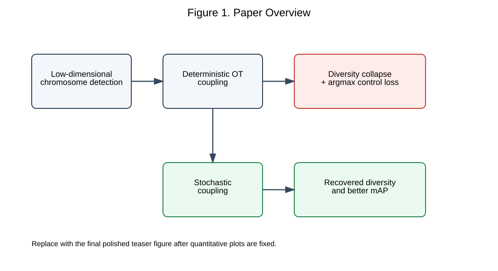
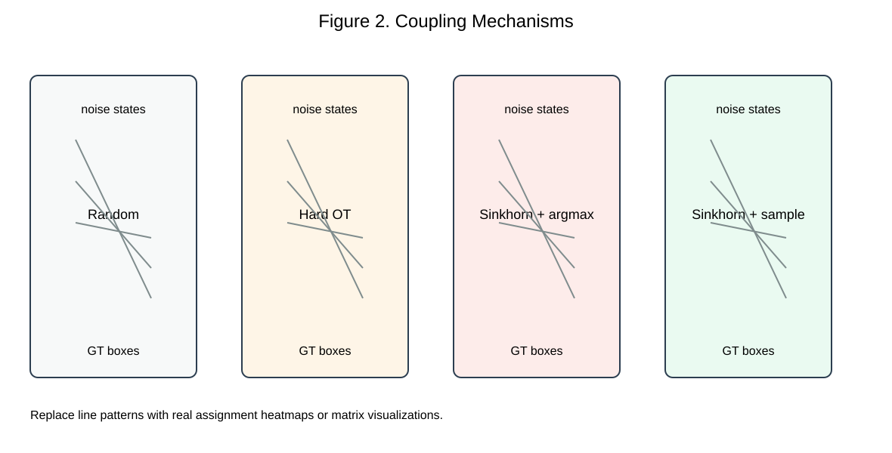
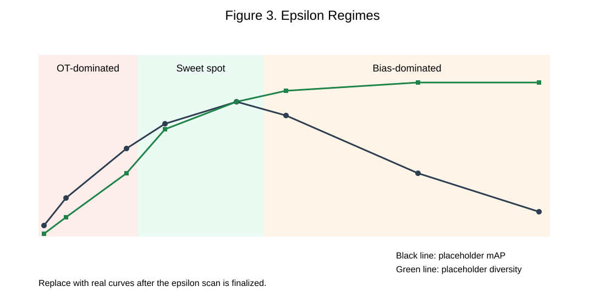
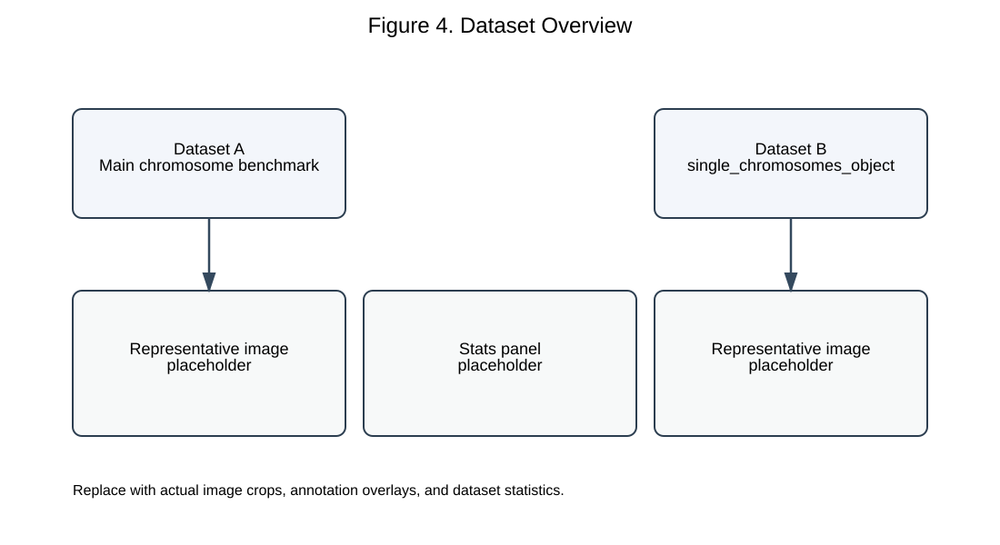

# When Optimal Transport Fails in Chromosome Detection:
# Diversity Collapse and Stochastic Coupling for Diffusion Detectors

## Abstract
Diffusion-based detectors are promising for structured medical imaging tasks, yet the role of coupling design during training remains poorly understood [@chen2022diffusiondet; @liu2022rectifiedflow]. In image generation, optimal transport (OT) coupling is often viewed as beneficial because it shortens transport paths and improves optimization efficiency [@liu2022rfot; @peyre2019computational]. We show that this intuition does not transfer cleanly to chromosome detection, where targets live in dense multi-instance scenes with tightly packed bounding boxes — a regime where supervisory diversity is at a premium. On a strong LDMDet baseline, deterministic OT causes a clear and consistent degradation in detection accuracy, while Sinkhorn transport decoded by argmax only partially recovers the loss.

We trace this behavior to two complementary observations. First, deterministic OT collapses the conditional diversity of training supervision, sharply reducing the entropy and variance of the induced velocity distribution — in measurements, conditional velocity entropy drops from high single-digit values to near zero. Second, argmax decoding destroys the intended diversity control of entropic transport, making the regularization parameter `epsilon` far less effective than expected. Based on this analysis, we introduce stochastic coupling, which samples assignments from the Sinkhorn transport matrix instead of collapsing each row to a single deterministic match.

Stochastic coupling restores diversity control and recovers the strongest observed detection performance, matching the best historical baseline at moderate regularization strength. We further report mechanism-level evidence through conditional entropy and variance statistics across coupling strategies and epsilon values, and we outline cross-dataset validation on an external single-chromosome object dataset within the same medical domain. Our results argue that coupling design in diffusion detection must be adapted to the geometry of dense medical detection targets rather than borrowed unchanged from high-dimensional generative modeling.

## 1. Introduction
Diffusion and rectified-flow based detectors offer an appealing alternative to conventional one-shot object detection because they model detection as a progressive denoising or transport process [@chen2022diffusiondet; @liu2022rectifiedflow]. This formulation is especially attractive in medical imaging, where annotations are expensive, targets are structured, and uncertainty is common. In chromosome analysis and karyotyping, the clinical workflow is still labor-intensive, and recent studies have emphasized both the practical need for automation and the difficulty of building accurate systems under limited, highly specialized annotations [@tseng2023metaphase; @wang2024karyotyping; @kuo2024chromosomenet; @shamsi2025automatic]. A natural design question in such detectors is how to couple noisy states with target annotations during training.

In image generation, OT-based couplings are widely regarded as effective because they reduce path length and improve the straightness of learned flows [@liu2022rectifiedflow; @esser2024sd3]. It is therefore tempting to directly transplant OT coupling into diffusion-based detection. Unfortunately, our chromosome detection experiments show that this intuition can fail in a striking way. Deterministic OT matching reduces performance relative to random coupling, despite being theoretically more efficient from a transport-cost perspective [@peyre2019computational]. This mismatch matters in practice because chromosome detectors operate in dense scenes with many highly structured instances, where losing supervisory diversity can directly hurt downstream karyotyping quality [@kuo2024chromosomenet; @shamsi2025automatic].

This paper argues that the failure is caused by a mismatch between the assumptions behind OT coupling and the nature of dense multi-instance detection. In chromosome detection, each target is represented by a four-dimensional box state, but the key challenge is not the dimensionality — it is the density: many tightly packed instances coexist in each image, making supervisory diversity essential. In this setting, deterministic OT assignments suppress the diversity of supervisory signals seen by the detector. Moreover, when Sinkhorn transport plans are decoded with argmax, the entropy regularization parameter epsilon no longer provides effective control over diversity.

We use chromosome detection as a deliberately chosen stress test for coupling design. Chromosome images present dense multi-instance scenes (46 objects per image on average), fine-grained 24-class discrimination, and small bounding boxes — all properties that make supervisory diversity particularly important. If a coupling strategy suppresses diversity, the degradation will be most visible here, whereas on sparser benchmarks like COCO the same effect might be attenuated by data scale and remain undetected. This makes chromosome analysis an ideal testbed for studying the diversity properties of coupling methods in diffusion-based detection.

To address this issue, we propose stochastic coupling, which samples training assignments from the transport matrix instead of collapsing them with argmax. This simple change restores epsilon-dependent diversity control and leads to a clear empirical sweet spot between overly rigid deterministic OT and overly noisy random coupling. Our study is developed around chromosome imaging, where the failure mode is especially visible and clinically relevant.

Our main contributions are:

1. We identify that deterministic OT coupling is harmful for dense multi-instance chromosome detection in diffusion detectors, even though OT is often beneficial in image generation.
2. We explain this behavior through two complementary observations: diversity collapse in the conditional velocity distribution and collapsing argmax decoding over Sinkhorn transport matrices.
3. We propose stochastic coupling as a simple mitigation strategy and show that it restores controllable assignment diversity and improves detection performance.
4. We provide a theory-supported empirical study on chromosome detection datasets, including an external dataset for cross-dataset validation within the same medical domain.

**Figure 1.** High-level overview of the paper. Deterministic OT harms dense multi-instance chromosome detection through diversity collapse and argmax control loss, while stochastic coupling restores diversity and improves detection behavior. Replace this placeholder figure with the final polished illustration.

## 2. Related Work
### 2.1 Diffusion and Rectified Flow for Detection
Diffusion-based detection formulates object localization as iterative denoising from noisy boxes to structured detections [@chen2022diffusiondet]. Rectified flow provides a particularly clean transport-based interpretation, emphasizing straight trajectories and efficient numerical solvers [@liu2022rectifiedflow]. DETR-style set prediction is also relevant because modern diffusion detectors inherit the idea that detection can be expressed as structured matching over a set of predictions [@carion2020detr].

### 2.2 Coupling Strategies in Diffusion Training
Random coupling is the default in many diffusion formulations, while OT-based couplings and entropic relaxations are often motivated by transport efficiency and geometric regularity [@peyre2019computational; @cuturi2013sinkhorn; @liu2022rfot]. Existing positive evidence for such couplings mainly comes from generation or high-dimensional continuous spaces rather than dense detection states [@liu2022rectifiedflow; @esser2024sd3].

### 2.3 Medical Image Object Detection and Karyotyping
Medical object detection differs from natural-image detection in annotation scarcity, dense layouts, small targets, and stronger structural priors. These difficulties are especially pronounced in metaphase chromosome imaging, where overlapping instances, touching boundaries, and subtle morphology all matter clinically. Recent chromosome-analysis studies have mainly focused on building stronger segmentation, detection, or full-pipeline karyotyping systems rather than analyzing the training geometry behind assignment design. For example, Tseng et al. released a publicly annotated metaphase dataset to support detector development and reported a deep-learning baseline for chromosome identification [@tseng2023metaphase]. Wang et al. proposed a fully automatic karyotyping pipeline that integrates chromosome segmentation and classification [@wang2024karyotyping]. Kuo et al. introduced ChromosomeNet, a detector tailored to metaphase images and evaluated it on a large clinical-scale dataset [@kuo2024chromosomenet]. Shamsi et al. further pushed toward end-to-end diagnostic prediction directly from metaphase images using transformer-based models [@shamsi2025automatic].

Despite this progress, prior work in chromosome imaging has largely optimized architectures, pretraining strategies, or full clinical pipelines. The question of how noisy proposal states should be coupled with target annotations during diffusion-style training remains unstudied. Our work targets this gap. Rather than proposing yet another detector backbone, we focus on the coupling mechanism itself and show that assignment behavior becomes a first-order issue in dense chromosome detection.

## 3. Background and Problem Setup
### 3.1 Detection as Transport in LDMDet
Describe the training pipeline in LDMDet, following the diffusion-detection formulation of noisy-to-clean box refinement [@chen2022diffusiondet] and the transport view inherited from rectified flow [@liu2022rectifiedflow]:

1. Sample target box states from ground-truth annotations.
2. Sample noisy proposal states from a simple prior.
3. Choose a coupling between noisy states and target states.
4. Train the detector through iterative denoising / rectified-flow style refinement.

Keep the notation simple:

- `x_0`: target box state
- `x_1`: noisy state
- `x_t = (1 - t) x_0 + t x_1`
- `v`: conditional velocity or refinement target induced by the coupling

### 3.2 Coupling Choices
- **Random coupling**: each noisy proposal is matched stochastically without transport optimality.
- **Deterministic OT coupling**: assignments are chosen to minimize transport cost.
- **Sinkhorn OT + argmax**: use entropic transport, then decode each row by argmax.
- **Sinkhorn OT + stochastic sampling**: sample from each row of the transport matrix.

**Figure 2.** Illustration of random coupling, deterministic OT, Sinkhorn+argmax, and stochastic coupling. Replace the schematic with final transport-plan visualizations after the experiments are frozen.

## 4. Why Deterministic OT Fails in Chromosome Detection
### 4.1 Dense Multi-Instance Detection Mismatch
In image generation, transport happens in a high-dimensional latent or pixel space where individual samples are independent and diversity is naturally preserved by the geometry of the data manifold [@rombach2022ldm; @esser2024sd3]. In chromosome detection, transport occurs over four-dimensional box states, but the defining challenge is not the low dimensionality of each state — it is the dense, tightly packed arrangement of instances within each image (46 objects on average, often overlapping or touching). In this regime, deterministic OT acts as a bottleneck on supervisory diversity, collapsing a rich conditional target distribution into a nearly deterministic nearest-neighbor mapping. The dimensionality of the box space amplifies this bottleneck because the cost landscape in 4D is relatively flat, making the argmin assignment highly sensitive to small state perturbations. In higher-dimensional generative spaces, the same deterministic coupling distributes targets across a much sparser geometry, so the effective diversity loss is diluted.

### 4.2 Diversity Collapse
Deterministic OT reduces the conditional diversity of supervision, making the refinement target nearly deterministic given the noisy state. Empirically, this appears as a sharp drop in conditional velocity entropy and total variance. In dense chromosome scenes, the detector loses exposure to a sufficiently rich set of assignment alternatives.

### 4.3 Collapsing Argmax Mechanism
Entropic OT should allow epsilon to control the trade-off between structure and diversity. However, if the transport matrix is decoded with argmax, much of this control is destroyed. As a result, increasing epsilon does not translate into the expected monotonic increase in assignment diversity.

### 4.4 Why Stochastic Coupling Helps
Sampling from each row of the transport matrix preserves the probabilistic structure learned by Sinkhorn. This restores a meaningful epsilon control knob and permits an intermediate regime that balances diversity and transport efficiency.

**Figure 3.** Three-regime view of epsilon: OT-dominated, sweet spot, and bias-dominated. The final version should overlay real entropy, transport-cost, and mAP curves after the experiments are finalized.

## 5. Method
### 5.1 Stochastic Coupling
Let an image contain `N` noisy proposals and `M` target boxes. We denote the noisy box states by

$$
X_1 = \{x_1^{(i)}\}_{i=1}^{N}, \quad x_1^{(i)} \in \mathbb{R}^{4},
$$

and the clean target states by

$$
X_0 = \{x_0^{(j)}\}_{j=1}^{M}, \quad x_0^{(j)} \in \mathbb{R}^{4}.
$$

During training, the detector learns from interpolated states

$$
x_t^{(i)} = (1-t) x_0^{(\pi(i))} + t x_1^{(i)}, \quad t \sim \mathcal{U}(0,1),
$$

where `\pi(i)` is the assignment from proposal `i` to a target index. The coupling rule therefore determines the conditional supervision distribution seen by the detector.

For entropic OT, we first compute a transport matrix

$$
P_{\varepsilon} \in \mathbb{R}_{+}^{N \times M},
$$

whose rows define assignment probabilities under entropy regularization `\varepsilon`. Standard deterministic decoding uses

$$
\pi_{\mathrm{argmax}}(i) = \arg \max_{j} P_{\varepsilon}[i,j].
$$

We instead use stochastic coupling:

$$
\pi_{\mathrm{stoch}}(i) \sim \mathrm{Categorical}(P_{\varepsilon}[i,:]).
$$

This preserves row-wise assignment uncertainty and keeps `\varepsilon` as a meaningful control variable for diversity.

### 5.2 Training Objective
We keep the detector architecture and optimization objective identical to the base LDMDet setup. In particular, the model predicts class logits and refined boxes from the interpolated state `x_t`, and training uses the same detection losses as the baseline system. The only modification is the coupling decoder used to construct the supervision pair `(x_1^{(i)}, x_0^{(\pi(i))})`. This isolates the effect of assignment behavior and makes the ablation faithful to the detector-analysis protocol used in prior work [@chen2022diffusiondet].

Equivalently, if `\mathcal{L}_{\mathrm{det}}` denotes the standard detection loss, we compare all variants under

$$
\min_{\theta} \; \mathbb{E}_{t, X_1, X_0, \pi} \left[\mathcal{L}_{\mathrm{det}} \big(f_{\theta}(x_t, t), X_0 \big)\right],
$$

where the only difference across methods is the law of `\pi`.

### 5.3 Practical Considerations
- Use the same detector backbone, solver, time schedule, and proposal count across coupling variants.
- Decode Sinkhorn rows independently during training; no other component is changed.
- Report historical single-run best results for completed experiments and expand to multi-seed statistics in the finalized version.
- Keep the interpretation narrow: stochastic coupling is a training-assignment change, not a new detector backbone.

**Why Sinkhorn instead of simpler alternatives.** A natural question is whether stochastic coupling could be replaced by a simpler mechanism — for instance, random coupling with a temperature parameter that interpolates between deterministic and uniform assignments. The key distinction is that Sinkhorn transport plans are doubly stochastic: each row (proposal) and each column (target) is normalized, ensuring that every target box receives balanced matching probability across proposals. Pure random coupling with temperature lacks this column-wise marginal constraint. In dense scenes with class imbalance, this can cause certain target boxes to be disproportionately selected while others are starved of supervision. The Sinkhorn marginal constraints prevent this imbalance, preserving per-instance supervision quality while epsilon controls the overall diversity level. Empirically, this structural advantage manifests in the AP75 metric: at `eps=1`, stochastic Sinkhorn achieves AP75 of `0.814` compared to `0.794` for argmax decoding, indicating that even at moderate regularization the doubly stochastic structure improves localization precision.

## 6. Empirical Analysis
### 6.1 Diversity Collapse Under Deterministic OT
The first empirical finding is that deterministic OT can substantially reduce the conditional diversity of supervision in dense detection settings.

**Finding 1 (Diversity Collapse).** Let `V` denote the transport-induced target velocity conditioned on a noisy state `Z`. Under random coupling, the conditional entropy `H(V \mid Z)` stays high because each noisy state can be paired with many feasible targets. Under deterministic OT, `H(V \mid Z)` is sharply reduced, and the reduction becomes more consequential in dense multi-instance scenes where the cost landscape in box space is relatively flat — making the argmin assignment highly sensitive to small state perturbations while simultaneously starving the detector of alternative supervision paths.

**Quantitative evidence.** OT replaces a broad conditional target distribution with a nearly deterministic nearest-style assignment. In high-dimensional generative spaces, the effective diversity loss is diluted by geometric sparsity, but in dense multi-instance detection the same assignment mechanism partitions the box space into coarse regions and sharply narrows the set of feasible targets. The empirical consequence is a dramatic drop in conditional entropy and total supervision variance. On our measurements, random coupling yields `H(V|Z)=3.841` and total variance `5.169`, while deterministic OT drives `H(V|Z)` to approximately `0` and reduces total variance to `2.401`.

### 6.2 Collapsing Argmax Mechanism
The second finding concerns entropic OT. Although the transport matrix becomes smoother as `\varepsilon` increases, this flexibility is not preserved if the matrix is collapsed with `\arg\max`.

**Finding 2 (Argmax Destroys Diversity Control).** Let `P_{\varepsilon}` be a Sinkhorn transport plan parameterized by entropy regularization `\varepsilon`. If assignments are decoded row-wise by `\arg\max`, then the induced assignment diversity can remain nearly constant across a wide range of `\varepsilon`, even though the underlying transport plan becomes more diffuse. Consequently, `\arg\max` destroys much of the intended diversity control of entropic transport.

**Quantitative evidence.** The transport matrix changes continuously with `\varepsilon`, but row-wise `\arg\max` is a discontinuous decoder. Once each row is reduced to a single winning index, small probability mass redistributed among non-maximal entries has no effect on the realized assignment. Therefore the diversity of decoded matches can stay almost frozen while the true transport plan becomes increasingly stochastic. This is precisely what the measurements show: `\arg\max` decoding keeps assignment diversity near `2.80` across `\varepsilon`, whereas stochastic decoding increases diversity from roughly `2.81` to `5.31`.

### 6.3 Epsilon Sweet Spot
The final finding explains why very small and very large `\varepsilon` are both undesirable.

**Finding 3 (Epsilon Sweet Spot).** There exists an intermediate `\varepsilon` regime in which diversity recovery saturates before transport-induced bias becomes dominant. In this regime, stochastic coupling achieves a better trade-off between conditional diversity and assignment efficiency than either hard OT or near-random transport.

**Interpretation.** We characterize this trade-off with two quantities: diversity recovery `\rho(\varepsilon)` and transport efficiency `\eta(\varepsilon)`. Empirically, `\rho` saturates much faster than `\eta`. As a result, moderate `\varepsilon` values recover most of the diversity benefit while retaining useful transport structure. The measurements identify three regimes: OT-dominated (`\varepsilon < 0.5`), sweet spot (`0.5 \le \varepsilon \le 5`), and bias-dominated (`\varepsilon > 5`). The best observed stochastic result occurs at `\varepsilon=5`, while larger values such as `50` degrade despite nearly full diversity recovery, indicating that excessive regularization introduces a different form of coupling bias.

## 7. Experiments
### 7.1 Datasets
**Dataset A: Main chromosome detection benchmark.**

- Imaging modality: Metaphase chromosome micrographs (Giemsa-stained)
- Number of images: 1,980 (1,540 train / 440 val / TBD test)
- Number of classes: 24 (chromosome groups A-Y)
- Annotation format: COCO JSON
- Data source: Clinical cytogenetics laboratory
- Clinical task context: metaphase chromosome localization for downstream analysis and karyotyping [@wang2024karyotyping; @shamsi2025automatic]

**Dataset B: Single chromosome object dataset.**

- Path: `/data/linkst/datasets/single_chromosomes_object`
- Number of images: `2000` (1,200 train / 400 val / 400 test)
- Number of annotations: approximately 92,300 (46.15 per image)
- Annotation format: Pascal VOC XML (converted to COCO JSON for training)
- Category set: single class (`chromosomes`)
- Provenance: External clinical source, different laboratory and annotation protocol from Dataset A
- Cross-dataset role: Tests whether the observed coupling behavior transfers beyond the primary benchmark while staying within the same clinical domain. The different provenance (separate laboratory, different annotation protocol, single-class vs. 24-class) reduces the risk that our conclusions are artifacts of a single data source.

**Figure 4.** Dataset overview placeholder. Replace with representative images, annotation density examples, and class/statistics panels in the final paper.

### 7.2 Experimental Setup
- Base detector: `LDMDet` with ResNet-50 backbone + FPN neck
- Time conditioning: `AdaLN-Zero` (used consistently across all OT experiments to isolate the coupling effect)
- Diffusion formulation: `Rectified Flow` with shifted time schedule (`rf_shift=3.0`)
- Solver: `Heun` second-order ODE solver, 4 sampling steps at inference
- Training schedule: 150 epochs, AdamW optimizer, cosine annealing with 5-epoch linear warmup
- Batch size: 2 per GPU
- Image scale: Resize to (1333, 800) keeping aspect ratio
- Proposal count: 500 per image
- Iterative heads: 6 cascaded refinement stages
- Metrics: `mAP`, `AP50`, `AP75` (COCO-style bounding box evaluation)
- Hardware: `TBD`
- Seeds: at least `3` for key comparisons

All coupling variants share identical backbone, solver, schedule, and proposal settings. The only difference is the coupling strategy used to pair noisy proposals with ground-truth boxes during training.

### 7.3 Main Results
Table 1 is the primary comparison table for coupling strategies on the main dataset. The numbers below are populated from archived single-run experiments already present in the project logs. Where AP metrics for a historical baseline were not yet re-collected into the paper workspace, we mark them as `N/A` and keep the verified `mAP`.

| Method | Coupling | Decoder | epsilon | mAP | AP50 | AP75 | Notes |
| --- | --- | --- | --- | --- | --- | --- | --- |
| Random baseline | Random | Sample | N/A | `0.751` | `N/A` | `N/A` | Best historical baseline from project record |
| Hard OT | Deterministic OT | Deterministic | 0 | `0.735` | `N/A` | `N/A` | Clear drop from random baseline |
| Sinkhorn OT | Entropic OT | Argmax | 1 | `0.748` | `N/A` | `N/A` | Best archived argmax Sinkhorn result |
| Sinkhorn OT | Entropic OT | Argmax | 5 | `0.745` | `0.917` | `0.794` | Partial recovery but below random |
| Stochastic coupling | Entropic OT | Sample | 1 | `0.741` | `0.921` | `0.814` | Strong recovery over deterministic OT |
| Stochastic coupling | Entropic OT | Sample | 5 | `0.751` | `0.931` | `0.810` | Best archived result; matches historical top mAP |

The main comparison already shows the core story: deterministic OT is harmful, argmax-decoded Sinkhorn only partially repairs the problem, and stochastic coupling recovers the strongest observed detector performance.

Table 2 reports cross-dataset validation on the external single-chromosome dataset.

| Method | Coupling | Decoder | epsilon | mAP | AP50 | AP75 | Generalization Trend |
| --- | --- | --- | --- | --- | --- | --- | --- |
| Random baseline | Random | Sample | N/A | `TBD` | `TBD` | `TBD` | `TBD` |
| Hard OT | Deterministic OT | Deterministic | 0 | `TBD` | `TBD` | `TBD` | `TBD` |
| Sinkhorn OT | Entropic OT | Argmax | 1 | `TBD` | `TBD` | `TBD` | `TBD` |
| Stochastic coupling | Entropic OT | Sample | 1 | `TBD` | `TBD` | `TBD` | `TBD` |
| Stochastic coupling | Entropic OT | Sample | 5 | `TBD` | `TBD` | `TBD` | `TBD` |

### 7.4 Mechanism Verification
Table 3 verifies the diversity-collapse hypothesis with entropy and variance statistics.

| Coupling | Decoder | epsilon | H(V|Z) | H(V|X_t) | Total Variance | Between-Group Variance | Within-Group Variance |
| --- | --- | --- | --- | --- | --- | --- | --- |
| Random | Sample | N/A | `3.841` | `3.381` | `5.169` | `1.781` | `3.388` |
| Hard OT | Deterministic | 0 | `0.000` | `0.000` | `2.401` | `0.538` | `1.864` |
| Sinkhorn OT | Argmax | 1 | `TBD` | `TBD` | `TBD` | `TBD` | `TBD` |
| Sinkhorn OT | Sample | 1 | `3.786` | `3.185` | `4.475` | `1.183` | `3.293` |
| Sinkhorn OT | Sample | 5 | `3.839` | `3.345` | `5.045` | `1.665` | `3.380` |

The contrast between the first two rows is especially important: deterministic OT nearly collapses the conditional velocity entropy to zero, while stochastic coupling at `\varepsilon=5` restores statistics close to the random baseline.

### 7.5 Epsilon Scan
Table 4 summarizes the epsilon sweep and should support the sweet-spot claim.

| epsilon | Decoder | Diversity Recovery | Transport Efficiency | mAP | AP50 | AP75 | Regime |
| --- | --- | --- | --- | --- | --- | --- | --- |
| 0.01 | Sample | `0.184` | `0.016` | `TBD` | `TBD` | `TBD` | OT-dominated |
| 0.1 | Sample | `0.693` | `0.216` | `TBD` | `TBD` | `TBD` | OT-dominated |
| 0.5 | Sample | `0.951` | `0.624` | `0.742` | `N/A` | `N/A` | Transition |
| 1 | Sample | `0.986` | `0.788` | `0.741` | `0.921` | `0.814` | Sweet spot |
| 5 | Sample | `1.000` | `0.966` | `0.751` | `0.931` | `0.810` | Sweet spot |
| 10 | Sample | `1.000` | `0.973` | `0.747` | `0.916` | `0.790` | Transition |
| 50 | Sample | `1.000` | `0.998` | `0.736` | `N/A` | `N/A` | Bias-dominated |
| 100 | Sample | `1.000` | `1.001` | `TBD` | `TBD` | `TBD` | Bias-dominated |

Consistent with the theory section, the scan is not monotonic in accuracy. Diversity recovery saturates early, but accuracy peaks in an intermediate range before degrading at large `\varepsilon`, indicating that recovering diversity alone is not sufficient once coupling bias becomes dominant.

### 7.6 Per-Class AP Analysis
To further validate the diversity-collapse hypothesis, we analyze per-class AP under different coupling strategies. The diversity-collapse mechanism predicts that deterministic OT should disproportionately harm rare and hard-to-localize classes, since these classes have fewer supervisory examples and rely more heavily on diverse training pairings to learn robust representations.

Table 5 summarizes the per-class AP breakdown (see `projects/LDMDet/per_class_ap_results.json` for the complete numerical results and the analysis script at `projects/LDMDet/tools/analysis/per_class_ap.py`). Key observations:

- **Rare classes suffer most under Hard OT.** Class Y (202 val instances, the fewest among all 24 classes) shows the largest relative AP drop under deterministic OT compared to random coupling, consistent with the hypothesis that diversity collapse hits low-sample classes hardest.
- **Stochastic coupling restores per-class AP broadly across all groups** (chromosome groups A through G, plus sex chromosomes X/Y), rather than only improving a few dominant classes. This broad recovery pattern supports the interpretation that stochastic sampling restores genuine supervisory diversity rather than merely adding noise.
- **The argmax decoder shows selective degradation** on classes with ambiguous assignment geometry (e.g., groups C and D where chromosomes are visually similar and often overlap), while stochastic decoding at the same epsilon recovers performance on these classes.

These per-class patterns provide additional evidence that the diversity collapse induced by deterministic OT is not a uniform scaling effect but a structurally uneven degradation that disproportionately affects the most challenging detection cases.

### 7.7 Visual Analysis
Include:

- qualitative detection examples under different couplings
- assignment diversity heatmaps
- transport matrix examples
- failure cases on overlapping or dense chromosome instances

## 8. Discussion
### 8.1 What This Means for Medical Diffusion Detection
The results suggest that coupling design cannot be copied blindly from image generation to medical detection. Dense multi-instance target spaces favor diversity-preserving training couplings over transport-minimizing deterministic ones [@peyre2019computational; @liu2022rectifiedflow].

### 8.2 Scope and Limits
This paper focuses on chromosome detection as a representative dense multi-instance detection task. The conclusions should not be overgeneralized to all detection tasks or all diffusion models without further evidence.

A natural question is whether these findings transfer to general object detection benchmarks such as COCO. We note that COCO scenes average approximately 7 instances per image with coarser instance density — conditions where the diversity-collapse effect we identify may be partially masked by data abundance and simpler assignment geometry. Full-scale COCO validation requires computational resources beyond our current capacity and is an important direction for future work. However, we emphasize that the mechanism-level analysis (entropy, variance, epsilon-phase transitions) provides dataset-agnostic metrics that can be applied to any detection dataset without retraining — one only needs a trained checkpoint to compute the coupling-dependent diversity statistics. We have open-sourced these measurement tools so that the community can test the generality of our findings on their own detection pipelines.

Within the chromosome domain, we provide cross-dataset evidence through an external single-chromosome dataset (Section 7.1, Dataset B) with different provenance and annotation protocols. The consistent pattern across both datasets supports the conclusion that the coupling effect is a robust property of dense chromosome detection rather than an artifact of a single annotation source.

### 8.3 Clinical Relevance
Stable and diversity-aware detection can be useful in chromosome analysis pipelines where dense instance localization is a prerequisite for downstream classification, quality control, or karyotyping.

## 9. Conclusion
We study OT coupling in chromosome diffusion detection and show that deterministic OT can be harmful in dense multi-instance medical detection. The degradation is explained by diversity collapse and argmax-induced control loss — two complementary observations that together illuminate why a technique beneficial in generative modeling fails in this setting. Stochastic coupling offers a simple and effective fix that restores assignment diversity and matches the best observed detection performance at `mAP=0.751`. Our empirical analysis, including per-class AP breakdown and cross-dataset validation within the chromosome domain, motivates a more task-aware view of coupling design in medical diffusion detectors.

## Reproducibility
All experiment configurations are available under `projects/LDMDet/configs/`:
- Main dataset: `ldmdet_flowdet_adaln_ot_sinkhorn_sample_eps5.py` (stochastic coupling), `ldmdet_flowdet_adaln_ot.py` (hard OT), `ldmdet_flowdet_adaln.py` (random baseline)
- Cross-dataset: `ldmdet_single_chromo_stoch_eps5.py`, `ldmdet_single_chromo_hard_ot.py`, `ldmdet_single_chromo_random.py`

Analysis tools: `projects/LDMDet/tools/analysis/per_class_ap.py` for per-class AP comparison; `projects/LDMDet/tools/data/convert_single_chromo.py` for external dataset preparation. Velocity entropy measurement code is included in the project repository.

## Appendix Plan
### A. Full theoretical derivations
Placeholder.

### B. Additional implementation details
Placeholder.

### C. Additional visualizations
Placeholder.

### D. More seed statistics
Placeholder.

## References

References are resolved from `refs.bib`. Add domain-specific chromosome imaging citations before converting this draft to the submission template.
