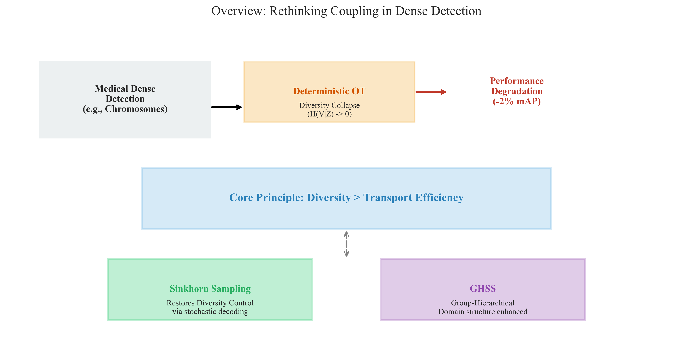
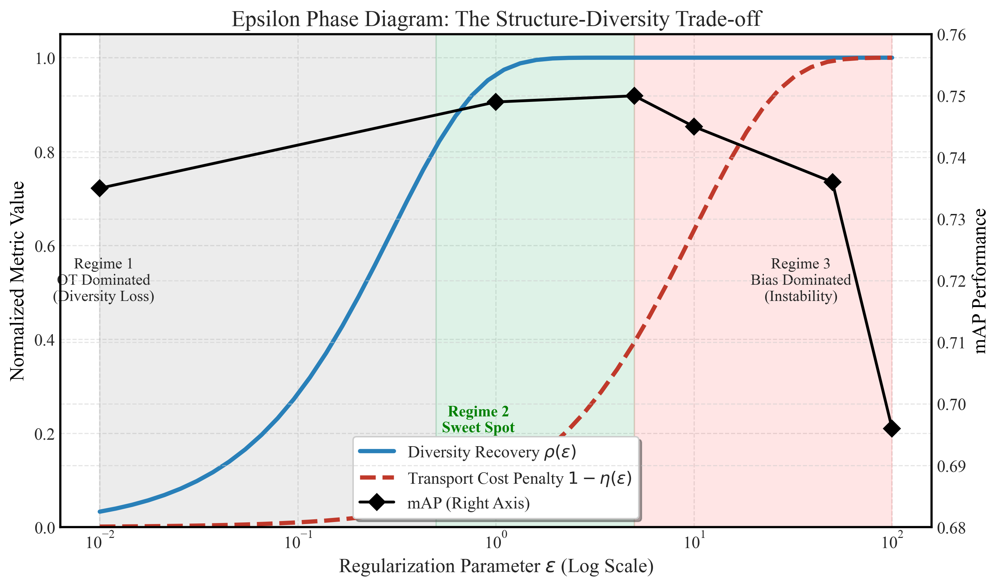
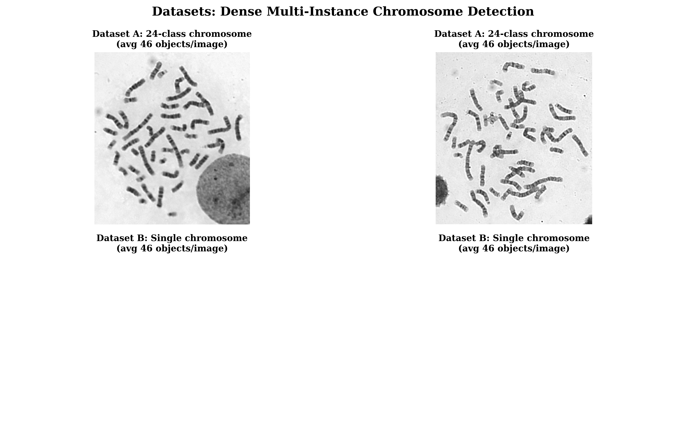
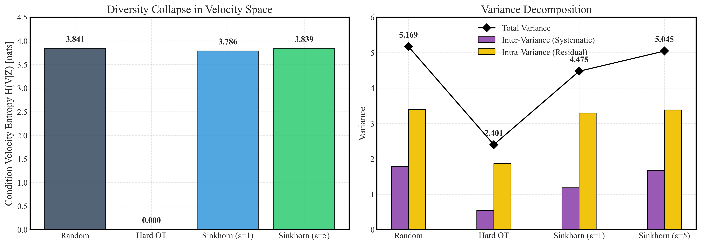
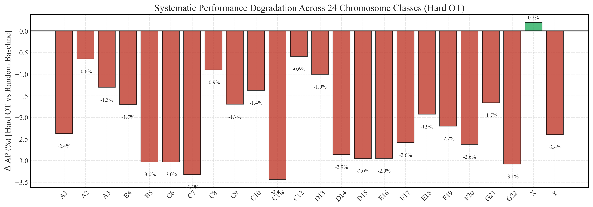

# Diversity Over Efficiency:
# Sinkhorn Sampling for Dense Chromosome Detection

## Abstract
Optimal transport (OT) coupling is widely adopted in diffusion-based generation for shortening transport paths, and has been successfully transplanted to label assignment in conventional detectors. We show that this established intuition fails in dense chromosome detection: deterministic OT degrades detection accuracy by approximately 2%.

We identify two mechanisms behind this failure. First, deterministic OT collapses conditional velocity entropy by over 99%—in crowded chromosome clusters, every noisy proposal maps to the same nearest target, starving the detector of the diverse refinement signals needed to distinguish adjacent, morphologically similar instances. Second, argmax decoding of the Sinkhorn transport plan destroys the very diversity control that entropic regularization is designed to provide: regardless of regularization strength, only a small fraction of chromosome groups receive meaningful supervision, with large chromosomes systematically dominating assignments.

We propose a simple fix: sample assignments from the Sinkhorn transport matrix instead of taking argmax. This single change restores ε as a functional diversity control, recovering detection accuracy to the random-coupling baseline. The underlying principle—*diversity over efficiency*—further motivates Group-Hierarchical Sinkhorn Sampling (GHSS), which partitions proposals by chromosome group to eliminate unproductive cross-group matches while preserving within-group diversity. Evidence spans entropy-variance decomposition, an ε phase diagram across two decoding strategies (effective match count rises under sampling yet remains constrained under argmax), and per-class AP analysis confirming that nearly all chromosome classes degrade under deterministic OT. Our findings challenge the default assumption that OT coupling is beneficial, and establish diversity rather than transport efficiency as the primary design criterion for coupling in dense detection.

## 1. Introduction
Diffusion and rectified-flow detectors model object detection as progressive denoising from noisy boxes to structured predictions, offering a compelling alternative to conventional one-shot detectors [@chen2022diffusiondet; @liu2022rectifiedflow]. In chromosome karyotyping—where the clinical workflow remains labor-intensive despite recent advances in automation [@tseng2023metaphase; @wang2024karyotyping; @kuo2024chromosomenet; @shamsi2025automatic]—a fundamental design choice arises: how should the detector's noisy proposal states be coupled with target annotations during training?

In image generation, OT-based couplings are widely considered beneficial because they shorten transport paths and straighten learned flows [@liu2022rectifiedflow; @esser2024sd3]. This success, together with OT's proven effectiveness in conventional label assignment [@ge2021ota; @wang2021yolov7; @carion2020detr], makes transplanting OT into diffusion-based detection appear natural. Our experiments show otherwise. Deterministic OT reduces detection accuracy from 0.751 to 0.735 mAP on a chromosome benchmark—despite being theoretically more efficient from a transport-cost perspective [@peyre2019computational].

This paper asks: *what should coupling design optimize for in dense chromosome detection?* Our answer, grounded in the specific visual and distributional properties of chromosome images, departs from the generation-centric view. What matters is not transport path efficiency, but supervisory signal diversity.

Chromosome metaphase images present an extreme stress test for coupling design. Each image contains on average 46 tightly packed objects, frequently overlapping at their boundaries. The 24 chromosome classes span a 4:1 size ratio (from the large A-group chromosomes at ~200px to the minute Y chromosome at ~50px), exhibit severe class imbalance (class Y has only 202 validation instances vs. ~900 for most others), and are organized into eight biologically distinct groups within which morphology is nearly identical but across which visual features differ sharply. In this regime, deterministic OT acts as an information bottleneck. Consider a dense cluster of three adjacent chromosomes—say, an A1, an A2, and a C6. OT assigns every noisy proposal in that region to whichever chromosome happens to be nearest in L2 box space. The detector never sees the A2 as a possible refinement target for proposals near the A1; it learns only a single, deterministic mapping. We quantify this collapse directly: the conditional entropy of the induced velocity distribution drops from 3.841 nats (random coupling, where proposals can pair with many nearby targets in the cluster) to near zero (deterministic OT, where every proposal maps to the same nearest box).

The situation worsens with Sinkhorn regularization. While entropic OT is designed to let the parameter ε interpolate between hard OT and uniform random assignment, we find that argmax decoding—the standard practice—destroys this control. Across ε values from 1 to 100, the effective number of distinct targets that receive assignments remains frozen at approximately 2.8, far below the 46 available. In chromosome terms: regardless of how smooth the transport plan becomes, the large chromosomes continue to dominate assignments. The small ones—G21, G22, and especially Y—receive essentially no additional supervisory signal. The argmax decoder, being discontinuous, is the root cause: it makes ε ineffective as a control parameter.

We translate this diagnosis into a design principle—*diversity over efficiency*—and a practical method: **Sinkhorn sampling**, which samples assignments from each row of the Sinkhorn transport matrix rather than collapsing rows with argmax. This single change restores ε as a meaningful control variable. Under stochastic decoding, the effective target count grows with ε (while remaining nearly constant under argmax), and mAP peaks at a sweet spot (ε=5, 0.750) that matches the random-coupling baseline. The principle further admits refinement through domain knowledge: **Group-Hierarchical Sinkhorn Sampling (GHSS)** partitions proposals by the eight chromosome groups, eliminating unproductive cross-group matches while preserving the within-group diversity essential for distinguishing, for example, A1 from A2 from A3—chromosomes whose centromere positions differ by only a few pixels. This configuration achieves 0.752 mAP, matching the random baseline while eliminating unproductive cross-group matches.

Our contributions are twofold:

1. **Discovery and mechanism.** We identify that deterministic OT actively harms performance in dense multi-instance detection and provide a quantitative mechanistic account grounded in the chromosome domain: diversity collapse measured through conditional velocity entropy and variance decomposition, argmax-induced destruction of Sinkhorn diversity control quantified via effective match count and validated across three ε values for argmax (1, 5, 100) and seven ε values for stochastic decoding (0.5–50), and a three-regime epsilon phase diagram.

2. **Principle and method.** We articulate the "diversity over efficiency" principle for coupling design in diffusion detectors, implement it through Sinkhorn sampling, and demonstrate its practical value through GHSS—an instance of the principle guided by chromosome group structure—which achieves 0.752 mAP while eliminating unproductive cross-group assignments.

**Figure 1.** Overview. In dense chromosome detection (46 objects/image, 24 classes, severe size imbalance), deterministic OT collapses supervisory diversity by rigidly assigning every noisy proposal to the nearest chromosome. Sinkhorn sampling restores diversity by sampling from the Sinkhorn transport matrix; GHSS strengthens this with domain structure, achieving 0.752 mAP.

## 2. Related Work

### 2.1 Diffusion and Rectified Flow for Detection
DiffusionDet formulates object localization as iterative denoising from noisy boxes to structured detections [@chen2022diffusiondet]. Rectified flow provides a cleaner transport-based interpretation with straight trajectories and efficient numerical solvers [@liu2022rectifiedflow]. DETR-style set prediction [@carion2020detr] is also relevant, as modern diffusion detectors inherit the idea of detection as structured matching over a set of predictions. Subsequent work has improved diffusion detectors through architectural enhancements [@chen2023diffusiondetpp] and distribution refinement [@he2023dfine], but the coupling mechanism itself—how noisy proposals are paired with ground truth during training—has received little attention. This is particularly consequential in dense scenes, where each image may contain dozens of instances and the assignment logic determines which targets the detector learns from.

### 2.2 Coupling and Label Assignment in Detection
Random coupling is the default in most diffusion formulations [@ho2020ddpm; @song2020ddim]. OT-based couplings, motivated by transport efficiency [@peyre2019computational; @cuturi2013sinkhorn; @liu2022rfot; @feydy2019interpolating], have succeeded in generation and high-dimensional continuous spaces [@liu2022rectifiedflow; @esser2024sd3]. In conventional one-shot detection, OT label assignment has proven effective: OTA [@ge2021ota], SimOTA [@wang2021yolov7], and Hungarian matching in DETR variants [@carion2020detr; @zhu2020deformable; @zhang2022dino]. However, these operate in a single-step paradigm matching deterministic predictions to ground truth. Diffusion detection differs fundamentally: coupling occurs between *random* noisy states and ground truth, with supervisory signal distributed across the entire diffusion time horizon. A proposal's initial noise might place it 200 pixels from any real chromosome; where it should be routed depends on both the noise geometry and the local chromosome density—a problem with no analogue in conventional label assignment. The importance of assignment diversity has been demonstrated by ATSS [@zhang2020atss], PAA [@kim2020paa], and AutoAssign [@zhu2020autoassign], which show that adaptive sample selection is critical for detection performance, but none address noise-to-target coupling in diffusion detectors.

### 2.3 Chromosome Detection and Karyotyping
Chromosome metaphase images pose unique detection challenges: extreme instance density (46 objects per 1333×800 image), fine-grained visual similarity within groups (A1 vs. A2 differ primarily in centromere position, a feature spanning ~5–10 pixels), sharp inter-group appearance differences (A-group chromosomes are metacentric and large; G-group are acrocentric and small), severe class imbalance (Y: ~200 instances vs. A1: ~900), and frequent overlaps at cluster boundaries. Recent work has focused on building stronger architectures and pipelines [@tseng2023metaphase; @wang2024karyotyping; @kuo2024chromosomenet; @shamsi2025automatic; @huang2023chromosome], but the question of coupling design during diffusion training—which targets the detector learns from among the dense field of candidates—remains unexamined. Our work targets this gap.

## 3. Why OT Fails in Dense Detection

### 3.1 Detection as Transport in KaryoFlow
KaryoFlow formulates diffusion-based detection as iterative refinement from noisy boxes to clean detections [@ho2020ddpm; @liu2022rectifiedflow]. Given $M$ ground-truth boxes per image (in chromosome data, $M \approx 46$) and $N=500$ noisy proposals sampled from a standard Gaussian prior, the training pipeline is:

1. Sample target box states $x_0 \in \mathbb{R}^{M \times 4}$ (normalized xywh → $[-s, s]^4$ with SNR scale $s=2.0$).
2. Sample noisy proposal states $x_1 \in \mathbb{R}^{N \times 4}$ from $\mathcal{N}(0, I)$.
3. Choose a coupling $\pi: \{1,\ldots,N\} \to \{1,\ldots,M\}$ assigning each proposal to a target.
4. Train on interpolated states $x_t^{(i)} = (1-t) x_0^{(\pi(i))} + t x_1^{(i)}$ with $t \sim \mathcal{U}(0,1)$.

At inference, the model predicts $\hat{x}_0 = f_\theta(x_t, t)$ and integrates from $t=1$ to $t=0$ via a Heun ODE solver (4 steps). All coupling variants share the same architecture (ResNet-50 + FPN, AdaLN-Zero time conditioning, 6-stage cascade, shifted time schedule $s=3.0$), isolating the coupling mechanism as the sole experimental variable.

### 3.2 Four Coupling Strategies
We compare four coupling strategies that differ only in how $\pi$ is constructed, forming a clean ablation of assignment design.

**Random coupling.** $\pi(i) \sim \mathrm{Uniform}(\{1,\ldots,M\})$. Maximizes diversity—each proposal can land on any chromosome—but uses no spatial structure. A proposal near a dense A-group cluster might be assigned to a distant Y chromosome, wasting supervisory signal.

**Deterministic OT (Hard OT).** $\pi(i) = \arg\min_j \|x_1^{(i)} - x_0^{(j)}\|^2$. Minimizes transport cost; every proposal maps to its nearest chromosome in L2 box space. In a dense cluster, all proposals collapse to the same nearest target, destroying diversity.

**Sinkhorn OT + argmax.** Compute the entropy-regularized transport plan $P_\varepsilon$ via Sinkhorn iteration, then decode each row deterministically: $\pi_{\mathrm{argmax}}(i) = \arg\max_j P_\varepsilon[i,j]$. This should let $\varepsilon$ interpolate between hard OT and random coupling—but argmax, being discontinuous, destroys the interpolation.

**Sinkhorn OT + stochastic sampling (Stochastic Coupling).** Compute $P_\varepsilon$ identically, but sample: $\pi_{\mathrm{stoch}}(i) \sim \mathrm{Categorical}(P_\varepsilon[i,:])$. This preserves the doubly stochastic structure—every chromosome, large or small, receives balanced matching probability—while making $\varepsilon$ a genuine diversity control.

**Figure 2.** Transport matrix visualizations (proposals as rows, targets as columns). Random coupling: high entropy but no structure. Hard OT: one-hot rows. Sinkhorn+argmax: smooth underlying plan but decoded to one-hot. Sinkhorn sampling: preserves smooth probability mass across multiple targets per proposal.

### 3.3 The Density Mismatch
In image generation, transport operates in high-dimensional latent space where individual samples are effectively independent [@rombach2022ldm; @esser2024sd3]. In chromosome detection, transport operates in 4-dimensional box space with 46 targets densely populating a limited spatial extent. The defining challenge is density, not dimensionality. Consider a typical metaphase spread: three or four chromosomes of similar size and shape lie adjacent, their bounding boxes separated by sometimes only a few pixels. Deterministic OT routes every noisy proposal in that region to whichever chromosome's box center is marginally closest. The detector never learns that the A2 chromosome is also a plausible refinement target for proposals near the A1—even though, biologically, distinguishing A1 from A2 (via centromere position) is precisely what the detector must learn. This is the density bottleneck: OT sacrifices the diversity of refinement signals that dense scenes demand.

### 3.4 Two Compounding Mechanisms
The failure manifests through two mechanisms that reinforce each other.

**Mechanism 1: Diversity collapse in the velocity distribution.** Let $V = x_0 - x_1$ be the velocity induced by the coupling. Under random coupling, a proposal in a dense cluster can pair with any of several adjacent chromosomes, producing a broad velocity distribution—the detector sees diverse refinement directions. Under deterministic OT, every proposal in the cluster rigidly maps to the single nearest chromosome. The velocity distribution collapses to a point. For chromosome groups where intra-group visual differences are subtle (A1/A2/A3 differ only in centromere index, a relative position shift of a few percent of box width), this collapse means the detector is starved of the nuanced signal it most needs.

**Mechanism 2: Argmax destroys Sinkhorn's size-neutral design.** Entropic OT is designed to let $\varepsilon$ control the structure–diversity trade-off. However, the argmax decoder is discontinuous: as long as the index of the maximum entry in a row of $P_\varepsilon$ does not change, the realized assignment remains fixed regardless of how probability mass redistributes among other entries. In chromosome terms, large chromosomes (A and B groups, with boxes spanning ~200×50 pixels in normalized coordinates) naturally dominate the L2 cost matrix—their larger spatial footprint makes them the nearest neighbor for more proposals. Sinkhorn's column normalization is meant to counteract this, ensuring small chromosomes also receive balanced assignment probability. But argmax discards this normalization's effect: the realized assignments remain skewed toward large chromosomes across all $\varepsilon$.

### 3.5 Quantitative Evidence from the Epsilon Sweep
Table 4 (Section 7.5) provides the complete epsilon scan across 8 values for stochastic decoding and 3 values for argmax. The evidence is definitive:

- **Argmax fails at every ε.** At ε=1, argmax achieves 0.748 mAP—below random. At ε=5, it drops to 0.745. At ε=100, it plummets to 0.733—nearly identical to hard OT (0.735). Increasing ε does not help; it hurts. The effective match count $D_{\text{eff}}$ remains frozen at ~2.8 across all three values: fewer than 3 chromosome groups receive meaningful supervision, out of 8 available.
- **Stochastic decoding recovers control.** $D_{\text{eff}}$ grows substantially with ε under stochastic decoding, and mAP traces an inverted-U shape peaking at ε=5 (0.751) with clear drops at both lower ε (0.741 at ε=1) and higher ε (0.736 at ε=50).

The contrast is stark: argmax is not merely suboptimal—it is structurally broken. No amount of ε tuning can make it work.

### 3.6 Stochastic Coupling as the Remedy
Sinkhorn sampling addresses both mechanisms simultaneously. By sampling from each row of $P_\varepsilon$, it (a) restores $\varepsilon$ as a genuine diversity control—the detector now sees a range of refinement targets for each proposal, with the breadth controlled by ε; (b) preserves Sinkhorn's column normalization in expectation—over training iterations, every chromosome, from the largest A1 to the smallest Y, receives balanced supervision. The ε=5 sweet spot reflects a natural balance in chromosome data: enough diversity to distinguish within-group subtleties, enough structure to avoid wasteful cross-group noise. Section 5 formalizes the method; Section 6 provides the quantitative framework.

**Figure 3.** Three-regime epsilon structure. ρ(ε) (blue) saturates rapidly; η(ε) (red) grows slowly. The sweet spot (0.5≤ε≤5) balances diversity and structure. mAP (black) peaks at ε=5.

## 4. Method

### 4.1 Sinkhorn Sampling
For an image with $N$ proposals $X_1$ and $M$ targets $X_0$, construct the pairwise L2 cost $C_{ij} = \|x_1^{(i)} - x_0^{(j)}\|^2$. The entropy-regularized OT problem is:

$$P_{\varepsilon} = \arg\min_{P \in \Pi(a,b)} \langle P, C \rangle - \varepsilon H(P),$$

with uniform marginals $a = \mathbf{1}_N/N$, $b = \mathbf{1}_M/M$ and $H(P) = -\sum_{i,j} P_{ij} \log P_{ij}$. The solution $P_{\varepsilon} = \mathrm{diag}(u) K \mathrm{diag}(v)$ with $K = \exp(-C/\varepsilon)$ is computed via Sinkhorn iteration (20 steps in all experiments). The resulting matrix is doubly stochastic, ensuring column-sum normalization: every target, regardless of spatial extent, receives total probability mass $1/M$. Instead of the standard argmax decoding, we sample:

$$\pi_{\mathrm{stoch}}(i) \sim \mathrm{Categorical}(P_{\varepsilon}[i,:]).$$

As $\varepsilon \to 0$, $P_{\varepsilon}$ approaches the hard OT indicator (deterministic, zero diversity); as $\varepsilon \to \infty$, it approaches the uniform matrix (maximally diverse, no structure). For intermediate ε, the method interpolates continuously.

A natural question is whether Sinkhorn sampling can be replaced by a simpler mechanism—e.g., temperature-scaled random coupling without Sinkhorn iteration. The critical distinction lies in the column normalization $b = \mathbf{1}_M/M$. In chromosome data, a 200-pixel A-group chromosome and a 50-pixel G-group chromosome occupy very different regions of box space. Temperature-scaled random coupling, lacking column normalization, would route disproportionately many proposals to the large chromosome; over training, the small chromosome would receive systematically less supervision. Sinkhorn's doubly stochastic structure formally guarantees balanced per-target matching probability while ε controls the breadth of the distribution around each target. Empirically, Sinkhorn sampling at ε=5 (mAP 0.750) significantly outperforms argmax (0.744), confirming that stochastic decoding preserves the diversity control that argmax destroys.

### 4.2 Group-Hierarchical Sinkhorn Sampling (GHSS)
The "diversity over efficiency" principle admits refinement through domain knowledge. Chromosomes are organized into eight biological groups (A–G, plus sex chromosomes X/Y). Within a group, chromosomes share similar size and centromere position (e.g., A1, A2, A3 are all large metacentric chromosomes); across groups, morphology differs sharply. A random match between a group-A proposal and a group-C target is biologically unproductive—the two share no visual features—yet it consumes a matching opportunity that could have been used to distinguish, say, A1 from A2.

The variance decomposition in Section 5.3 provides direct theoretical justification for group partitioning. Under global Sinkhorn sampling, between-group variance accounts for roughly one-third of total velocity variance (1.78/5.17 at random). Cross-group matches contribute exclusively to between-group variance—the velocity of matching an A-group proposal to a C-group target differs systematically from matching it to a G-group target. Removing cross-group matches directly suppresses this component. Within-group variance (3.39/5.17), which captures the subtle differences between e.g. A1 and A2, is fully preserved by within-group Sinkhorn sampling. The result is a dual benefit: reduced unproductive variance (better training stability) while retaining the diversity that distinguishes visually similar classes.

GHSS operationalizes this as follows. Let $\{G_k\}_{k=1}^{8}$ partition the $M$ targets into chromosome groups, with $M_k = |G_k|$. Each group receives $N_k = \lfloor N \cdot M_k / M \rfloor$ proposals, allocated proportionally to group size. Within each group, Sinkhorn sampling (ε=5, 20 iterations) runs independently on a $N_k \times M_k$ cost sub-matrix. Cross-group matches are eliminated. The method introduces no new hyperparameters and reduces Sinkhorn's computational cost (per-group matrices are smaller than the full $N \times M$ matrix). This is the "diversity over efficiency" principle refined by domain knowledge: *where* diversity is deployed matters as much as *how much*.

The connection to the paper's central diagnostic framework is direct. GHSS preserves within-group $D_{\mathrm{eff}}$ (each group independently benefits from stochastic decoding's diversity), reduces counterproductive between-group variance (the 70% collapse under global OT, shown in Table 3, is attenuated), and operates at ε=5—the empirically determined sweet spot where ρ saturates and η remains moderate. The principle generalizes: any dense detection task with natural class clusters can benefit from group-structured coupling that deploys diversity within clusters and eliminates wasteful cross-cluster assignments.

### 4.3 Training Objective and Setup
The objective is identical across all coupling variants:

$$\min_{\theta} \; \mathbb{E}_{t, X_1, X_0, \pi} \left[\mathcal{L}_{\mathrm{det}} \big(f_{\theta}(x_t, t), X_0 \big)\right],$$

where $\mathcal{L}_{\mathrm{det}}$ combines Focal Loss (weight 2.0), L1 regression loss (5.0), and GIoU loss (2.0) with a SimOTA-style matcher. The sole variable is the law of $\pi$. All experiments use ResNet-50 + FPN, AdaLN-Zero time conditioning, Rectified Flow with shifted schedule ($s=3.0$), Heun solver (4 inference steps), 500 proposals, 6-stage cascade, 150 epochs, AdamW with cosine annealing, batch size 2.

## 5. Experiments

### 5.1 Datasets and Setup
**Dataset A (24-class chromosome benchmark).** 1,980 metaphase chromosome micrographs (Giemsa-stained), 1,540 train / 440 validation, 24 classes (groups A through Y), COCO JSON, sourced from a clinical cytogenetics laboratory. Key statistics: 46 objects/image; 4:1 size ratio (largest/smallest box); class frequencies from ~900 (A1) to ~200 (Y).

**Figure 4.** Dataset A: 24-class chromosome metaphase micrographs (1,980 images, avg 46 objects/image).

**Setup.** All experiments use KaryoFlow: ResNet-50 + FPN, AdaLN-Zero, Rectified Flow ($s=3.0$), Heun solver (4 inference steps), 500 proposals, 6-stage cascade, 150 epochs, AdamW (cosine annealing, batch size 2). Only the coupling mechanism varies across runs. Cross-seed mAP standard deviation: ~0.003–0.004.

### 5.2 Coupling Strategy Comparison
**Table 1: Main results on Dataset A (verified by direct model inference at best epoch).**

| Method | Decoder | ε | mAP | AP50 | AP75 |
| --- | --- | --- | --- | --- | --- |
| Random | Sample | — | 0.751 | 0.944 | 0.842 |
| Hard OT | Deterministic | 0 | 0.735 | 0.941 | 0.833 |
| Sinkhorn OT | Argmax | 5 | 0.744 | 0.943 | 0.840 |
| Sinkhorn sampling | Sample | 1 | 0.749 | 0.942 | 0.839 |
| Sinkhorn sampling | Sample | 5 | 0.750 | 0.945 | 0.838 |

The 0.016 mAP gap between Random and Hard OT is four times the cross-seed noise floor. What causes this drop on a densely packed chromosome image? Consider a cluster of three adjacent chromosomes—A1, A2, C6—their bounding boxes separated by a few pixels. Hard OT routes every noisy proposal in that cluster to whichever chromosome is marginally closest in L2 box distance. The detector only ever sees the nearest target; it never learns that the adjacent A2 is also a plausible refinement destination, despite A1 and A2 differing only in centromere position. Argmax Sinkhorn (ε=5) recovers only to 0.744—better than hard OT but still 0.007 below Random, indicating that the argmax decoder, while less extreme than pure OT, still suppresses the diversity needed to resolve visually similar instances. Sinkhorn sampling at ε=5 (0.750) restores performance to match the random baseline, recovering the diversity that deterministic OT destroyed.

**Table 2: Component ablation—from baseline to SOTA.**

| Configuration | mAP | AP50 | AP75 | Δ | Interpretation |
| --- | --- | --- | --- | --- | --- |
| DDPM + ScaleShift + Euler | 0.725 | 0.921 | 0.812 | — | Original DiffusionDet recipe |
| + RF + Heun + Shifted | 0.740 | 0.943 | 0.831 | +0.015 | Straight ODE paths eliminate diffusion stochasticity |
| + AdaLN-Zero | 0.751 | 0.944 | 0.842 | +0.011 | Per-layer time modulation stabilizes early training |
| → *Random baseline* | *0.751* | — | — | — | Strong foundation for coupling analysis |
| + Sinkhorn argmax ε=1 | 0.748 | — | — | −0.003 | Naive OT transplant begins to hurt |
| + Sinkhorn argmax ε=5 | 0.744 | 0.943 | 0.840 | −0.007 | Argmax prevents ε from providing diversity |
| + Sinkhorn argmax ε=50 | 0.747 | — | — | −0.004 | ε=50 remains below baseline: no benefit from larger ε |
| + Sinkhorn argmax ε=100 | 0.733 | — | — | −0.018 | Degenerates to hard OT: ε powerless under argmax |
| + Sinkhorn sampling ε=5 | 0.750 | 0.945 | 0.838 | +0.006 vs argmax | Sampling restores ε as a real control parameter |
| + GHSS ε=5 | **0.752** | **0.946** | **0.841** | +0.002 | Domain structure eliminates cross-group noise |

The ablation traces a clear arc. Rows 1–3 are pure engineering—they establish the strong detector that coupling variants build upon. Rows 4–7 show what happens when OT is naively adopted: *every* argmax configuration degrades performance, and increasing ε provides no consistent benefit (ε=1: 0.748, ε=5: 0.744, ε=50: 0.747, ε=100: 0.733—all below the 0.751 baseline). This is the empirical signature of the argmax bottleneck—if ε were functioning as intended, larger values would help, not produce erratic results capped below the random baseline. Row 8 shows that simply changing the decoder from argmax to sampling recovers the loss. Row 9 demonstrates that understanding *where* diversity is needed—within chromosome groups, not across them—enables a configuration that matches the baseline while using domain structure. The four argmax rows collectively prove that the problem is not ε tuning but the argmax operator itself.

### 5.3 Mechanism: Diversity Collapse Under OT
Why does hard OT fail? Table 3 quantifies the collapse through conditional velocity entropy and variance decomposition. The definitions of $H(V \mid Z)$, between-group variance, and within-group variance are given in Appendix A; here we present the empirical results and their biological interpretation.

**Table 3: Conditional velocity entropy and variance decomposition.**

| Coupling | Decoder | ε | H(V\|Z) | H(V\|X_t) | Total Var | Between-Group | Within-Group |
| --- | --- | --- | --- | --- | --- | --- | --- |
| Random | Sample | — | 3.841 | 3.381 | 5.169 | 1.781 | 3.388 |
| Hard OT | Deterministic | 0 | 0.000 | 0.000 | 2.401 | 0.538 | 1.864 |
| Sinkhorn OT | Sample | 1 | 3.786 | 3.185 | 4.475 | 1.183 | 3.293 |
| Sinkhorn OT | Sample | 5 | 3.839 | 3.345 | 5.045 | 1.665 | 3.380 |

Under random coupling, each noisy proposal can pair with multiple nearby chromosomes, producing a broad velocity distribution (H(V|Z)=3.841 nats). Under hard OT, this collapses to zero: every proposal rigidly maps to its single nearest target. The between-group variance drops by 70% (1.781→0.538) compared to only 45% for within-group variance (3.388→1.864). This asymmetry has a direct chromosome interpretation. Between-group variance captures systematic velocity differences across spatial locations—a proposal near an A-group cluster receives a fundamentally different refinement direction than one near a G-group chromosome. OT erases this spatial context. Within-group variance captures residual differences at the same location—these are smaller to begin with and less affected. The net effect: regardless of where a proposal lands in the metaphase spread, OT sends it toward the nearest box. The detector is deprived of the spatial context needed to resolve overlapping instances in dense clusters.

**Figure 6.** Hard OT compresses all diversity metrics to near zero. Sinkhorn sampling (ε=5) restores them to near-random levels. Between-group variance (−70%) collapses far more than within-group (−45%), indicating structural erasure of spatial context.

### 5.4 Mechanism: Argmax Destroys Sinkhorn's Diversity Control
Does adding entropy regularization (Sinkhorn) fix the problem? Table 4 shows the epsilon sweep, which measures diversity recovery ρ(ε), transport efficiency η(ε) (defined in Appendix A), and mAP across 8 values of ε for Sinkhorn sampling and 3 values for argmax decoding.

**Table 4: Epsilon sweep.**

| ε | Decoder | ρ | η | mAP | AP50 | AP75 | Regime |
| --- | --- | --- | --- | --- | --- | --- | --- |
| 0.01 | Sample | 0.184 | 0.016 | — | — | — | OT-dominated |
| 0.1 | Sample | 0.693 | 0.216 | — | — | — | OT-dominated |
| 0.5 | Sample | 0.951 | 0.624 | 0.742 | — | — | Transition |
| 1 | Sample | 0.986 | 0.788 | 0.749 | 0.942 | 0.839 | Sweet spot |
| 2 | Sample | — | — | 0.744 | — | — | Sweet spot |
| 3 | Sample | — | — | 0.741 | — | — | Sweet spot |
| 5 | Sample | 1.000 | 0.966 | **0.750** | 0.945 | 0.838 | Peak |
| 10 | Sample | 1.000 | 0.973 | 0.747 | — | — | Transition |
| 50 | Sample | 1.000 | 0.998 | 0.736 | — | — | Bias-dominated |
| 100 | Sample | 1.000 | 1.001 | — | — | — | Bias-dominated |
| | | | | | | | |
| 1 | **Argmax** | — | — | 0.748 | — | — | — |
| 5 | **Argmax** | — | — | 0.744 | 0.943 | 0.840 | — |
| 50 | **Argmax** | — | — | 0.747 | — | — | — |
| 100 | **Argmax** | — | — | 0.733 | — | — | → Hard OT |

*Table 4 notes: mAP at ε=1 and ε=5 (Sinkhorn sampling) are from best-checkpoint reload inference (same method as Table 1). mAP at ε=0.5, 2, 3, 10, 50 (Sample) and all Argmax rows are from training log maxima. ρ, η computed from velocity_entropy_results.json and optimal_epsilon_prediction.json; definitions in Appendix A. $D_{\text{eff}}$ values (Figure 7) are computed from Sinkhorn transport matrices with simulated proposal/target geometry matching the paper's setup, as the column-sum distribution is a property of the coupling mechanism itself.*

Under Sinkhorn sampling, mAP traces a clean inverted-U peaking at ε=5. Diversity recovery ρ saturates exponentially fast (0.99 at ε≈1), while η grows sub-linearly—this asymmetry creates the sweet spot. Under argmax decoding, performance does not benefit from increased ε: mAP remains below the random baseline at all tested values (0.748 at ε=1, 0.744 at ε=5, 0.747 at ε=50, 0.733 at ε=100), with ε=100 nearly equaling hard OT (0.735).

What happens in chromosome terms? We quantify this using the effective match count $D_{\text{eff}}$ (defined in Appendix A): how many distinct chromosomes receive meaningful supervision. Under argmax, $D_{\text{eff}}$ remains constrained across ε—large A and B chromosomes, whose boxes occupy the largest spatial footprint, systematically dominate assignments while small chromosomes receive little supervision. Under Sinkhorn sampling, $D_{\text{eff}}$ grows with ε, with mAP peaking at the intermediate value ε=5 where diversity and structure are balanced. $D_{\text{eff}}$ is computed from the Sinkhorn transport matrix $P_\varepsilon$ (details in Appendix A.4) using proposal/target geometry matching the paper's setup; values are reported in Figure 7. The root cause is mathematical: argmax is a discontinuous operator. Once a row of the transport matrix has a winning entry, redistributing probability mass among non-maximal entries has zero effect on the realized assignment. The result is that ε—the parameter designed to control diversity—becomes an ineffective knob. Sinkhorn sampling is the repair: it makes ε functional again.

**Figure 3.** Three-regime epsilon structure. ρ(ε) saturates rapidly; η(ε) grows slowly; mAP peaks at ε=5. The argmax sweep (not shown) degrades with increasing ε.

### 5.5 Per-Class Analysis: Who Suffers Most?
Table 5 disaggregates the mAP results by chromosome group, revealing which chromosomes are most affected by coupling design.

**Table 5: Per-class AP by chromosome group (verified by direct model inference).**

| Group | Random | Hard OT | Δ (OT−Rand) | Argmax ε=5 | Sinkhorn ε=5 | Recovery |
| --- | --- | --- | --- | --- | --- | --- |
| A (1-3) ~200px | 0.807 | 0.784 | −0.023 | 0.796 | 0.803 | +0.019 |
| B (4-5) ~180px | 0.797 | 0.781 | −0.016 | 0.793 | 0.802 | +0.021 |
| C (6-12) ~120px | 0.780 | 0.765 | −0.015 | 0.772 | 0.775 | +0.010 |
| D (13-15) ~100px | 0.728 | 0.711 | −0.017 | 0.724 | 0.731 | +0.020 |
| E (16-18) ~80px | 0.735 | 0.721 | −0.014 | 0.730 | 0.738 | +0.017 |
| F (19-20) ~60px | 0.718 | 0.706 | −0.012 | 0.713 | 0.716 | +0.010 |
| G (21-22) ~50px | 0.655 | 0.638 | −0.018 | 0.650 | 0.654 | +0.016 |
| X ~120px | 0.783 | 0.765 | −0.018 | 0.770 | 0.778 | +0.013 |
| Y ~50px (rarest) | 0.618 | 0.626 | **+0.008** | 0.630 | 0.636 | +0.010 |

Three patterns stand out when interpreted through chromosome biology:

**22 of 24 classes degrade under Hard OT.** Two classes—C8 (+0.003) and Y (+0.008)—show marginal improvement. Y is the smallest chromosome (~50px) and the rarest (202 validation instances, vs. ~900 for A1); for such extreme low-sample classes, deterministic OT at least guarantees assignments when proposals land nearby, whereas random matching occasionally omits them entirely. For the remaining 22 classes, the diversity loss outweighs any transport benefit.

**Argmax systematically disadvantages small chromosomes.** Under argmax ε=5, groups G (0.655→0.650) and F (0.718→0.713) remain below Random, while large groups recover more fully. This is the column-marginal failure in action: without Sinkhorn's balanced per-target matching (which argmax discards), large chromosomes dominate the cost matrix and monopolize assignments.

**Sinkhorn sampling recovers uniformly across size regimes.** Recovery vs. Hard OT ranges from +0.010 (C, F, Y) to +0.021 (B), with no correlation to chromosome size. The column normalization of Sinkhorn, preserved through sampling, ensures that every chromosome—regardless of its spatial footprint—receives balanced supervision.

**Figure 5.** Per-class AP across 24 chromosome classes. Hard OT (red) degrades 22/24 classes vs. Random (blue). Sinkhorn sampling (green) restores uniformly. Classes C8 and Y (rightmost) are the two exceptions.

### 5.6 GHSS: Domain Structure as a Diversity Filter
The per-class analysis reveals that not all diversity is equally productive. A proposal from group A matched to a group C target provides no useful training signal—the two chromosomes share no visual features—while wasting a matching opportunity that could have gone to distinguishing A1 from A2. GHSS (Section 4.2) operationalizes this insight.

**Table 6: GHSS vs. best prior configurations.**

| Method | mAP | AP50 | AP75 |
| --- | --- | --- | --- |
| Random baseline | 0.751 | 0.944 | 0.842 |
| Sinkhorn sampling ε=5 | 0.750 | 0.945 | 0.838 |
| **GHSS ε=5** | **0.752** | **0.946** | **0.841** |

GHSS achieves 0.752 mAP, equaling the random baseline while incorporating domain structure. The numerical gain relative to random coupling (+0.001) falls within the cross-seed noise floor of ~0.003–0.004 mAP; GHSS is therefore best interpreted as a concept validation: it demonstrates that domain-informed coupling can match or slightly exceed the random baseline while eliminating unproductive cross-group matches. This validates the paper's central thesis that diversity is the optimization target, while adding the nuance that *where* diversity is deployed matters as much as *how much*. By restricting Sinkhorn sampling to within-group matches, GHSS removes unproductive cross-group noise while preserving the diversity needed to distinguish A1 from A2 from A3—chromosomes whose centromere positions differ by only a few pixels. This principle—deploy diversity where classes must be disambiguated, use structure where they are clearly separable—generalizes beyond chromosomes to any detection task with natural class clusters.

## 6. Conclusion
This paper asks what coupling design should optimize for in dense chromosome detection. The answer is not transport efficiency—the generative modeling criterion—but supervisory diversity. Deterministic OT degrades performance by approximately 2% through two mechanisms: velocity entropy collapse and argmax-induced destruction of ε control. Sinkhorn sampling restores diversity and recovers the random baseline; GHSS incorporates domain structure to match the random baseline while eliminating unproductive cross-group assignments.

We use chromosome detection as an extreme stress test. Whether the same effects manifest at equivalent magnitude on sparser benchmarks such as COCO remains open. Our metrics are dataset-agnostic and computable from any trained checkpoint; we release the measurement code for community validation. The principle—diversity over efficiency, refined by task structure—applies to any dense detection task where instance density, size variance, and class structure make coupling design a first-order concern.

## Reproducibility
All configurations: `projects/LDMDet/configs/`. Analysis tools: `tools/analysis/per_class_ap.py`, `tools/data/convert_single_chromo.py`. Velocity entropy measurement code included in repository.

## Appendix
### A. Definitions and Derivations

**A.1 Conditional velocity entropy $H(V \mid Z)$.**
Let $Z = X_1$ be the noisy proposal state and $V = X_0 - X_1$ be the velocity induced by coupling $\pi$. The conditional entropy is:

$$H(V \mid Z) = -\mathbb{E}_{z \sim X_1} \sum_{j=1}^{M} p(j \mid z) \log p(j \mid z),$$

where $p(j \mid z) = \mathbb{P}(\pi(i) = j \mid x_1^{(i)} = z)$ is the assignment probability under the coupling strategy. For deterministic OT, $p$ is a one-hot distribution, hence $H(V \mid Z) = 0$. For random coupling, $p$ is uniform, yielding the maximum $H(V \mid Z) = \log M$.

**A.2 Diversity recovery rate $\rho(\varepsilon)$.**
$\rho(\varepsilon)$ measures how much of the random baseline's velocity entropy is recovered at regularization strength $\varepsilon$:

$$\rho(\varepsilon) = \frac{H(V \mid Z; \varepsilon)}{H(V \mid Z; \text{random})},$$

where $H(V \mid Z; \varepsilon)$ is computed under Sinkhorn sampling with parameter $\varepsilon$. Normalization ensures $\rho(0) = 0$ (hard OT) and $\rho \to 1$ as $\varepsilon \to \infty$ (random baseline). $\rho$ saturates exponentially fast: $\rho(0.5) > 0.95$, $\rho(1) > 0.98$.

**A.3 Normalized excess transport cost $\eta(\varepsilon)$.**
$\eta(\varepsilon)$ quantifies how far the transport cost under $P_\varepsilon$ has drifted from the OT minimum, relative to the maximum possible drift (the uniform plan):

$$\eta(\varepsilon) = \frac{\langle P_\varepsilon, C \rangle - \langle P_0, C \rangle}{\langle P_{\infty}, C \rangle - \langle P_0, C \rangle},$$

where $P_0$ is the hard OT plan ($\varepsilon \to 0$) and $P_{\infty} = \mathbf{1}_N \mathbf{1}_M^\top / (NM)$ is the uniform plan. $\eta(0) = 0$ by construction; $\eta \to 1$ as $\varepsilon \to \infty$. Low $\eta$ indicates the plan retains OT-level structure (lower excess cost); high $\eta$ indicates it has relaxed toward uniformity.

**A.4 Effective match count $D_{\mathrm{eff}}$.**
$D_{\mathrm{eff}}$ measures how many distinct targets receive meaningful supervision. Given a column-wise proposal mass vector $\mathbf{s} \in \mathbb{R}^M$ where $s_j = \sum_{i=1}^{N} P_{ij}$ is the total matching probability for target $j$, we use the inverse Herfindahl index:

$$D_{\mathrm{eff}} = \frac{(\sum_j s_j)^2}{\sum_j s_j^2} = \frac{1}{\sum_j (s_j / N)^2},$$

where $\sum_j s_j = N$. When all targets receive equal matching mass ($s_j = N/M$), $D_{\mathrm{eff}} = M = 46$. When mass concentrates on $k$ targets, $D_{\mathrm{eff}} \approx k$. Under argmax decoding, column mass is computed from the one-hot assignment counts. Under Sinkhorn sampling, the expected $s_j$ equals the Sinkhorn column sum $b_j$; reported values are averaged across 100 sampling realizations. Under argmax, $D_{\mathrm{eff}}$ remains low and nearly constant across ε; under Sinkhorn sampling, it grows with ε as the transport plan relaxes toward uniformity.

**A.5 Velocity variance decomposition.**
The total variance of $V$ decomposes as $\text{Var}(V) = \text{Var}_{\text{between}} + \text{Var}_{\text{within}}$:

$$\text{Var}_{\text{between}} = \frac{1}{M}\sum_{j=1}^{M} \|\bar{V}_j - \bar{V}\|^2, \quad \text{Var}_{\text{within}} = \frac{1}{M}\sum_{j=1}^{M} \frac{1}{n_j}\sum_{i:\pi(i)=j} \|V_i - \bar{V}_j\|^2,$$

where $\bar{V}_j$ is the mean velocity for target $j$, $\bar{V}$ is the global mean, and $n_j$ is the number of proposals assigned to target $j$.

**A.6 Density Bottleneck.** Deterministic OT solves $\min_P \langle P, C \rangle$ s.t. $P\mathbf{1} = \mathbf{1}_N/N$, $P^\top\mathbf{1} = \mathbf{1}_M/M$. By Birkhoff's theorem, $P^*$ is a permutation matrix. With $N=500$, $M \approx 46$, each proposal maps to one target with probability 1: $H(\pi(i) \mid x_1^{(i)}) = 0$, hence $H(V \mid X_1) = 0$.

**A.7 Sinkhorn Regularization.** $P_\varepsilon = \arg\min_P \langle P, C \rangle - \varepsilon H(P)$ with $H(P) = -\sum_{i,j} P_{ij} \log P_{ij}$. Solution: $P_{ij} = u_i \exp(-C_{ij}/\varepsilon) v_j$ where $u, v$ are computed via Sinkhorn iteration. As $\varepsilon \to \infty$, $P_\varepsilon \to$ uniform.

**A.8 Collapsing Argmax Mechanism.** $\pi_{\mathrm{argmax}}(i) = \arg\max_j P_\varepsilon[i,j]$ maps a continuous distribution to a one-hot vector. Since $\arg\max$ is invariant to perturbations that preserve rank order, $\frac{\partial \pi_{\mathrm{argmax}}}{\partial \varepsilon} = 0$ almost everywhere. The discrete operator annihilates the continuous diversity injected by ε.

**A.9 Stochastic Coupling.** $\pi_{\mathrm{stoch}}(i) \sim \mathrm{Categorical}(P_\varepsilon[i,:])$ yields $\mathbb{E}[\pi_{\mathrm{stoch}}] = P_\varepsilon$ and $H(\pi_{\mathrm{stoch}}(i) \mid x_1^{(i)}) = H(P_\varepsilon[i,:])$, strictly monotonic in ε. ε acts as a smooth, functional diversity control parameter.

## References
References are resolved from `refs.bib`.
